# Conceptos Basicos

Antes de comenzar la lectura de este libro el estudiante debe tener claros ciertos conceptos que harán posible la mejor comprensión de cada uno de los temas descritos en estas páginas. Esta guía de estudio apunta principalmente a la certificación CCNA, profundizando en el temario cada vez más en cada capítulo. Estos primeros párrafos servirán como base a todo lo que sigue posteriormente.

Las infraestructuras de red pueden variar dependiendo del tamaño del área, del número de usuarios conectados y del número y los diferentes tipos de servicios disponibles. Además del dispositivo final, hay otros componentes que hacen posible que se establezca el enlace entre los dispositivos de origen y destino. Dos de los componentes críticos en una red de cualquier tamaño son el router y el switch, el funcionamiento y configuración de ambos se detallarán en los capítulos siguientes.

Todos los tipos de mensajes se tienen que convertir a bits, señales digitales codificadas en binario, antes de enviarse a sus destinos. Esto es así sin importar el formato del mensaje original. Generalmente, las redes utilizan diferentes tipos de medios para proporcionar conectividad. Ethernet es la tecnología de red más común en la actualidad. Las redes cableadas son ideales para transmitir gran cantidad de datos a altas velocidades. Las redes inalámbricas permiten el uso de dispositivos conectados a la red en cualquier lugar de una oficina o casa, incluso en el exterior.

Las redes LAN (*Local Area Network*) y las redes WAN (*Wide Area Network*), conectan a los usuarios dentro y fuera de la organización. Permiten gran cantidad y diversos tipos de comunicación.

Sin embargo, los aspectos más importantes de las redes no son los dispositivos ni los medios, sino los protocolos que especifican la manera en que se envían los mensajes, cómo se direccionan a través de la red y cómo se interpretan en los dispositivos de destino.

## Modelo de referencia OSI

A principios de los años ochenta los fabricantes informáticos más importantes de la época se reúnen para unificar diferencias y recopilar la mayor información posible acerca de cómo poder integrar sus productos hasta el momento no compatibles entre sí y exclusivos para cada uno de ellos. Como resultado de este acuerdo surge el modelo de referencia OSI, que sigue los parámetros comunes de hardware y software haciendo posible la integración multifabricante.

El modelo OSI (*Open System Interconnection*, no confundir con ISO) divide a la red en diferentes capas con el propósito de que cada desarrollador trabaje específicamente en su campo sin tener necesidad de depender de otras áreas. Un programador crea una aplicación determinada sin importarle cuáles serán los medios por los que se trasladarán los datos, inversamente un técnico de comunicaciones proveerá comunicación sin importarle qué datos transporta.

**Las siete capas del modelo OSI**

| Capa | Nombre |
| --- | --- |
| 7 | Aplicación |
| 6 | Presentación |
| 5 | Sesión |
| 4 | Transporte |
| 3 | Red |
| 2 | Enlace de datos |
| 1 | Física |

En su conjunto, el modelo OSI se compone de siete capas bien definidas que son: Aplicación, Presentación, Sesión, Transporte, Red, Enlace de Datos y Física.

Cada una de estas capas presta servicio a la capa inmediatamente superior, siendo la capa de aplicación la única que no lo hace ya que al ser la última capa su servicio está directamente relacionado con el usuario. Así mismo, cada una de estas siete capas del host origen se comunica directamente con su similar en el host de destino. Las cuatro capas inferiores también son denominadas capas de Medios (en algunos casos capas de Flujo de Datos), mientras que las tres capas superiores se llaman de Host o de Aplicación.

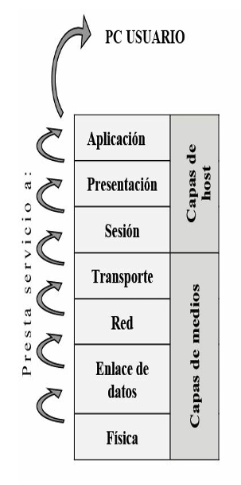

Las principales características del modelo de referencia OSI pueden resumirse en los siguientes puntos:

- Proporciona una forma de entender cómo operan los dispositivos en una red.
- Es la referencia para crear e implementar estándares de red, dispositivos y esquemas de internetworking.
- Separa la compleja operación de una red en elementos más simples.
- Permite a los ingenieros centrarse en el diseño y desarrollo de funciones modulares ocupándose cada uno de su parte específica.
- Proporciona la posibilidad de definir interfaces estándar para compatibilidad "plug-and-play" e integración multifabricante.

### Descripción de las siete capas

#### Capa de aplicación

Es la única capa que no presta servicio a otra puesto que es la capa de nivel superior del modelo OSI directamente relacionada con el usuario. La aplicación a través del software dialoga con los protocolos respectivos para acceder al medio. Por ejemplo, se accede a un procesador de textos por el servicio de transferencia de archivos de esta capa. Algunos protocolos relacionados con esta capa son: HTTP, correo electrónico, telnet.

#### Capa de presentación

Los datos formateados se proveen de diversas funciones de conversión y codificación que se aplican a los datos provenientes de la capa de aplicación. Estas funciones aseguran que estos datos enviados desde la capa de aplicación de un sistema origen podrán ser leídos por la capa de aplicación de otro sistema destino. Un ejemplo de funciones de codificación sería el cifrado de datos una vez que éstos salen de una aplicación. Por ejemplo, los formatos de imágenes JPEG y GIF que se muestran en páginas web. Este formato asegura que todos los navegadores web puedan mostrar las imágenes, con independencia del sistema operativo utilizado. Algunos protocolos relacionados con esta capa son: JPEG, MIDI, MPEG, QUICKTIME.

#### Capa de sesión

Es la responsable de establecer, administrar y concluir las sesiones de comunicaciones entre entidades de la capa de presentación. La comunicación en esta capa consiste en peticiones de servicios y respuestas entre aplicaciones ubicadas en diferentes dispositivos. Un ejemplo de este tipo de coordinación podría ser el que tiene lugar entre un servidor y un cliente de base de datos.

#### Capa de transporte

Es la encargada de la comunicación confiable entre host, control de flujo y de la corrección de errores entre otras cosas. Los datos son divididos en segmentos identificados con un encabezado con un número de puerto que identifica la aplicación de origen. En esta capa funcionan protocolos como UDP y TCP, siendo este último uno de los más utilizados debido a su estabilidad y confiabilidad.

#### Capa de red

En esta capa se lleva a cabo el direccionamiento lógico que tiene carácter jerárquico, se selecciona la mejor ruta hacia el destino mediante el uso de tablas de enrutamiento a través del uso de protocolos de enrutamiento o por direccionamiento estático. Protocolos de capa de red pueden ser: IP, IPX, RIP, IGRP, Apple Talk.

#### Capa de enlace de datos

Proporciona las comunicaciones entre puestos de trabajo en una primera capa lógica, transforma los voltios en tramas y las tramas en voltios. El direccionamiento físico y la determinación de si deben subir un mensaje a la pila de protocolo ocurren en esta capa. Está dividida en dos subcapas, la LLC (*Logical Link Control*) y la subcapa MAC (*Media Access Control*). Algunos protocolos de capa 2: Ethernet, 802.2, 802.3, HDLC, Frame-Relay.

#### Capa física

Se encarga de los medios, conectores, especificaciones eléctricas, lumínicas, radiofrecuencia y de la codificación. Los bits son transformados en pulsos eléctricos, en luz o en radiofrecuencia para ser enviados según sea el medio en que se propaguen.

| Capa | Nombre | Protocolos / conceptos |
| --- | --- | --- |
| 7 | Aplicación | HTML, http, telnet, FTP, TFTP… |
| 6 | Presentación | JPEG, MIDI, MPEG, ASCII, Quicktime… |
| 5 | Sesión | Control de diálogo |
| 4 | Transporte | Control de flujo, TCP, UDP… |
| 3 | Red | Enrutamiento, IP, IPX, RIP, IGRP, Apple Talk… |
| 2 | Enlace de datos | LLC — Ethernet, 802.2, 802.3, HDLC, Frame-Relay… / MAC |
| 1 | Física | Bits, RJ45… |

## Funciones de la capa física

La capa física define el medio, el conector y el tipo de señalización. Se especifican los requisitos necesarios para la correcta transmisión de los datos. Se establecen las características eléctricas, mecánicas y funcionales para activar, mantener y desactivar la conexión física entre sistemas finales.

La capa física especifica también características tales como niveles de voltaje, tasas de transferencia de datos, distancias máximas de transmisión y conectores, cada medio de red posee a su vez su propio ancho de banda y unidad máxima de transmisión (MTU).

El medio físico y los conectores usados para conectar dispositivos al medio vienen definidos por estándares de la capa física.

### Dispositivos de la capa física

La capa física comprende los medios (cobre, fibra, RF), los conectores, transceivers, repetidores, AP y hubs. Ninguno de ellos manipula los datos transmitidos, sino que solo se encargan de transportarlos y propagarlos por la red.

Los repetidores se encargan de retransmitir y de retemporizar los pulsos eléctricos cuando la extensión del cableado supera las medidas específicas.

Los hubs son repetidores multipuesto, también llamados concentradores. Al recibir una trama inundan todos sus puertos obligando a todos los dispositivos conectados a cada uno de sus puertos a leer dichas tramas.

Los transceivers son adaptadores de un medio a otro.

### Estándares de la capa física

Los estándares de cableado se identifican siguiendo los siguientes conceptos, tomando como ejemplo **10 Base T**:

- **10** hace referencia a la velocidad de transmisión en Mbps (megabits por segundo), en este caso 10 Mbps.
- **Base** es la tecnología de transmisión (banda base, analógica o digital), en este caso digital.
- **T** se refiere al medio físico, en este caso par trenzado.

El siguiente cuadro muestra las características de los estándares más comunes:

| Estándar | Nombre | Distancia máxima | Comentarios |
| --- | --- | --- | --- |
| 10GBase-S | Fibra óptica multimodo | 400 metros | SFP/SFP+ |
| 10GBase-LX4 | Fibra óptica multimodo | 300 metros | SFP/SFP+ |
| 10GBase-LR | Fibra óptica monomodo | 10 km | SFP/SFP+ |
| 10GBase-E | Fibra óptica monomodo | 30 km | SFP/SFP+ |
| 1000Base-LX | Gigabit Ethernet | 5000 metros | SFP/SFP+ |
| 802.3z | 10Base-T (Ethernet) | 100 metros | RJ-45 |
| 802.3 | 100Base-T (Fast Ethernet) | 100 metros | RJ-45 |
| 802.3u | 1000Base-T (Gigabit Ethernet) | 100 metros | RJ-45 |
| 802.3ab | 10GBase-T (10 Gig Ethernet) | 100 metros | RJ-45 |
| 802.3an | | | |

### Medios de la capa física

La normativa EIE/TIA 568 fue creada en 1991 y establece los estándares de cableado estructurado, ampliada posteriormente a 568-A y 568-B.

**Orden de los pines correspondiente a la norma 568-A sobre un conector RJ-45**

| Pin | Par | Función | Color |
| --- | --- | --- | --- |
| 1 | 3 | Transmite (+) | Blanco/verde |
| 2 | 3 | Transmite (-) | Verde |
| 3 | 2 | Recibe (+) | Blanco/naranja |
| 4 | 1 | Telefonía | Azul |
| 5 | 1 | Telefonía | Blanco/azul |
| 6 | 2 | Recibe (-) | Naranja |
| 7 | 4 | Respaldo | Blanco/marrón |
| 8 | 4 | Respaldo | Marrón |

**Orden de los pines correspondiente a la norma 568-B sobre un conector RJ-45**

| Pin | Par | Función | Color |
| --- | --- | --- | --- |
| 1 | 3 | Transmite (+) | Blanco/naranja |
| 2 | 3 | Transmite (-) | Naranja |
| 3 | 2 | Recibe (+) | Blanco/verde |
| 4 | 1 | Telefonía | Azul |
| 5 | 1 | Telefonía | Blanco/azul |
| 6 | 2 | Recibe (-) | Verde |
| 7 | 4 | Respaldo | Blanco/marrón |
| 8 | 4 | Respaldo | Marrón |

#### Cable directo

El orden de los pines es igual en ambos conectores, se debe utilizar la misma norma en cada extremo.

**Cable directo 568 B**

| Extremo 1 | Extremo 2 |
| --- | --- |
| Blanco/naranja | Blanco/naranja |
| Naranja | Naranja |
| Blanco/verde | Blanco/verde |
| Azul | Azul |
| Blanco/azul | Blanco/azul |
| Verde | Verde |
| Blanco/marrón | Blanco/marrón |
| Marrón | Marrón |

**Cable directo 568 A**

| Extremo 1 | Extremo 2 |
| --- | --- |
| Blanco/verde | Blanco/verde |
| Verde | Verde |
| Blanco/naranja | Blanco/naranja |
| Azul | Azul |
| Blanco/azul | Blanco/azul |
| Naranja | Naranja |
| Blanco/marrón | Blanco/marrón |
| Marrón | Marrón |

#### Cable cruzado

El orden de los pines varía en ambos extremos, se cruzan el 1-2 con el 3-6 y el 3-6 con el 1-2. El cable cruzado también es llamado *crossover*. Se utiliza para conectar dispositivos como, por ejemplo, PC-PC, PC-Router, Router-Router, etc.

**Orden de los colores en ambos extremos de un cable cruzado**

| Extremo 1 | Extremo 2 |
| --- | --- |
| Blanco/naranja | Blanco/verde |
| Naranja | Verde |
| Blanco/verde | Blanco/naranja |
| Azul | Azul |
| Blanco/azul | Blanco/azul |
| Verde | Naranja |
| Blanco/marrón | Blanco/marrón |
| Marrón | Marrón |

#### Cable consola

El orden de los pines es completamente inverso, 1-2-3-4-5-6-7-8 con el 8-7-6-5-4-3-2-1, respectivamente. El cable de consola también es llamado *rollover*.

**Conector RJ-45**

| Extremo 1 | Extremo 2 |
| --- | --- |
| 1 al 8 | 8 al 1 |
| 2 al 7 | 7 al 2 |
| 3 al 6 | 6 al 3 |
| 4 al 5 | 5 al 4 |

Tipos de cable y conectores habituales: Cable UTP, Cable blindado STP, Fibra óptica, Transceptor SFP, Conector LC.

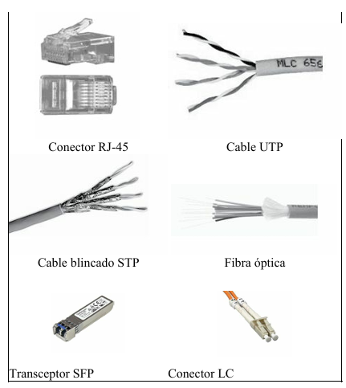

!!! note "NOTA"
    El enfoque principal de este libro está asociado con los estándares e implementaciones Ethernet e IEE 802.3.

### Medios inalámbricos

Los medios inalámbricos transportan señales electromagnéticas mediante frecuencias de microondas y radiofrecuencias que representan los dígitos binarios de las comunicaciones de datos. Como medio en sí mismo, el sistema inalámbrico no se limita a condiciones físicas, como en el caso de los medios de fibra o de cobre. Sin embargo, el medio inalámbrico es susceptible a la interferencia y puede distorsionarse por dispositivos comunes como teléfonos inalámbricos domésticos, algunos tipos de luces fluorescentes, hornos microondas y otras comunicaciones inalámbricas.

Los estándares IEEE sobre las comunicaciones inalámbricas abarcan las capas físicas y de enlace de datos. Los cuatro estándares comunes de comunicación de datos que se aplican a los medios inalámbricos son:

- **IEEE estándar 802.11:** comúnmente denominada Wi-Fi, se trata de una tecnología LAN inalámbrica (red de área local inalámbrica, WLAN) que utiliza una contención o sistema no determinista con un proceso de acceso a los medios de Acceso múltiple con detección de portadora/Prevención de colisiones (CSMA/CA).
- **IEEE estándar 802.15:** estándar de red de área personal inalámbrica (WPAN), comúnmente denominada Bluetooth, utiliza un proceso de emparejamiento de dispositivos para comunicarse a través de una distancia de 1 a 100 metros.
- **IEEE estándar 802.16:** comúnmente conocida como WiMAX (*Worldwide Interoperability for Microwave Access*), utiliza una topología punto a multipunto para proporcionar un acceso de ancho de banda inalámbrico en una extensa cobertura.
- **Sistema global para comunicaciones móviles (GSM):** incluye las especificaciones de la capa física que habilitan la implementación del protocolo Servicio general de radio por paquetes (GPRS) de capa 2 para proporcionar la transferencia de datos a través de redes de telefonía celular móvil.

### Topologías

La topología define como las estaciones de trabajo se conectan entre sí. Existe un número de factores a considerar para determinar cuál topología es la más apropiada para una situación dada.

**Topologías más comunes:**

- **Bus:** esta topología permite que todas las estaciones reciban la información que se transmite, una estación transmite y todas las restantes escuchan. Consiste en un cable con un terminador en cada extremo del que se cuelgan todos los elementos de una red.
- **Anillo:** las estaciones están unidas unas con otras formando un círculo por medio de un cable común. El último nodo de la cadena se conecta al primero cerrando el anillo. Las señales circulan en un solo sentido alrededor del círculo, regenerándose en cada nodo. Con esta metodología, cada nodo examina la información que es enviada a través del anillo. Si la información no está dirigida al nodo que la examina, la pasa al siguiente en el anillo. La desventaja del anillo es que si se rompe una conexión se cae la red completa.
- **Estrella:** los datos en estas redes fluyen del emisor hasta un concentrador, que realiza las funciones de enviar y recibir las señales de red, además actúa como amplificador de los datos.
- **Estrella extendida:** es la combinación de dos o más topologías en estrella unidas entre sí por sus respectivos concentradores.
- **Híbridas:** es una combinación de todas las anteriores.

Los concentradores o hubs de capa uno son reemplazados en la actualidad por switches de capa dos.

## Funciones de la capa de enlace de datos

La finalidad de esta capa es proporcionar comunicación entre puestos de trabajo en una primera capa lógica que hay por encima de los bits del cable. El direccionamiento físico de los puestos finales se realiza en la capa de enlace de datos con el fin de facilitar a los dispositivos de red la determinación de si deben subir un mensaje a la pila de protocolo.

La capa de enlace de datos da soporte a servicios basados en la conectividad y no basados en ella, y proporciona la secuencia y control de flujo (no confundir con la capa de transporte). Tiene conocimiento de la topología a la que está afectada y donde se desempeña la tarjeta de red o NIC (*Network interface controller*).

Está dividida en dos subcapas, la LLC (*Logical Link Control* 802.2), responsable de la identificación lógica de los distintos tipos de protocolos y el encapsulado posterior de los mismos para ser transmitidos a través de la red, y la subcapa MAC (*Media Access Control* 802.3), responsable del acceso al medio, el direccionamiento físico, topología de la red, disciplina de la línea, notificación de errores, distribución ordenada de tramas y control óptimo de flujo. Las direcciones físicas de origen destino son representadas como direcciones de capa MAC.

### Dispositivos de capa de enlace de datos

En la capa de enlace de datos se diferencian perfectamente los Dominios de Colisión y los Dominios de Difusión (ver más adelante). Los puentes y los switches dividen a la red en segmentos, estos a su vez crean dominios de colisión. Una colisión producida en un segmento conectado a un switch no afectará a los demás segmentos conectados al mismo switch. Sin embargo, los dispositivos de capa 2 no crean dominios de broadcast o difusión.

!!! note "NOTA"
    Un switch de 12 puertos utilizados tendrá 12 dominios de colisión y uno de difusión. Los dispositivos de capa dos crean dominios de colisión pero mantienen un único dominio de broadcast. Una colisión producida en un segmento no afecta al resto.

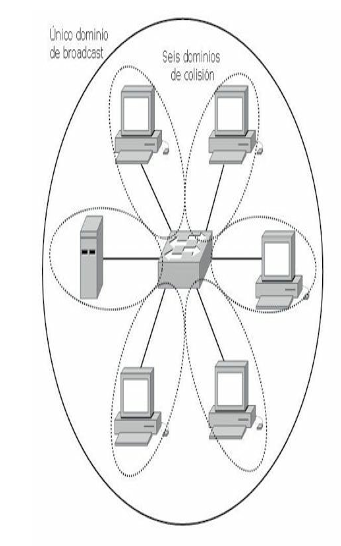

En un switch, el reenvío de tramas se controla por medio de hardware (ASIC). Esta tecnología permite que las funciones de conmutación puedan llevarse a cabo a una velocidad mucho mayor que por software. Debido a la tecnología ASIC (*Application-Specific Integrated Circuits*), los switches proporcionan escalabilidad a velocidades de gigabits con una latencia baja.

Los puentes funcionan a nivel de software por lo que poseen mayor latencia comparados con un switch.

El switch almacena en una memoria de contenido direccionable (CAM) las direcciones físicas de los dispositivos asociados a un segmento de red conectado directamente a un puerto determinado. De esta manera identificará inmediatamente por qué puerto enviar la trama. Si el dispositivo de destino está en el mismo segmento que el origen, el switch bloquea el paso de la trama a otro segmento. Este proceso se conoce como filtrado. Si el dispositivo de destino se encuentra en un segmento diferente, el switch envía la trama únicamente al segmento apropiado, técnica conocida como conmutación de capa dos. Si la dirección de destino es desconocida para el switch, o si se tratara de un broadcast, este enviará la trama a todos los segmentos excepto a aquel de donde se ha recibido la información. Este proceso se denomina inundación.

#### La tarjeta de red (NIC)

La NIC o tarjeta de red opera en la capa de enlace de datos, no debe confundirse con la capa física a pesar de estar directamente conectada al medio ya que sus principales funciones radican en la capa 2. La NIC almacena en su propia ROM la dirección MAC que consta de 48 bits y viene expresada en 12 dígitos hexadecimales. Los primeros 24 bits, o 6 dígitos hexadecimales, de la dirección MAC contienen un código de identificación del fabricante o vendedor OUI (*Organizationally Unique Identifier*). Los últimos 24 bits, o 6 dígitos hexadecimales, están administrados por cada fabricante y presentan, por lo general, el número de serie de la tarjeta. La dirección de la capa de enlace de datos no tiene jerarquías, es decir, que es un direccionamiento plano.

**Ejemplo de una dirección MAC o dirección física:** `00-11-85-f2-32-e5`

- `00-11-85` representa el código del fabricante.
- `f2-32-e5` representa el número de serie.

#### El punto de acceso (AP)

Un AP o punto de acceso es un concentrador que gestiona y administra la red wireless anunciando su propia presencia para que los clientes puedan asociarse y controla el proceso de la comunicación. Es, además, responsable de enviar los ACK a las estaciones que están enviando.

La función primaria del AP es puentear datos wireless del aire hasta la red tradicional cableada. El AP lleva a cabo ciertas consideraciones antes de permitir transmitir a la estación.

Una vez asociadas todas las comunicaciones desde y hacia el cliente pasarán por el AP. Los clientes ahora no pueden comunicarse directamente con otros sin la intervención del AP.

Los Wireless Controllers de Cisco se utilizan para configurar las directivas inalámbricas o la configuración de seguridad en cualquier momento a través de una gestión centralizada. Reducen los gastos operativos mediante la simplificación de despliegue de red, operaciones y gestión. Responden al crecimiento de la organización con el modelo de licencias escalables.

La implementación de los controladores inalámbricos ayuda a gestionar de forma centralizada, segura y permite configurar los puntos de acceso en toda la organización.

Los Cisco Wireless Controllers pueden funcionar en capa 2 y capa 3 y brindan movilidad y calidad de servicio para voz y vídeo y el acceso inalámbrico de alta seguridad para invitados.

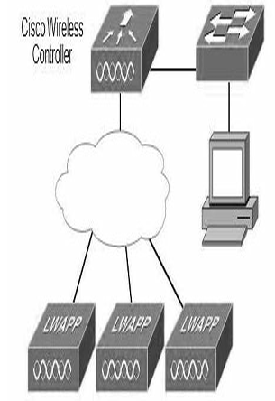

Los Wireless Controllers de Cisco se utilizan para configurar las directivas inalámbricas a través de una gestión centralizada.

!!! note "NOTA"
    Para verificar el correcto funcionamiento de la tarjeta de red se realiza un ping a la dirección IP de la misma.

### Características de las redes conmutadas

- Cada segmento genera su propio dominio de colisión.
- Todos los dispositivos conectados al mismo bridge o switch forman parte del mismo dominio de difusión.
- Todos los segmentos deben utilizar la misma implementación al nivel de la capa de enlace de datos como, por ejemplo, Ethernet o Token Ring.
- Si un puesto final concreto necesita comunicarse con otro puesto final a través de un medio diferente, se hace necesaria la presencia de algún dispositivo, como puede ser un router o un bridge de traducción, que haga posible el diálogo entre los diferentes tipos de medios.

En un entorno conmutado, puede haber un dispositivo por segmento, y todos los dispositivos pueden enviar tramas al mismo tiempo, permitiendo de este modo que se comparta la ruta primaria.

## Funciones de la capa de red

La capa de red define cómo transportar el tráfico de datos entre dispositivos que no están conectados localmente en el mismo dominio de difusión, es decir, que pertenecen a diferentes redes. Para conseguir esta comunicación se necesita conocer las direcciones lógicas asociadas a cada puesto de origen y de destino y una ruta bien definida a través de la red para alcanzar el destino deseado. La capa de red es independiente de la de enlace de datos y, por lo tanto, puede ser utilizada para conectividad de medios físicos diferentes.

Las direcciones de capa 3, o direcciones lógicas, son direcciones jerárquicas. Esta jerarquía define primero las redes y luego a los dispositivos (nodos) pertenecientes a esas redes. Un ejemplo para la comprensión de una dirección jerárquica sería un número telefónico, donde primero se define el código del país, luego el estado y luego el número del usuario. Un esquema plano se puede exemplificar con un número de un documento de identidad donde cada número es único y personal.

Una dirección lógica cuenta con dos partes bien definidas, una que identifica de forma única a la red dentro de un conjunto en la internetwork y la otra parte que representa al host dentro de estas redes. Con la suma o combinación de ambas partes se obtiene un identificador único para cada dispositivo. El router identifica dentro de la dirección lógica la porción perteneciente a la red con el fin de identificar la red donde enviar los paquetes.

!!! note "NOTA"
    Existen muchos protocolos de red, todos cumplen las mismas funciones de identificar redes y hosts. TCP/IP es el protocolo común más usado.

### Dirección de capa tres

Una dirección IPv4 se caracteriza por lo siguiente:

- Una dirección de 32 bits, dividida en cuatro octetos. Este direccionamiento identifica una porción perteneciente a la red y otra al host.
- A cada dirección IP le corresponde una máscara de red de 32 bits dividida en cuatro octetos. El router determina las porciones de red y host por medio de la máscara de red.
- Las direcciones IP generalmente se representan en forma decimal para hacerlas más comprensibles. Esta forma se conoce como decimal punteado o notación decimal de punto.

**Ejemplo del formato de una dirección IPv4**

- **Dirección IP:** 172.16.1.3 → `10101100.00010000.00000001.00000011`
- **Máscara:** 255.255.0.0 → `11111111.11111111.00000000.00000000`

| | Octeto 1 | Octeto 2 | Octeto 3 | Octeto 4 |
| --- | --- | --- | --- | --- |
| **Dirección IP** | 172 | 16 | 1 | 3 |
| **Máscara** | 255 | 255 | 0 | 0 |
| | **Porción de red** | | **Porción de host** | |

Las direcciones IPv6 miden 128 bits y son identificadores de interfaces individuales y conjuntos de interfaces. Las direcciones IPv6 se asignan a interfaces, no a nodos. Como cada interfaz pertenece a un solo nodo, cualquiera de las direcciones unicast asignada a las interfaces del nodo se pueden usar como identificadores del nodo. Las direcciones IPv6 se escriben en hexadecimal, separadas por dos puntos. Los campos IPv6 tienen una longitud de 16 bits.

**Ejemplo de una dirección IPv6:** `24ae:0000:f2f3:0000:0000:0687:a2ff:6184`

### Comparación entre IPv4 e IPv6

Cuando se adoptó TCP/IP en los años ochenta, la versión 4 del direccionamiento IP (IPv4) ofrecía una estrategia de direccionamiento que, aunque resultó escalable durante algún tiempo, produjo una asignación poco eficiente de las direcciones.

A mediados de los años noventa se comenzaron a detectar las siguientes dificultades sobre IPv4:

- Agotamiento de las restantes direcciones de red IPv4 no asignadas. En ese entonces, el espacio de Clase B estaba a punto de agotarse.
- Se produjo un gran y rápido aumento en el tamaño de las tablas de enrutamiento de Internet a medida que las redes Clase C se conectaban en línea. La inundación resultante de nueva información en la red amenazaba la capacidad de los routers de Internet para ejercer una efectiva administración.
- Durante las últimas dos décadas, se desarrollaron numerosas extensiones al IPv4. Estas extensiones se diseñaron específicamente para mejorar la eficiencia con la cual es posible utilizar un espacio de direccionamiento de 32 bits como VLSM y CIDR (ver más adelante).

Mientras tanto, se ha definido y desarrollado una versión más extensible y escalable del IP, la versión 6 del IP (IPv6). IPv6 utiliza 128 bits en lugar de los 32 bits que en la actualidad utiliza el IPv4. IPv6 utiliza números hexadecimales para representar los 128 bits. IPv6 proporciona 640 sextillones de direcciones. Esta versión del IP proporciona un número de direcciones suficientes para futuras necesidades de comunicación.

!!! note "NOTA"
    El direccionamiento IPv6 también es conocido como IPng o "IP de nueva generación".

### Operación AND

Los routers determinan la ruta de destino a partir de la dirección de red, estos comparan las direcciones IP con sus respectivas máscaras efectuando la operación booleana AND. Los routers ignoran el rango de host para encontrar la red destino a la que éste pertenece.

La operación AND consiste en comparar bit a bit la dirección IP y la máscara utilizando el siguiente razonamiento:

| IP | x | Máscara | = | Resultado |
| --- | --- | --- | --- | --- |
| 1 | x | 1 | = | 1 |
| 1 | x | 0 | = | 0 |
| 0 | x | 1 | = | 0 |
| 0 | x | 0 | = | 0 |

| | Binario | Decimal |
| --- | --- | --- |
| Dirección de host | 10101100.00100000.00000001.00000011 | 172.16.1.3 |
| Máscara de red | 11111111.11111111.00000000.00000000 | 255.255.0.0 |
| **Dirección de red** | **10101100.00100000.00000000.00000000** | **172.16.0.0** |

### Dispositivos de la capa de red

Los routers funcionan en la capa de red del modelo OSI separando los segmentos en dominios de colisión y difusión únicos. Estos segmentos están identificados por una dirección de red que permitirá alcanzar las estaciones finales. Los routers cumplen dos funciones básicas que son la de enrutar y conmutar los paquetes. Para ejecutar estas funciones registran en tablas de enrutamiento los datos necesarios para esta función.

Además de identificar redes y proporcionar conectividad, los routers deben proporcionar estas otras funciones:

- Los routers no envían difusiones de capa 2 ni tramas de multidifusión.
- Los routers intentan determinar la ruta óptima a través de una red enrutada basándose en algoritmos de enrutamiento.
- Los routers separan las tramas de capa 2 y envían paquetes basados en direcciones de destino capa 3.
- Los routers asignan una dirección lógica de capa 3 individual a cada dispositivo de red; por tanto, los routers pueden limitar o asegurar el tráfico de la red basándose en atributos identificables con cada paquete. Estas opciones, controladas por medio de listas de acceso, pueden ser aplicadas para incluir o descartar paquetes.
- Los routers pueden ser configurados para realizar funciones tanto de puenteado como de enrutamiento.
- Los routers proporcionan conectividad entre diferentes LAN virtuales (VLAN) en entornos conmutados.
- Los routers pueden ser usados para desplegar parámetros de calidad de servicio para tipos específicos de tráfico de red.

Los routers conocen los diferentes destinos manteniendo tablas de enrutamiento que contienen la siguiente información:

- **Dirección de red.** Representa redes conocidas por el router. La dirección de red es específica del protocolo. Si un router soporta varios protocolos, tendrá una tabla por cada uno de ellos.
- **Interfaz.** Se refiere a la interfaz usada por el router para llegar a una red dada. Esta es la interfaz que será usada para enviar los paquetes destinados a la red que figura en la lista.
- **Métrica.** Se refiere al coste o distancia para llegar a la red de destino. Se trata de un valor que facilita al router la elección de la mejor ruta para alcanzar una red dada. Esta métrica cambia en función de la forma en que el router elige las rutas. Entre las métricas más habituales figuran el número de redes que han de ser cruzadas para llegar al destino (conocido también como saltos), el tiempo que se tarda en atravesar todas las interfaces hasta una red dada (conocido también como retraso), o un valor asociado con la velocidad de un enlace (conocido también como ancho de banda).

En la siguiente salida del router se observa una tabla de enrutamiento con las direcciones IP de destino (172.25.25.6/32), la métrica ([120/2]) y la correspondiente interfaz de salida Serial 0.1.

```text
Router2#show ip route rip
R 172.21.0.0/16 [120/1] via 172.25.2.1, 00:00:01, Serial0.1
R 172.22.0.0/16 [120/1] via 172.25.2.1, 00:00:01, Serial0.1
172.25.0.0/16 is variably subnetted, 6 subnets, 3 masks
R 172.25.25.6/32 [120/2] via 172.25.2.1, 00:00:01, Serial0.1
R 172.25.25.1/32 [120/1] via 172.25.2.1, 00:00:01, Serial0.1
R 172.25.1.0/24 [120/1] via 172.25.2.1, 00:00:01, Serial0.1
R 172.25.0.0/16 [120/1] via 172.25.2.1, 00:00:01, Serial0.1
```

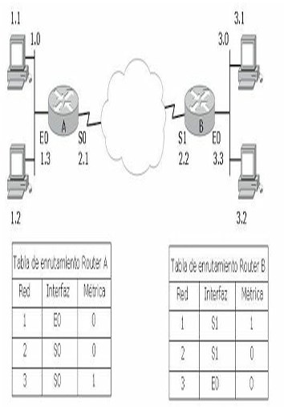

Además de las ventajas que aporta su uso en un campus, los routers pueden utilizarse también para conectar ubicaciones remotas con la oficina principal por medio de servicios WAN. Los routers soportan una gran variedad de estándares de conectividad al nivel de la capa física, lo cual ofrece la posibilidad de construir WAN. Además, pueden proporcionar controles de acceso y seguridad, que son elementos necesarios cuando se conectan ubicaciones remotas.

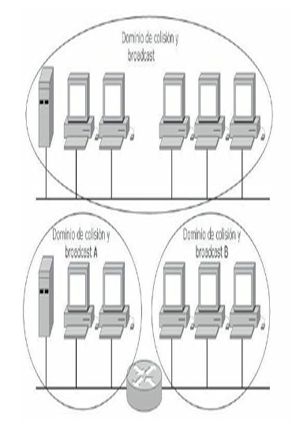

Los routers comunican redes diferentes creando dominios de difusión y de colisión, los broadcast de un segmento no inundan a los demás ni las colisiones afectan al resto.

#### Firewalls

Los Firewalls trabajan principalmente en la capa de Red del modelo OSI y generalmente se los considera dispositivos de esta capa. Sin embargo, algunos firewalls, analizan tráfico basándose en información de las capas 3, 4, 5 y 7 del modelo de referencia OSI, como protocolo y números de puerto de origen y destino. El filtrado de paquetes utiliza las ACL para determinar si permite o deniega tráfico basándose en direcciones IP de origen y destino, protocolo, tipo de paquete y números de puerto origen y destino. Los firewalls de filtrado de paquetes generalmente son parte de un router con funcionalidad de firewall.

Algunos diseños con firewalls son tan simples como la designación de una red externa y una interna, determinadas por dos interfaces del firewall. La red externa no es confiable, mientras que la interna sí lo es. El tráfico proveniente de la red interna pasa a través del firewall hacia afuera con pocas o ninguna restricción. El tráfico que se origina fuera generalmente es bloqueado o permitido muy selectivamente. Al tráfico de retorno que proviene de la red externa, asociado con tráfico de origen interno, se le permite pasar de la interfaz no confiable a la confiable. Un diseño más complicado puede involucrar tres o más interfaces del firewall.

## Funciones de la capa de transporte

Para conectar dos dispositivos remotos es necesario establecer una conexión. La capa de transporte establece las reglas para esta interconexión. Permite que las estaciones finales ensamblen y reensamblen múltiples segmentos del mismo flujo de datos. Esto se hace por medio de identificadores que en TCP/IP reciben el nombre de números de puerto. La capa cuatro permite además que las aplicaciones soliciten transporte fiable entre los sistemas.

- Asegura que los segmentos distribuidos serán confirmados al remitente.
- Proporciona la retransmisión de cualquier segmento que no sea confirmado.
- Coloca de nuevo los segmentos en su orden correcto en el receptor.
- Proporciona control de flujo regulando el tráfico de datos.

En la capa de transporte, los datos pueden ser transmitidos de forma fiable o no fiable. Para IP, el protocolo TCP (*Transmission Control Protocol*) es fiable u orientado a conexión con un saludo previo de tres vías, mientras que UDP (*User Datagram Protocol*) no es fiable, o no orientado a la conexión donde solo se establece un saludo de dos vías antes de enviar los datos.

## Modelo TCP/IP

El Departamento de Defensa de EE.UU. (DoD) creó el modelo de referencia TCP/IP porque necesitaba una red que pudiera sobrevivir ante cualquier circunstancia. Para tener una mejor idea, imagine un mundo, cruzado por numerosos tendidos de cables, alambres, microondas, fibras ópticas y enlaces satelitales. Entonces, imagine la necesidad de transmitir datos independientemente del estado de un nodo o red en particular. El DoD requería una transmisión de datos confiable hacia cualquier destino de la red, en cualquier circunstancia. La creación del modelo TCP/IP ayudó a solucionar este difícil problema de diseño. Desde entonces, TCP/IP se ha convertido en el estándar en el que se basa Internet. Al leer sobre las capas del modelo TCP/IP, tenga en cuenta el diseño original de Internet. Recordar su propósito ayudará a reducir las confusiones.

El modelo TCP/IP tenía originalmente cuatro capas: la capa de aplicación, la capa de transporte, la capa de Internet y la capa de acceso de red (NAL). Posteriormente en una actualización del modelo la capa de acceso a la red se ha dividido en dos subcapas.

| TCP/IP original | TCP/IP actualizado |
| --- | --- |
| Aplicación | Aplicación |
| Transporte | Transporte |
| Internet | Red |
| Acceso a la red | Enlace de datos |
| | Física |

Es importante observar que algunas de las capas del modelo TCP/IP poseen el mismo nombre que las capas del modelo OSI. Resulta fundamental no confundir las funciones de las capas de los dos modelos ya que estas se desempeñan de diferente manera en cada modelo.


| Modelo OSI | Modelo TCP/IP | Protocolos |
| --- | --- | --- |
| Aplicación, Presentación, Sesión | Aplicación | Telnet, FTP, LPD, SNMP, TFTP, SMTP, NFS, HTTP, X Windows |
| Transporte | Transporte | TCP, UDP |
| Red | Internet | ICMP, BOOTP, ARP, RARP, IP |
| Enlace de datos, Física | Red | Ethernet, Fast-Ethernet, Token Ring, FDDI |

**Comparativa entre el modelo OSI y el modelo TCP/IP**

### Protocolos de capa de aplicación

Los protocolos describen el conjunto de normas y convenciones que rigen la forma en que los dispositivos de una red intercambian información. Algunos de los protocolos de la capa de Aplicación del modelo TCP/IP son:

- **Telnet.** Protocolo de emulación de terminal estándar que se usa para la conexión de terminales remotas, permitiendo que los usuarios se registren en dichos sistemas y utilicen los recursos como si estuvieran conectados localmente.
- **FTP.** Protocolo utilizado para transferir archivos entre host de red de manera confiable ya que utiliza un mecanismo orientado a conexión.
- **TFTP.** Versión simplificada de FTP que permite la transferencia de archivos de un host a otro a través de una red de manera menos confiable.
- **DNS.** El sistema de denominación de dominio es utilizado en Internet para convertir los nombres de los nodos de red en direcciones.
- **SMTP.** Protocolo simple de transferencia de correo basado en texto utilizado para el intercambio de mensajes de correo electrónico entre distintos dispositivos. Se basa en el modelo cliente-servidor, donde un cliente envía un mensaje a uno o varios receptores.
- **SNMP.** Protocolo de administración de redes utilizado casi con exclusividad en redes TCP/IP. El SNMP brinda una forma de monitorizar y controlar los dispositivos de red y de administrar configuraciones, recolección de estadísticas, desempeño y seguridad.
- **DHCP.** Protocolo de configuración dinámica del host. Protocolo que proporciona un mecanismo para asignar direcciones IP de forma dinámica, de modo que las direcciones se pueden reutilizar automáticamente cuando los hosts ya no las necesitan.

### Protocolos de capa de transporte

Los protocolos de la capa de transporte se encargan de dar soporte a la capa superior brindando apoyo enviando los datos sin importar el contenido de los mismos. Los dos protocolos extensamente conocidos para tal proceso son:

- **TCP.** Protocolo de control de transmisión, es básicamente el más utilizado, tiene control de flujo, reensamblado de paquetes y acuses de recibo. Es un protocolo orientado a conexión muy seguro que utiliza un saludo de tres vías antes del envío de los datos. En párrafos anteriores se hace una descripción más en detalle del funcionamiento de TCP.
- **UDP.** El protocolo de datagrama del usuario es en general menos seguro que TCP, no tiene corrección de errores y es del tipo no orientado a conexión, los datos se envían sin verificar previamente el destino. A pesar de ello es muy utilizado por el bajo consumo de recursos de red.

Un ejemplo de protocolo orientado a conexión puede compararse con una llamada telefónica, donde el interlocutor establece una conexión (marcando el número), verifica que el destinatario sea la persona que se espera (saludando recíprocamente) y, finalmente, estableciendo la conversación (envío de datos). El caso de un protocolo no orientado a conexión puede ser un envío postal, donde se envía la correspondencia sin establecer ningún aviso previo, ni acuse de recibo.

TCP utiliza una técnica llamada ventanas, donde se establece la cantidad de envío de paquetes antes de transmitir; mientras que en el *windowing* o de ventana deslizante, el flujo de envío de datos es negociado dinámicamente entre el emisor y el receptor. En las ventanas deslizantes o *windowing* cada acuse de recibo ACK (*acknowledgement*) confirma la recepción y el envío siguiente.

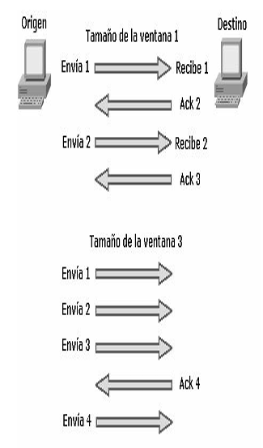

!!! tip "RECUERDE"
    - TCP, protocolo confiable de capa de transporte orientado a conexión.
    - UDP, protocolo NO confiable de capa de transporte NO orientado a conexión.

    Un protocolo orientado a conexión es el que previamente establece un saludo antes de enviar los datos, como es el ejemplo de una llamada telefónica, donde se establece un saludo de tres vías. Un protocolo No orientado a conexión es el que no establece saludo previo antes de enviar los datos como es el caso de un envío postal donde se establece un saludo de dos vías.

### Números de puertos

Los números de puerto son utilizados por TCP y UDP para identificar sesiones de diferentes aplicaciones, los números de puertos ocupan rangos definidos que van desde puertos bien conocidos hasta puertos específicos determinados por los usuarios.

**Números de puerto utilizados por TCP y UDP para identificar sesiones de diferentes aplicaciones**

| Rango | Descripción |
| --- | --- |
| 1 al 1023 | Puertos bien conocidos |
| 1 al 255 | Puertos públicos |
| 256 al 1023 | Asignados a empresas |
| Mayores al 1023 | Definidos por el usuario |

A continuación, se detallan los números de puertos más comunes:

| Número de puerto | Protocolo |
| --- | --- |
| 7 | Echo |
| 9 | Discard |
| 13 | Daytime |
| 19 | Character Generator |
| 20 | FTP Data Connections |
| 21 | File Transfer Protocol |
| 23 | Telnet |
| 25 | Simple Mail Transport Protocol |
| 37 | Time |
| 43 | Nicname |
| 49 | TAC Access Control System |
| 53 | Domain Name Service |
| 69 | Trivial File Transfer Protocol |
| 70 | Gopher |
| 79 | Finger |
| 80 | World Wide Web |
| 101 | NIC hostname server |
| 109 | Post Office Protocol v2 |
| 110 | Post Office Protocol v3 |
| 111 | Sun Remote Procedure Call |
| 113 | Ident Protocol |
| 119 | Network News Transport Protocol |
| 179 | Border Gateway Protocol |

### Protocolos de capa de Internet

Estos son algunos de los protocolos más usados que operan en la capa de Internet del modelo TCP/IP:

- **IP.** Protocolo de Internet, proporciona un enrutamiento de paquetes no orientado a conexión de máximo esfuerzo. IP no se ve afectado por el contenido de los paquetes, sino que busca una ruta hacia el destino.
- **ARP.** Protocolo de resolución de direcciones, determina la dirección de la capa de enlace de datos, la dirección MAC, para las direcciones IP conocidas.
- **RARP.** Protocolo de resolución inversa de direcciones, determina las direcciones IP cuando se conoce la dirección MAC.
- **ICMP.** Protocolo de mensajes de control en Internet, suministra capacidades de control y envío de mensajes. Herramientas tales como PING y tracert utilizan ICMP para poder funcionar, enviando un paquete a la dirección destino específica y esperando una determinada respuesta. ICMP se describe con más detalle más adelante.

!!! note "NOTA"
    La capa de Acceso a la Red está dividida en dos subcapas: Enlace de datos y Física. La capa de Internet también es llamada capa de Interred o capa de red.

!!! tip "RECUERDE"
    - Puertos bien conocidos del 1 al 1023.
    - Puertos públicos del 1 al 255.
    - Puertos asignados a empresas del 256 al 1023.
    - Puertos definidos por el usuario son los superiores a 1023.

## Ethernet

Ethernet es la tecnología de acceso al medio más popular, es escalable, económica y fácilmente integrable a nuevas aplicaciones, se pueden obtener arquitecturas de LAN a velocidades de Gigabit sobre cobre y la resolución de fallos suele ser simple y rápida. Ethernet opera sobre la capa de enlace de datos y física del modelo OSI. Sin embargo, no es determinista ni ofrece jerarquías.

Ethernet es una tecnología conflictiva de máximo esfuerzo, todos los equipos de trabajo que se conectan al mismo medio físico reciben las señales enviadas por otros dispositivos. Si dos estaciones transmiten a la vez, se genera una colisión. Si no existieran mecanismos que detectasen y corrigiesen los errores de estas colisiones, Ethernet no podría funcionar.

Ethernet fue creada en colaboración por Intel, Digital y Xerox, originalmente se implementó como Ethernet 802.3, half-duplex, limitada al transporte de datos por solo un par de cobre a la vez (recibe por un par y transmite por otro, pero no al mismo tiempo). Posteriormente, la tecnología Ethernet full-duplex permitió recibir y enviar datos al mismo tiempo libre de colisiones. El uso más adecuado del ancho de banda permite casi duplicarse al poder transmitir y recibir al 100% de capacidad. Sin embargo, esta tecnología no es tan económica y es solo aplicable a dispositivos que lo permitan.

En el diseño de una red Ethernet se debe tener especial cuidado con los llamados dominios de colisión y dominios de difusión (broadcast) debido a que la excesiva cantidad de colisiones o de broadcast (tormentas de broadcast) harían inaceptable el funcionamiento de Ethernet.

### Dominio de colisión

Grupo de dispositivos conectados al mismo medio físico, de tal manera que, si dos dispositivos acceden al medio al mismo tiempo, el resultado será una colisión entre las dos señales. Como resultado de estas colisiones se produce un consumo inadecuado de recursos y de ancho de banda. Cuanto menor sea la cantidad de dispositivos afectados a un dominio de colisión mejor desempeño de la red.

### Dominio de difusión

Grupo de dispositivos de la red que envían y reciben mensajes de difusión entre ellos. Una cantidad excesiva de estos mensajes de difusión (broadcast) provocará un bajo rendimiento en la red, una cantidad exagerada (tormenta de broadcast) dará como resultado el mal funcionamiento de la red hasta tal punto de poder dejarla completamente congestionada.

Los hubs o concentradores tienen un único dominio de colisión, eso quiere decir que si dos equipos provocan una colisión en un segmento asociado a un puerto del hub, todos los demás dispositivos aun estando en diferentes puertos se verán afectados. De igual manera se verían afectados si una estación envía un broadcast, debido a que un hub también tiene un solo dominio de difusión.

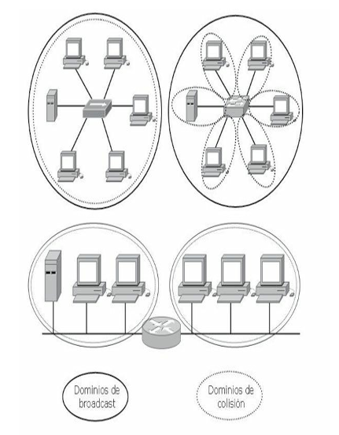

**Comparativa entre dominios de colisión y dominios de difusión en dispositivos de tres capas diferentes**

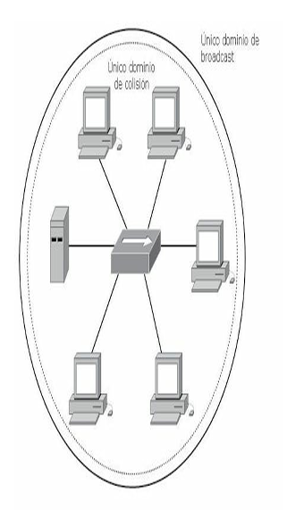

Los dispositivos conectados a través de un hub comparten el mismo dominio de colisión y de broadcast. Las colisiones en el medio afectarán por igual a todos los hosts del segmento.

!!! note "NOTA"
    Asocie a los routers como los dispositivos que crean dominios de difusión y a los switches como los que crean dominios de colisión.

### CSMA/CD

La tecnología Ethernet utiliza para controlar las colisiones dentro de un determinado segmento el protocolo CSMA/CD (*Carrier Sense Multiple Access with Collision Detection*). En la práctica, esto significa que varios puestos pueden tener acceso al medio y que, para que un puesto pueda acceder a dicho medio, deberá detectar la portadora para asegurarse de que ningún otro puesto esté utilizándolo. Si el medio se encuentra en uso, el puesto procederá a mantener en suspenso el envío de datos. En caso de que haya dos puestos que no detectan ningún otro tráfico, ambos tratarán de transmitir al mismo tiempo, dando como resultado una colisión.

A partir de esta colisión las estaciones emiten una señal de congestión para asegurarse de que existe una colisión y se genera un algoritmo de espera con el que las estaciones retransmitirán aleatoriamente.

!!! tip "RECUERDE"
    El ejemplo más claro de CSMA/CD es el de "escucho y luego transmito".


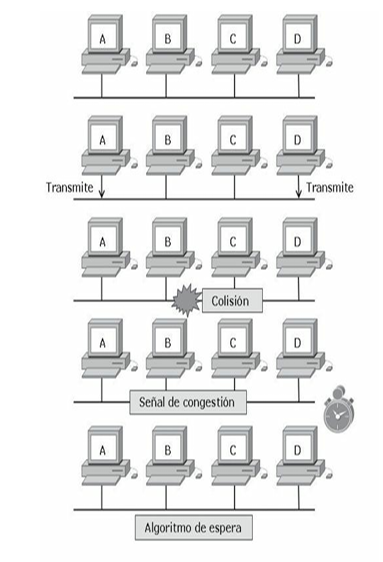

**Secuencia de una colisión en un entorno Ethernet**

### Operación dúplex

En las comunicaciones de datos, *duplex* se refiere a la dirección de transmisión de los datos entre dos dispositivos.

- **Half-duplex:** la comunicación se limita al intercambio de datos en una dirección a la vez.
- **Full-duplex:** la comunicación es simultánea y permite al envío y recepción de datos al mismo tiempo.

Los dispositivos interconectados deben funcionar en el mismo modo dúplex para evitar problemas en el enlace. La autonegociación Ethernet facilita esta configuración y, por tanto, minimiza los problemas. Los *duplex mismatches* son desajustes en el modo dúplex y producen problemas de comunicación entre los dispositivos. Pueden ser difíciles de solucionar porque pueden no ser evidentes incluso cuando se utilizan herramientas como ping.

### Formato básico de una trama Ethernet

El formato de la trama del estándar IEEE 802.3 y el de Ethernet creado por Xerox son muy similares y compatibles, solo difieren en algunas pequeñas cuestiones de concepto. IEEE 802.3 se basa en las especificaciones recogidas por los estándares del Instituto de Ingenieros Eléctricos y Electrónicos, a partir de Ethernet mientras que Ethernet II es una versión actualizada de Ethernet.

| Preámbulo | Dirección MAC destino | Dirección MAC origen | Tipo de protocolo | Datos | FCS |
| --- | --- | --- | --- | --- | --- |
| 8 Bytes | 6 Bytes | 6 Bytes | 2 Bytes | 46 - 1500 Bytes | 4 Bytes |

**Longitud máxima: 1518 Bytes. Longitud mínima: 64 Bytes**

- **Preámbulo.** Secuencia de valores alternados 1 y 0 usados para la sincronización y para detectar la presencia de señal, indica el inicio de la trama.
- **Dirección de destino.** Este campo identifica la dirección MAC del dispositivo que debe recibir la trama. La dirección de destino puede especificar una dirección individual o una dirección multicast destinada a un grupo de estaciones. Una dirección destino con todos los bits en 1 se refiere a todos los dispositivos de la red denominada dirección de broadcast o difusión.
- **Dirección de origen.** Este campo identifica la dirección MAC del dispositivo que debe enviar la trama.
- **Tipo.** Indica el tipo de protocolo de capa superior.
- **Datos.** Este campo contiene los datos transferidos desde el origen hasta el destino. El tamaño máximo de este campo es de 1500 bytes. Si el tamaño de este campo es menor de 46 bytes, entonces es necesario el uso del campo siguiente (Pad) para añadir bytes hasta que el tamaño de la trama alcance el valor mínimo.
- **FSC.** Campo de comprobación de la trama, este campo contiene un valor de chequeo de redundancia de 4 bytes (CRC) para verificación de errores. La estación origen efectúa un cálculo y lo transmite como parte de la trama. Cuando la trama es recibida por el destino, este realiza un chequeo idéntico. Si el valor calculado no coincide con el valor en el campo, el destino asume que ha sido un error durante la transmisión y entonces descarta la trama completa.

Los estándares originales Ethernet definen el tamaño mínimo de trama como 64 bytes y el máximo como 1518 bytes. Estas cantidades incluyen todos los bytes de la trama menos los comprendidos en el preámbulo. En 1998 se promovió una iniciativa con el fin de incrementar el tamaño máximo del campo de datos de 1500 a 9000 bytes. Las tramas más largas (tramas gigantes) proveen un uso más eficiente del ancho de banda en la red a la vez que reducen la cantidad de tramas a procesar.

### Proceso de encapsulación de los datos

El proceso desde que los datos son incorporados al ordenador hasta que se transmiten al medio se llama encapsulación. Estos datos son formateados, segmentados, identificados con el direccionamiento lógico y físico para finalmente ser enviados al medio. A cada capa del modelo OSI le corresponde una PDU (Unidad de Datos) que se puede abreviar con el formato LxPDU, donde la x representa el número de la capa correspondiente. Por ejemplo, para la capa de red la abreviatura correspondiente será L3PDU.

Siguiendo por lo tanto el siguiente orden de encapsulamiento:

1. **Datos.** Los datos son incorporados al ordenador por el usuario a través de una determinada aplicación. Los datos son formateados de tal manera que puedan ser leídos por la capa de aplicación de otro ordenador en el destino.
2. **Segmentos.** Debido a que posiblemente la cantidad de los datos sea demasiada, la capa de transporte desde el origen se encarga de segmentarlos para así ser empaquetados debidamente, esta misma capa en el destino se encargará de reensamblar los datos y colocarlos en forma secuencial, ya que no siempre llegan a su destino en el orden en que han sido segmentados, así mismo acorde al protocolo que se esté utilizando habrá o no corrección de errores.
3. **Paquetes.** Los segmentos son empaquetados en paquetes o datagramas e identificados en la capa de red con la dirección lógica o IP correspondiente al origen y destino.
4. **Tramas.** En la capa de enlace de datos se añade una cabecera con la dirección MAC y el campo de comprobación de la trama formándose las tramas, o *frames*, para ser transmitidos a través de alguna interfaz.
5. **Bits.** Finalmente, las tramas son enviadas al medio desde la capa física, en forma de pulsos eléctricos, luz o radiofrecuencia.

**Relación entre capas del modelo OSI y su correspondiente PDU**

| Capa | Unidad | Abreviatura |
| --- | --- | --- |
| Aplicación | Datos | L7PDU |
| Presentación | Datos | L6PDU |
| Sesión | Datos | L5PDU |
| Transporte | Segmentos | L4PDU |
| Red | Paquetes | L3PDU |
| Enlace de datos | Tramas | L2PDU |
| Física | Bits | L1PDU |

**Secuencia de la encapsulación de datos:**

1. Se crean los datos a través de una aplicación → **DATOS**
2. Los datos son segmentados → **SEGMENTO** (Puerto origen, Puerto destino, . . . ., DATOS)
3. Se coloca el encabezado IP → **PAQUETE** (Dirección IP de origen, Dirección IP de destino, Protocolo, . . . ., SEGMENTO)
4. Se agrega el encabezado MAC → **TRAMA** (Dirección MAC origen, Dirección MAC destino, . . . ., PAQUETE, FCS)
5. Se envía al medio → **BITS** (`10010111010011110010101000111101010000…………`)

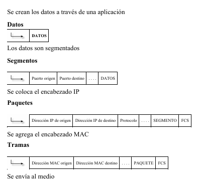

!!! note "NOTA"
    El proceso inverso se realiza en el destino y se llama desencapsulación de datos.

## Modelo jerárquico

Con el fin de simplificar el diseño, implementación y administración de las redes, Cisco utiliza un modelo jerárquico para describir la red. Aunque la práctica de este método suele estar asociada con el proceso de diseño de una red, es importante comprender el modelo para poder determinar el equipo y características que van a necesitar en la red. Un modelo jerárquico acelera la convergencia, mantiene posibles problemas aislados por capas y reduce la sobrecarga en los dispositivos.

El modelo se compone de tres capas o niveles:

- Capa o nivel de acceso.
- Capa o nivel de distribución.
- Capa o nivel de núcleo.

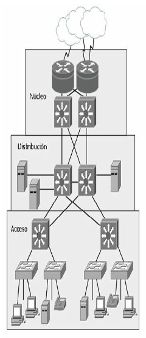

**Modelo jerárquico de tres capas**

### Capa de acceso

La capa de acceso de la red es el punto en el que cada usuario se conecta a la red. Esta es la razón por la cual la capa de acceso se denomina a veces capa de puesto de trabajo, capa de escritorio o de usuario. Los usuarios, así como los recursos a los que estos necesitan acceder con más frecuente están disponibles a nivel local. El tráfico hacia y desde recursos locales está confinado entre los recursos, switches y usuarios finales.

En la capa de acceso podemos encontrar múltiples grupos de usuarios con sus correspondientes recursos. En muchas redes no es posible proporcionar a los usuarios un acceso local a todos los servicios, como archivos de bases de datos, almacenamiento centralizado o acceso telefónico a la Web. En estos casos, el tráfico de usuarios que demandan estos servicios se desvía a la siguiente capa del modelo: la capa de distribución.

Algunas de las funciones de la capa de acceso son:

- Interconexión de los diferentes grupos de trabajo hacia la capa de distribución.
- Segmentación en múltiples dominios de colisión.
- Brinda soporte a tecnologías como Ethernet y Wireless.
- Implementación de redes virtuales (VLAN).

### Capa de distribución

La capa de distribución marca el punto medio entre la capa de acceso y los servicios principales de la red. La función primordial de esta capa es realizar funciones tales como enrutamiento, filtrado y acceso a WAN.

En un entorno de campus, la capa de distribución abarca una gran diversidad de funciones, entre las que figuran las siguientes:

- Servir como punto de concentración para acceder a los dispositivos de capa de acceso.
- Enrutar el tráfico para proporcionar acceso a los departamentos o grupos de trabajo y entre las diferentes VLAN.
- Segmentar la red en múltiples dominios de difusión/multidifusión.
- Traducir los diálogos entre diferentes tipos de medios, como Token Ring y Ethernet.
- Proporcionar servicios de seguridad y filtrado.

La capa de distribución puede resumirse como la capa que proporciona una conectividad basada en una determinada política, dado que determina cuándo y cómo los paquetes pueden acceder a los servicios principales de la red. La capa de distribución determina la forma más rápida para que la petición de un usuario (como un acceso al servidor de archivos) pueda ser remitida al servidor. Una vez que la capa de distribución ha elegido la ruta, envía la petición a la capa de núcleo. La capa de núcleo podrá entonces transportar la petición al servicio apropiado.

### Capa de núcleo

La capa del núcleo o *core* se encarga de desviar el tráfico lo más rápidamente posible hacia los servicios apropiados. Normalmente, el tráfico transportado se dirige o proviene de servicios comunes a todos los usuarios. Estos servicios se conocen como servicios globales o corporativos. Algunos de ellos pueden ser e-mail, el acceso a Internet o videoconferencia.

Cuando un usuario necesita acceder a un servicio corporativo, la petición se procesa al nivel de la capa de distribución. El dispositivo de la capa de distribución envía la petición del usuario al núcleo. Este se limita a proporcionar un transporte rápido hasta el servicio corporativo solicitado. El dispositivo de la capa de distribución se encarga de proporcionar un acceso controlado a la capa de núcleo.

Para la capa de *core* se deben tomar en cuenta los siguientes conceptos:

- Esta capa debe ser diseñada para una alta velocidad de transferencia y mínima latencia.
- No se debe dar soporte a grupos de trabajo ni enrutamiento entre VLAN.
- El tráfico debe haber sido filtrado en la capa anterior.
- Los protocolos de enrutamientos utilizados deben ser de rápida convergencia y redundantes.

!!! tip "RECUERDE"

    | Capa | Funciones | Dispositivos |
    | --- | --- | --- |
    | Núcleo | Conmuta el tráfico hacia el servicio solicitado, comunicación rápida y segura | Routers, switch multicapa |
    | Distribución | Enrutamiento, filtrado, acceso WAN, seguridad basada en políticas, servicios empresariales, enrutamiento entre VLANS, definición de dominios de broadcast y multicast | Router |
    | Acceso | Define Dominios de colisión, estaciones finales, ubicación de usuarios, servicios de grupos de trabajos, VLANS | Hub, switch |

## Modelo de core colapsado

El diseño jerárquico de tres niveles maximiza el rendimiento, la disponibilidad de la red y la capacidad de escalar el diseño de la red. La mayoría de las pequeñas empresas no crecen significativamente con el tiempo, por tanto, un diseño jerárquico de dos capas o niveles, donde las capas de núcleo y de distribución se colapsan en una sola capa, es suficiente para proporcionar las exigencias de la empresa. La principal motivación para el diseño de núcleo colapsado es la reducción de costos de la red, manteniendo al mismo tiempo la mayor parte de los beneficios del modelo jerárquico de tres niveles.

La implementación principal de un modelo colapsado reside en que las funciones de la capa de distribución y la capa de core están aplicadas en un solo dispositivo.

El dispositivo de núcleo-distribución colapsado debe proporcionar lo siguiente:

- Rutas físicas y lógicas de alta velocidad de conexión a la red.
- Servir como punto de demarcación entre acceso y núcleo y de concentración de capa 2.
- Definir las políticas de acceso y de enrutamiento.
- Proveer calidad de servicio (QoS), virtualización de red, etc.

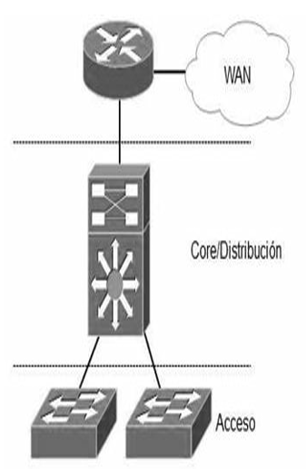

Sin embargo, si se espera que la empresa crezca con el tiempo, la implementación del modelo jerárquico de tres niveles es la mejor opción.

## Procedimientos básicos de troubleshooting

Un buen procedimiento de troubleshooting estructurado ayuda a utilizar de manera más eficiente los recursos de una empresa, además, en caso de que un administrador deba continuar el trabajo de otro será más fácil de asumir. La combinación de las herramientas mencionadas en los párrafos anteriores (como *ping*, *traceroute* y todos los comandos *show* que se verán a lo largo de todo este libro) permite obtener resultados positivos a la hora de solucionar problemas en la red.

Los siguientes pasos siguen un correcto mecanismo de *troubleshooting* estructurado:

1. **Informe del problema.** Normalmente viene dado por alguien que hace uso de los recursos de la red y casi siempre será información poco precisa, e incluso errónea. El que alguien reporte un problema tiene que servir, sobre todo, para ser capaz de identificar qué parte de la red ha sido afectada, qué dispositivos, o qué grupo es responsable de la avería.
2. **Recopilación de información.** Una vez que el error ha sido reportado y se piensa haber identificado la parte de la red que tiene el problema, se ha de recopilar tanta información como sea posible, tanto de los dispositivos afectados, como logs, histórico de cambios realizados, etc. En caso de que haya dispositivos de red a los que no se tenga acceso será necesario ponerse en contacto con los grupos correspondientes para solicitar dicha información.
3. **Examinar la información recopilada.** Una vez recopilada toda la información necesaria se debe analizar exhaustivamente, estando siempre pendientes de:
    - Identificar causas que apunten al problema raíz.
    - Eliminar información que sea innecesaria.

    Dependiendo del grado de experiencia del administrador se deben efectuar seguidamente algunas preguntas que se contestarán de manera más o menos rápida, necesitando para ello analizar toda la información recopilada, o simplemente mirando el comportamiento de los protocolos de la red, etc.

    - ¿Qué es lo que está pasando en la red?
    - ¿Qué debería estar pasando?, ¿cómo debería estar funcionando?
4. **Eliminar causas potenciales.** Una vez examinados los datos se debe descartar la información relativa a causas que no sean propias del problema y, lo que es muy importante, no imaginar ni querer formular hipótesis basadas en datos que no están en la información recopilada.
5. **Crear una hipótesis de la causa.** Una vez eliminadas las causas potenciales, centrarse únicamente en la que se crea sea la definitiva. En caso de que se tenga acceso al dispositivo se procederá a intentar solucionar el problema. En caso de que no tener acceso al dispositivo se deberá buscar una solución alternativa a través del administrador de red correspondiente.
6. **Verificación de la hipótesis.** Una vez conocida la causa se puede intentar resolverla. Es importante pensar cómo actuar debido a que el hecho de implementar la solución inmediatamente puede provocar cortes en la red, entonces quizás sea mejor planificar la intervención para un momento más adecuado: por la noche o cuando el impacto sea mínimo.

    Es de vital importancia documentar todos los cambios que se apliquen para que, en caso de que la solución pensada no resuelva el problema, sea posible dar marcha atrás y pensar en otra solución.
7. **Resolución del problema.** Una vez resuelto el problema se debe dejar claramente documentado y todas las partes implicadas han de recibir una explicación de lo ocurrido y cómo se resolvió.

## Caso práctico

### Prueba de conectividad TCP/IP

Imagine que desea comprobar la conectividad de un host, usted enviará un *ping* a la dirección IP del host en cuestión esperando algún tipo de respuesta o mensaje de error (protocolo ICMP).

El host emisor debe conocer las direcciones físicas y lógicas del destino. Antes de enviar el *ping* buscará en su tabla ARP la dirección MAC del destinatario. Si este no supiera cuál es la dirección física de aquel, enviará una petición ARP con la dirección IP del receptor y la MAC en forma de *broadcast*. El receptor responderá con su MAC haciendo posible que el emisor agregue a su tabla esa dirección y envíe por fin el PING. Si el host destino está dentro de otra red, quien responde en este caso es el router entregando su propia MAC para recibir el paquete y conmutarlo a la red correspondiente, es lo que se llama **ARP Proxy**.

Desde su PC abra una ventana de línea de comandos:

1. Ejecute `ipconfig` para verificar su configuración.
2. Ejecute `arp –a` para ver el contenido de la tabla ARP.
   
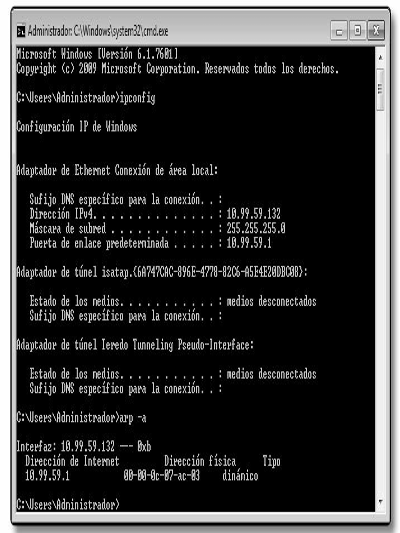

3. Ejecute un *ping* al host de destino y vuelva a ejecutar `arp –a`. Verifique las diferencias entre la tabla anterior y la actual.

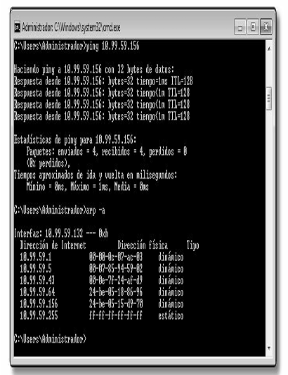

Otros sistemas operativos como MAC OS ofrecen además de una consola de terminal, aplicaciones específicas para ejecutar pruebas de red como *ping*, *traceroute*, *netstat*, etc.

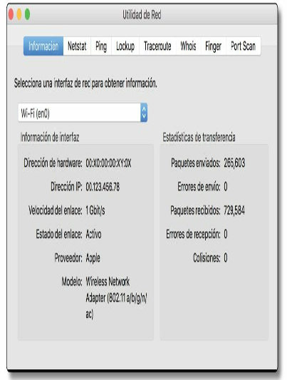

## Fundamentos para el examen

Este capítulo resulta extremadamente teórico, incluso puede llegar a ser aburrido si se tienen conocimientos básicos sobre redes. Sin embargo, es fundamental entender el principio de la división en capas de una red, los modelos utilizados y los protocolos principales que resultan básicos y primordiales. Conocer el modelo OSI le ayudará a identificar problemas e incluso le ayudarán a determinar a qué departamento corresponde la solución de la incidencia (redes, sistema, desarrollo, etc.).

- Tenga una idea clara sobre las siete capas del modelo OSI, las funciones en la red para que se usan y los protocolos asociados a cada una.
- Analice las diferencias entre los dispositivos de cada capa del modelo OSI, cuáles son sus funciones y para qué se aplican en cada caso.
- Recuerde las posibles causas que pueden generar congestión en una LAN. Cómo, de ser posible, evitarlo.
- Tenga en cuenta las diferencias entre dominio de colisión y dominio de broadcast y los dispositivos asociados a cada uno.
- Recuerde la diferencia entre orientado a conexión y no orientado a conexión y los protocolos a que hacen referencia.
- Sepa diferenciar entre los tipos de cableado Ethernet y sus estándares, además de saber distinguir en cada caso cuál utilizar según los dispositivos a conectar.
- Tenga en cuenta las características, campos y tamaño de la trama Ethernet.
- Recuerde las funciones de cada capa del modelo jerárquico de Cisco, para qué se aplican y los dispositivos asociados.
- Recuerde las cuatro capas del modelo TCP/IP, sus funciones y los protocolos asociados a cada una.
- Sepa cuáles son las diferencias entre el modelo TCP/IP y el modelo OSI. Analice y compare sus capas.
- Tenga en cuenta las diferencias fundamentales entre TCP y UDP, control de flujo, ACK, ventanas y ventanas deslizantes.
- Recuerde las diferencias entre el modelo de tres capas y el modelo de core colapsado.
- Analice y recuerde los pasos para un procedimiento de *troubleshooting*.
