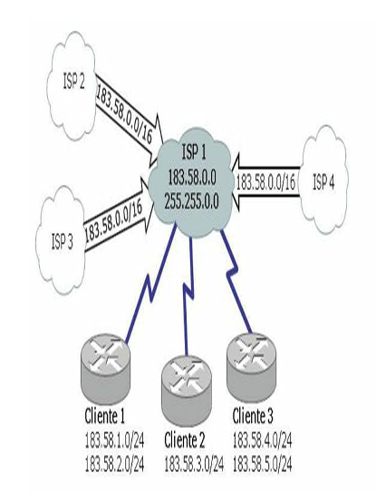
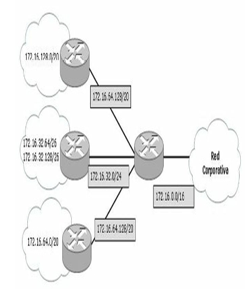
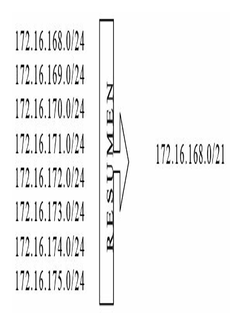
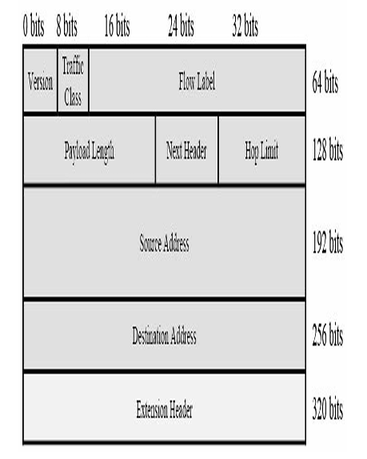
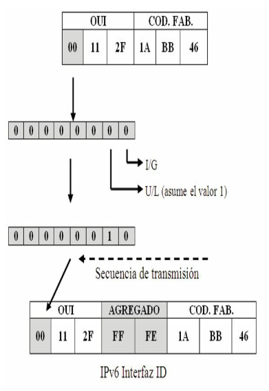
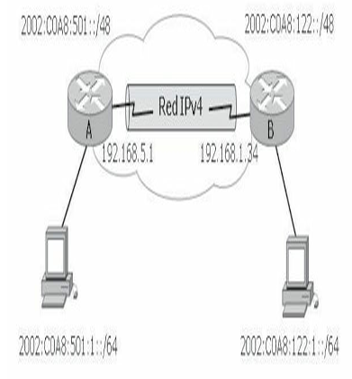

# Direccionamiento IP

## Números binarios

Los dispositivos emiten y reciben pulsos eléctricos o luminosos. Estos pulsos poseen dos estados, SÍ y NO. Este sistema de dos signos se le llama binario.

Matemáticamente hablando un sistema binario está compuesto por dos estados de unos y ceros siendo, por tanto, una potencia en base 2. En informática se llama bits a la unidad que tiene también dos estados; un byte es un grupo de ocho bits.

Un octeto o un byte se expresa de la siguiente manera: `00000000`

Cada uno de estos bits que componen el octeto posee dos estados, 1 y 0, obteniendo, por tanto, 256 estados con todas las combinaciones posibles.

```text
00000000 = 0
00000001 = 1
00000010 = 2
00000011 = 3
00000100 = 4
00000101 = 5
00000110 = 6
...........
11111110 = 254
11111111 = 255
```

Para que estos bits sean más entendibles conviene trasladarlos al modo decimal al que se está más acostumbrado cotidianamente, por tanto, si son potencias de 2, su valor será:

| 2⁷ | 2⁶ | 2⁵ | 2⁴ | 2³ | 2² | 2¹ | 2⁰ |
| --- | --- | --- | --- | --- | --- | --- | --- |
| 128 | 64 | 32 | 16 | 8 | 4 | 2 | 1 |

Los bits que resulten iguales a 1 tendrán el valor correspondiente a esa potencia, mientras que los que permanezcan en 0 tendrán un valor igual a cero, finalmente se suma el conjunto de los decimales resultantes y se obtiene el equivalente en decimal.

### Conversión de binario a decimal

Para pasar de binario a decimal es posible utilizar la siguiente técnica:

- `0000001` (en binario) = `0×2⁰` (en decimal) = **1**
    - En el octeto: 0+0+0+0+0+0+0+1
- `01001001` (en binario) = `0×2⁷ + 1×2⁶ + 0×2⁵ + 0×2⁴ + 1×2³ + 0×2² + 0×2¹ + 1×2⁰` (en decimal) = **73**
    - En el octeto: 0+64+0+0+8+0+0+1

| | 8º | 7º | 6º | 5º | 4º | 3º | 2º | 1º |
| --- | --- | --- | --- | --- | --- | --- | --- | --- |
| **Dígito binario** | 0 | 1 | 0 | 0 | 1 | 0 | 0 | 1 |
| **Potencia de dos** | 2⁷ | 2⁶ | 2⁵ | 2⁴ | 2³ | 2² | 2¹ | 2⁰ |
| **Valor decimal** | 128 | 64 | 32 | 16 | 8 | 4 | 2 | 1 |

### Conversión de decimal a binario

Para pasar de decimal a binario es posible utilizar la siguiente técnica, por ejemplo: **Convertir a binario el número decimal 195**.

| Valor binario | Acción | Resta | Resultado |
| --- | --- | --- | --- |
| 128 | ¿Entra en 195? | 195-128 | Sí = 67 |
| 64 | ¿Entra en 67? | 67-64 | Sí = 3 |
| 32 | ¿Entra en 3? | 3-32 | No, siguiente |
| 16 | ¿Entra en 3? | 3-16 | No, siguiente |
| 8 | ¿Entra en 3? | 3-8 | No, siguiente |
| 4 | ¿Entra en 3? | 3-4 | No, siguiente |
| 2 | ¿Entra en 3? | 3-2 | Sí = 1 |
| 1 | ¿Entra en 1? | 1-1 | Sí = 1 |

Donde los SÍ equivalen al valor binario 1 y los NO al valor binario 0.

Por lo tanto, **195 es equivalente en binario a 11000011**.

## Números hexadecimales

Los números hexadecimales se basan en potencias de 16, utilizando símbolos alfanuméricos, la siguiente tabla le ayudará a convertir números hexadecimales en binarios o en decimales:

| Número decimal | Número hexadecimal | Número binario |
| --- | --- | --- |
| 0 | 0 | 0000 |
| 1 | 1 | 0001 |
| 2 | 2 | 0010 |
| 3 | 3 | 0011 |
| 4 | 4 | 0100 |
| 5 | 5 | 0101 |
| 6 | 6 | 0110 |
| 7 | 7 | 0111 |
| 8 | 8 | 1000 |
| 9 | 9 | 1001 |
| 10 | A | 1010 |
| 11 | B | 1011 |
| 12 | C | 1100 |
| 13 | D | 1101 |
| 14 | E | 1110 |
| 15 | F | 1111 |

### Conversión de números hexadecimales

Siguiendo el ejemplo anterior, el número **195** es igual al número binario:

```text
11000011
```

1. Divida este octeto en dos grupos de cuatro: `1100 0011`
2. Busque el valor correspondiente en la tabla de estos dos grupos de bits.
3. Al número binario 1100 le corresponde el número hexadecimal **C**.
4. Al número binario 0011 le corresponde el número hexadecimal **3**.

Por lo tanto, 195 es igual a 11000011 en binario y al C3 en hexadecimal. Para que no existan confusiones los números hexadecimales se identifican con un `0x` delante, en este caso `0xC3`.

El proceso inverso será, por ejemplo, el número hexadecimal `0xAE` donde:

- A es igual a 1010
- E es igual a 1110

Por lo tanto, `0xAE` es igual al número binario `10101110`. Si se convierte este número a decimal:

```text
2⁷+0+2⁵+0+2³+2²+2¹+0 = 174
```

!!! note "NOTA"
    Existen varias técnicas para hacer conversiones de un sistema numérico a otro; un matemático, un físico o un informático podrían utilizar diferentes métodos de conversión con iguales resultados. El estudiante podrá utilizar el método que crea más conveniente según su propio criterio.

## Direccionamiento IPv4

Para que dos dispositivos se comuniquen entre sí, es necesario poder identificarlos claramente. Una dirección IPv4 es una secuencia de unos y ceros de 32 bits. Para hacer más comprensible el direccionamiento, una dirección IP aparece escrita en forma de cuatro números decimales separados por puntos. La notación decimal punteada es un método más sencillo de comprender que el método binario de unos y ceros.

Esta notación decimal punteada también evita que se produzca una gran cantidad de errores por transposición, que sí se produciría si solo se utilizaran números binarios. El uso de decimales separados por puntos permite una mejor comprensión de los patrones numéricos.

Una dirección IPv4 consta de dos partes definidas por la llamada máscara de red. La máscara puede describirse a través de una notación decimal punteada o con el prefijo `/X`, donde X es igual a la cantidad de bits en 1 que contiene dicha máscara. Una parte identifica la red donde se conecta el sistema y la segunda identifica el sistema en particular de esa red. Este tipo de dirección recibe el nombre de dirección jerárquica porque contiene diferentes niveles.

Una dirección IPv4 combina estos dos identificadores en un solo número. Este número debe ser exclusivo, porque las direcciones repetidas harían imposible el enrutamiento. La primera parte identifica la dirección de la red del sistema. La segunda parte, la del host, identifica qué máquina en particular de la red.

**Ejemplo de una dirección IPv4**

- **Dirección IP:** 172.16.1.3 → `10101100.00010000.00000001.00000011`
- **Máscara:** 255.255.0.0 → `11111111.11111111.00000000.00000000`

| | Octeto 1 | Octeto 2 | Octeto 3 | Octeto 4 |
| --- | --- | --- | --- | --- |
| **Dirección IP** | 172 | 16 | 1 | 3 |
| **Máscara** | 255 | 255 | 0 | 0 |
| | **Porción de red** | | **Porción de host** | |

### Tipos de direcciones IPv4

Dentro del rango de direcciones de cada red IPv4, existen tres tipos de direcciones:

- **Dirección de red:** la dirección en la que se hace referencia a la red o subred.
- **Dirección de broadcast:** una dirección especial que se utiliza para enviar datos a todos los hosts de la red.
- **Direcciones host:** las direcciones asignadas a los dispositivos finales de la red.

### Tipos de comunicación IPv4

En una red IPv4, los hosts pueden comunicarse de tres maneras diferentes:

- **Unicast:** es el método por el cual se envía un paquete de un host individual a otro host individual. La comunicación unicast se usa para una comunicación normal de host a host, tanto en una red de cliente/servidor como en una red punto a punto. Los paquetes unicast utilizan la dirección host del dispositivo de destino como la dirección de destino y pueden enrutarse a través de una internetwork. El envío unicast está habilitado por defecto, es el más común de los tres tipos de direccionamiento, mientras que los paquetes broadcast y multicast usan direcciones especiales como dirección de destino. Al utilizar estas direcciones especiales, los broadcasts están generalmente restringidos a la red local.
- **Broadcast:** el método por el cual se envía un paquete de un host a todos los hosts de la red. Existe un direccionamiento particular cuando los bits de la dirección de host están todos en la llamada dirección de broadcast, o de difusión. Este direccionamiento identifica al host origen, mientras que como destino tiene a todos los dispositivos que integran el mismo dominio. Las NIC están programadas para escuchar todo el tráfico y de esa manera reconocer el que está destinado a la propia dirección local MAC o la dirección MAC de broadcast y, así, enviar las tramas a las capas superiores. Una cantidad excesiva de estas difusiones provocará una tormenta de broadcast que hará ineficiente el uso de la red, consumiendo gran cantidad de ancho de banda y haciendo que los hosts utilicen demasiados recursos al estar "obligados" a leer esos paquetes, ya que están dirigidos a todos los hosts que integran ese dominio de broadcast. Existen protocolos de enrutamiento que utilizan broadcasts para distribuir la información de enrutamiento. En lugar de requerir varios paquetes unicast simplemente se envía un paquete que alcanza a todos los dispositivos.
- **Multicast:** es el mecanismo por el cual se envía un paquete de un host a un grupo seleccionado de hosts. Un dispositivo IP se une a un grupo reconociendo una dirección IP de otro grupo y reprogramando su tarjeta de red (NIC) para copiar todo el tráfico destinado a la dirección MAC del grupo. Debido a que el tráfico multicast está dirigido a diferentes MAC algunos hosts prestarán atención mientras que otros lo ignorarán. El tráfico multicast generalmente es unidireccional, hay un origen que envía el tráfico a todos los destinos, mientras que éstos devuelven el tráfico de manera unicast. El tráfico multicast solamente es procesado por los hosts que están programados para recibirlo.

Estos tres tipos de comunicación se usan con diferentes objetivos en las redes de datos. En los tres casos, se coloca la dirección IPv4 del host de origen en el encabezado del paquete como la dirección de origen.

!!! note "NOTA"
    Para esta certificación, todas las comunicaciones entre dispositivos son comunicaciones unicast a menos que se indique lo contrario.

## Clases de direcciones IPv4

La RFC1700 agrupa rangos de direcciones unicast en tamaños específicos llamados direcciones de clase. Las direcciones IPv4 se dividen en clases para definir las redes de tamaño pequeño, mediano y grande. Las direcciones Clase A se asignan a las redes de mayor tamaño. Las direcciones Clase B se utilizan para las redes de tamaño medio y las de Clase C para redes pequeñas. Dentro de cada rango existen direcciones llamadas privadas para uso interno que no veremos en Internet. Las direcciones de clase D son de uso multicast y las de clase E, experimentales.

| Clase | Rango de direcciones IP | Máscara de red | Direcciones privadas / Uso |
| --- | --- | --- | --- |
| **A** | 1.0.0.0 a 127.0.0.0 | 255.0.0.0 o /8 | 10.0.0.0 a 10.255.255.255 |
| **B** | 128.0.0.0 a 191.255.0.0 | 255.255.0.0 o /16 | 172.16.0.0 a 172.31.255.255 |
| **C** | 192.0.0.0 a 223.255.255.0 | 255.255.255.0 o /24 | 192.168.0.0 a 192.168.255.255 |
| **D** | 224.0.0.0 a 239.255.255.255 | — | Uso multicast o multidifusión |
| **E** | 240.0.0.0 a 254.255.255.255 | — | Uso experimental o científico |

**En números binarios:**

- Las clases A comienzan con `00xxxxxx`
- Las clases B comienzan con `10xxxxxx`
- Las clases C comienzan con `11xxxxxx`
- Las clases D comienzan con `111xxxxx`
- Las clases E comienzan con `1111xxxx`

### Direcciones reservadas IPv4

Hay determinadas direcciones que no pueden asignarse a los hosts por varios motivos. También hay direcciones especiales que pueden asignarse a los hosts pero con restricciones en la interacción de dichos hosts dentro de la red.

- **Direcciones de red y de broadcast:** no es posible asignar la primera ni la última dirección a los hosts dentro de cada red. Éstas son, respectivamente, la dirección de red y la dirección de broadcast del rango de host.
- **Ruta predeterminada:** la ruta predeterminada IPv4 se representa como `0.0.0.0`. La ruta predeterminada se usa como ruta por defecto cuando no se dispone de una ruta más específica. El uso de esta dirección también reserva todas las direcciones en el bloque de direcciones 0.0.0.0 al 0.255.255.255 (0.0.0.0/8).
- **Loopback:** es una de las direcciones reservadas IPv4. La dirección de loopback `127.0.0.1` es una dirección especial que los hosts utilizan para dirigir el tráfico hacia ellos mismos. La dirección de loopback crea un método de acceso directo para las aplicaciones y servicios TCP/IP que se ejecutan en el mismo dispositivo para comunicarse entre sí. Al utilizar la dirección de loopback en lugar de la dirección host IPv4 asignada, dos servicios en el mismo host pueden desviar las capas inferiores de la pila TCP/IP. También es posible hacer ping a la dirección de loopback para probar la configuración de TCP/IP en el host local.
- **Direcciones link-local:** las direcciones IPv4 del bloque de direcciones desde 169.254.0.0 hasta 169.254.255.255 (169.254.0.0/16) se encuentran designadas como direcciones link-local. El sistema operativo puede asignar automáticamente estas direcciones al host local en entornos donde no se dispone de una configuración IP. Se puede usar en una red de punto a punto o para un host que no pudo obtener automáticamente una dirección de un servidor de protocolo de configuración dinámica de host (DHCP).

### Subredes

Las redes IPv4 se pueden dividir en redes más pequeñas, para el mayor aprovechamiento de las mismas, son las llamadas subredes, además de contar con esta flexibilidad, la división en subredes permite que el administrador de la red brinde contención de broadcast y seguridad de bajo nivel en la LAN.

La división en subredes, además, ofrece seguridad ya que el acceso a las otras subredes está disponible solamente a través de los servicios de un router. Las clases de direcciones IP disponen de 256 a 16,8 millones de hosts según su clase.

El proceso de creación de subredes comienza pidiendo "prestado" al rango de host la cantidad de bits necesaria para la cantidad de subredes requeridas. Se debe tener especial cuidado en esta acción de pedir ya que deben quedar como mínimo dos bits del rango de host.

La máxima cantidad de bits disponibles para este propósito depende del tipo de clase:

| Clase | Cantidad disponible de bits |
| --- | --- |
| Clase A | 22 bits |
| Clase B | 14 bits |
| Clase C | 6 bits |

Cada bit que se toma del rango de host posee dos estados, 0 y 1, por lo tanto, si se toman tres bits existirán 8 estados diferentes:

| Bits prestados | Bits de host | Valor decimal |
| --- | --- | --- |
| `000` | `00000` | 0 |
| `001` | `00000` | 32 |
| `010` | `00000` | 64 |
| `011` | `00000` | 96 |
| `100` | `00000` | 128 |
| `101` | `00000` | 160 |
| `110` | `00000` | 192 |
| `111` | `00000` | 224 |

El número de subredes que se puede usar es igual a: **2 elevado a la potencia del número de bits asignados a subred**.

```text
2^N = Número de subredes
```

Donde N es la cantidad de bits tomados al rango de host.

Por lo tanto, si se quieren crear 5 subredes, es decir, cumpliendo la fórmula 2^N, tendrá que tomar del rango de host 3 bits:

```text
2³ = 8
```

Observe que no siempre el resultado es exacto, en este caso se pedían 5 subredes pero se obtendrán 8.

#### Procedimiento para la creación de subredes

1. **Piense en binarios.**
2. **Encuentre la máscara adecuada** para la cantidad de subredes que le solicitan, independientemente de la dirección IP, lo que nos importa es la cantidad de bits libres.

    Razone, por ejemplo red clase C, el primer octeto, el segundo y el tercero corresponden a la dirección de red, por lo tanto, trabaje con el cuarto octeto correspondiente a los hosts. De izquierda a derecha tome la cantidad de bits necesarios de la máscara para la cantidad de subredes que le solicitan.

    Crear 10 subredes a partir de una red Clase C. Recuerde que no siempre los valores son exactos, en este caso el resultado será 16. Según la formula 2^N debemos tomar 4 bits del rango de host, por lo tanto:

    ```text
    2⁴ = 16
    ```

    | | Rango de red | Rango de host |
    | --- | --- | --- |
    | Máscara de red 255.255.255.0 | `11111111.11111111.11111111.00000000` | |
    | Cuarto octeto | `00000000` | `11110000` |

    Coloque en 1 (uno) los bits que resultaron de la operación anterior y súmelos, recuerde el valor de cada bit dentro del octeto: 128, 64, 32, 16, 8, 4, 2, 1

    Se obtiene: `11110000` → 128+64+32+16+0+0+0+0 = **240**

    La máscara de subred de clase C para obtener 10 subredes válidas es: **255.255.255.240**

3. **Identifique las correspondientes direcciones IP de las subredes** restando a 256, que es la cantidad máxima de combinaciones que tiene un octeto (0 a 255), el valor de la máscara obtenida. Este número será la dirección de la primera subred que a su vez es el incremento o la constante para determinar las siguientes subredes.

    ```text
    256-240 = 16
    ```

    El resultado indica la primera dirección de subred, en este caso 16.

    | Nº de subred | Valor del octeto | Incremento | Valor decimal |
    | --- | --- | --- | --- |
    | 1º | `00000000` | 0 | 0 |
    | 2º | `00010000` | 0+16 | 16 |
    | 3º | `00100000` | 16+16 | 32 |
    | 4º | `00110000` | 32+16 | 48 |
    | 5º | `01000000` | 48+16 | 64 |
    | 6º | `01010000` | 64+16 | 80 |
    | 7º | `01100000` | 80+16 | 96 |
    | 8º | `01110000` | 96+16 | 112 |
    | 9º | `10000000` | 112+16 | 128 |
    | 10º | `10010000` | 128+16 | 144 |
    | 11º | `10100000` | 144+16 | 160 |
    | 12º | `10110000` | 160+16 | 176 |
    | 13º | `11000000` | 176+16 | 192 |
    | 14º | `11010000` | 176+16 | 208 |
    | 15º | `11100000` | 208+16 | 224 |
    | 16º | `11110000` | 224+16 | 240 |

    El incremento constante en este caso será de **16**.

4. **Obtenga las direcciones IP de las subredes** (observe el cuadro anterior).

    **Dirección IP de la red original:** 192.168.1.0 255.255.255.0

    | Subred | Dirección IP | Máscara |
    | --- | --- | --- |
    | 1ª | 192.168.1.0 | 255.255.255.240 |
    | 2ª | 192.168.1.16 | 255.255.255.240 |
    | 3ª | 192.168.1.32 | 255.255.255.240 |
    | 4ª | 192.168.1.48 | 255.255.255.240 |
    | … | ……………………………………… | |
    | 15ª | 192.168.1.224 | 255.255.255.240 |
    | 16ª | 192.168.1.240 | 255.255.255.240 |

    Otra forma de identificar las máscaras es sumar los bits en uno y colocarlos detrás de la dirección IP separados por una barra:

    | Subred | Dirección IP | Prefijo |
    | --- | --- | --- |
    | Red original | 192.168.1.0 | /24 |
    | 1ª subred | 192.168.1.0 | /28 |
    | 2ª subred | 192.168.1.16 | /28 |
    | 3ª subred | 192.168.1.32 | /28 |
    | 4ª subred | 192.168.1.48 | /28 |
    | … | ……………………………………… | |
    | 15ª subred | 192.168.1.224 | /28 |
    | 14ª subred | 192.168.1.240 | /28 |

5. **Identifique el rango de host que integran las subredes.** Hasta ahora se ha trabajado con los bits del rango de red, es decir de izquierda a derecha en el octeto correspondiente, ahora lo haremos con los bits restantes del rango de host, es decir de derecha a izquierda.

    Tomemos como ejemplo la subred 196.168.1.16/28 y apliquemos la fórmula 2^N - 2, nos han quedado 4 bits libres, por lo tanto:

    ```text
    2⁴-2 = 16-2 = 14
    ```

    Estas subredes tendrán 14 host válidos utilizables en cada una.

    | Nº de host | Valor del octeto | | |
    | --- | --- | --- | --- |
    | | `00010000` | Subred 16 | |
    | 1º | `00010001` | Host 17 | |
    | 2º | `00010010` | Host 18 | |
    | 3º | `00010011` | Host 19 | |
    | 4º | `00010100` | Host 20 | |
    | 5º | `00010101` | Host 21 | |
    | 6º | `00010110` | Host 22 | |
    | 7º | `00010111` | Host 23 | |
    | 8º | `00011000` | Host 24 | |
    | 9º | `00011001` | Host 25 | |
    | 10º | `00011010` | Host 26 | |
    | 11º | `00011011` | Host 27 | |
    | 12º | `00011100` | Host 28 | |
    | 13º | `00011101` | Host 29 | |
    | 14º | `00011110` | Host 30 | |
    | 15º | `00011111` | Broadcast | 31 |

    El rango de host válido para la subred 192.168.1.16/28 será: **192.168.1.17 al 192.168.1.30**

    El mismo procedimiento se lleva a cabo con el resto de las subredes:

    | Nº de subred | Rango de host válidos | Broadcast |
    | --- | --- | --- |
    | 192.168.1.0 | 1 al 14 | 15 |
    | 192.168.1.16 | 17 al 30 | 31 |
    | 192.168.1.32 | 31 al 62 | 63 |
    | 192.168.1.64 | 65 al 78 | 79 |
    | 192.168.1.80 | 81 al 94 | 95 |
    | 192.168.1.96 | 97 al 110 | 111 |
    | 192.168.1.112 | 113 al 126 | 127 |
    | 192.168.1.128 | 129 al 142 | 143 |
    | 192.168.1.144 | 145 al 158 | 159 |
    | 192.168.1.160 | 161 al 174 | 175 |
    | 192.168.1.176 | 177 al 190 | 191 |
    | 192.168.1.192 | 193 al 206 | 207 |
    | 192.168.1.208 | 209 al 222 | 223 |
    | 192.168.1.224 | 225 al 238 | 239 |
    | 192.168.1.240 | 241 al 254 | 255 |

!!! tip "RECUERDE"
    - **Paso 1.** Piense en binarios.
    - **Paso 2.** Encuentre la máscara contando de izquierda a derecha los bits que tomará prestados del rango de host. Cada uno tendrá dos estados, un bit dos subredes, dos bits cuatro subredes, tres bits ocho subredes, etc.
    - **Paso 3.** Reste a 256 la suma de los bits que ha tomado en el paso anterior para obtener el incremento para las siguientes subredes.
    - **Paso 4.** Obtenga las direcciones IP de las subredes siguientes sumando a la "subred 0" el incremento para obtener la siguiente y así hasta la última.
    - **Paso 5.** Identifique el rango de host y la correspondiente dirección de broadcast de cada subred.

!!! tip "RECUERDE"

    | Clase | Red | | | Host | | | Máscara de red | | | |
    | --- | --- | --- | --- | --- | --- | --- | --- | --- | --- | --- |
    | **A** | 10 | 0 | 0 | 0 | 255 | 0 | 0 | 0 | | |
    | **B** | 172 | 16 | 0 | 0 | 255 | 255 | 0 | 0 | | |
    | **C** | 192 | 168 | 0 | 0 | 255 | 255 | 255 | 0 | | |

!!! tip "RECUERDE"
    Las diferentes clases de redes se pueden identificar fácilmente en números binarios observando el comienzo del primer octeto, puesto que:

    - Las clases A comienzan con `00xxxxxx`
    - Las clases B comienzan con `10xxxxxx`
    - Las clases C comienzan con `11xxxxxx`
    - Las clases D comienzan con `111xxxxx`
    - Las clases E comienzan con `1111xxxx`

!!! note "NOTA"
    La dirección de broadcast de una subred será la inmediatamente inferior a la subred siguiente. La máscara con todos los bits en 1 se denomina máscara de host e identifica un host en particular. Por lo tanto, para IPv4 podría ser /32 o para IPv6 que podría ser /128.

## Escalabilidad del direccionamiento IPv4

Una de las razones de que el direccionamiento IPv4 sea demasiado escaso es que no ha sido asignado eficientemente. Las direcciones de clase A son excesivamente grandes para la mayoría de las organizaciones ya que soportan unas 16.777.214 direcciones de host, mientras que las direcciones de clase C soportan solo 254 direcciones de host. Como resultado de esto muchas organizaciones hacen peticiones de clase B que soportan 65.534 direcciones de host, pero hacen solo un uso parcial de dicho rango.

Inicialmente un dispositivo IP requería una dirección pública. Para prevenir el agotamiento de las direcciones IPv4 la IETF (*Internet Engineering Task Force*) adoptó el uso de CIDR (*Classless Interdomain Routing*), VLSM (*Variable-Length Subnet Mask*) y NAT (*Network Address Translation*).

CIDR y VLSM trabajan juntas a la hora de mejorar el direccionamiento, mientras que NAT oculta clientes y minimiza la necesidad de direcciones públicas. Otra de las razones de escasez de direcciones públicas es que no han sido asignadas equitativamente a lo largo del mundo.

### Máscaras de subred de longitud variable

El crecimiento exponencial de las redes ha hecho que el direccionamiento IPv4 no permita un desarrollo y una escalabilidad acorde a lo deseado por los administradores de red. IPv4 pronto será reemplazado por IP versión 6 (IPv6) como protocolo dominante de Internet. IPv6 posee un espacio de direccionamiento prácticamente ilimitado y algunos administradores ya han empezado a implementarlo en sus redes. Para dar soporte al direccionamiento IPv4 se ha creado VLSM (*Variable Length Subnet Masking*) que permite incluir más de una máscara de subred dentro de una misma dirección de red. VLSM es soportado únicamente por protocolos sin clase tales como OSPF, RIPv2 y EIGRP.

El uso de las máscaras de subred de longitud variable permite el uso más eficaz del direccionamiento IP. Al permitir niveles de jerarquía se pueden resumir diferentes direcciones en una sola, evitando gran cantidad de actualizaciones de ruta.

Por ejemplo, la red 192.168.1.0/24 debe dividirse en subredes utilizando una máscara de subred de 28 bits. Hasta ahora la primera subred utilizable era la 192.168.1.16/28; configurando el router con el comando `ip subnet-zero` la dirección IP 192.168.1.0/28 será una dirección válida pudiendo sumar 14 host válidos más al direccionamiento total.

Siguiendo el esquema de direccionamiento anterior una de las subredes que surgen de la división se utilizará para un enlace serial entre dos routers. En este caso la máscara de 28 bits permite el uso válido de 14 host desperdiciándose 12 direcciones de host para este enlace. El uso de VLSM permite volver a dividir más subredes en otra subred, en este caso la máscara ideal sería una /30.

Por lo tanto, la red 192.168.1.0/24 será dividida en 16 subredes, se obtienen las siguientes direcciones:

```text
192.168.1.0/28
192.168.1.16/28
192.168.1.32/28
192.168.1.48/28
192.168.1.64/28
192.168.1.80/28
192.168.1.96/28
192.168.1.112/28
192.168.1.128/28
192.168.1.144/28
192.168.1.160/28
192.168.1.176/28
192.168.1.192/28
192.168.1.208/28
192.168.1.224/28
192.168.1.240/28
```

Observe que se tomará en cuenta la 192.168.1.0 al configurar el comando `ip subnet-zero`.

Para el enlace serial entre los routers se utilizará una máscara que permita el uso de dos hosts (/30). Elija una de las subredes creadas en el paso anterior, esta subred elegida **NO** podrá utilizarse con la máscara /28 puesto que se seguirá dividiendo en subredes más pequeñas.

1. Piense en binario.
2. La red 192.168.1.0/24 se divide en subredes con una máscara /28, escriba en binario el último octeto.
3. Elija una de las subredes para dividirla con una máscara /30, en este caso la 128. Trace una línea que separe los bits con la máscara /28 y otra que separe los bits con máscara /30. Las subredes se obtienen haciendo las combinaciones correspondientes entre el primer bit (128) y los contenidos entre las dos paralelas.
4. Las direcciones de host se obtienen haciendo la combinación con los dos bits libres en cada una de las subredes obtenidas.

**Ejemplo con una red Clase B:**

La red 172.16.0.0/16 se debe dividir en redes más pequeñas:

- La red 172.16.0.0/16 se divide utilizando una máscara `/21`:
    172.16.0.0/21, 172.16.8.0/21, 172.16.16.0/21, 172.16.24.0/21, etc. Para seguir el proceso elija una, por ejemplo `172.16.8.0/21`.
- 172.16.8.0/21 se divide en subredes con una máscara `/24`:
    172.16.8.0/24, 172.16.9.0/24, 172.16.10.0/24, etc. Para seguir el proceso elija una, por ejemplo `172.16.10.0/24`.
- 172.16.10.0/24 se divide en subredes con una máscara `/26`:
    172.16.10.0/26, 172.16.10.64/26, 172.16.10.128/26, 172.16.10.192/26, etc. Para seguir el proceso elija por ejemplo la `172.16.10.128/26`.
- 172.16.10.128/26 se divide en subredes con una máscara `/30`:
    172.16.10.128/30, 172.16.10.132/30, 172.16.10.136/30, etc. Para seguir el proceso elija una, por ejemplo `172.16.10.132/30`, en este caso las direcciones de host serán la 172.16.10.133/30 y la 172.16.10.134/30.

El rango de red/subred se va ampliando mientras el rango de host disminuye a medida que se siguen dividiendo en más subredes.

### Enrutamiento entre dominios sin clase

El CIDR (*Classless Inter-Domain Routing*) definido en la RFC 4632 consiste en la capacidad de un router para utilizar protocolos que no consideran las clases como los límites naturales de las subredes. En otras palabras, CIDR significa que un protocolo de enrutamiento tiene en cuenta el direccionamiento VLSM en sus actualizaciones de enrutamiento y puede enviar actualizaciones incluyendo las máscaras de subred. El objetivo de CIDR es permitir un esquema de sumarización flexible, en especial para los routers de backbone de Internet cuya tabla de enrutamiento es tan grande que están llegando a su límite antes de tiempo.

En CIDR, una red IP se representa mediante un prefijo, es decir una dirección IP y alguna indicación de la longitud de la máscara. Longitud significa el número de bits de la máscara más a la izquierda contiguos que se establecen a uno. Por ejemplo la red 172.16.0.0 255.255.0.0 se puede representar como la 172.16.0.0/16. CIDR también representa una arquitectura más jerárquica de Internet, donde cada dominio obtiene sus direcciones IP a partir de un nivel superior, de tal forma que el resumen de las rutas ocurra en dicho nivel superior.

Por ejemplo, si un ISP (*Internet Service Provider*) es propietario de la red 183.58.0.0/16, podrá otorgar las subredes 183.58.1.0/24, 183.58.2.0/24, y así sucesivamente para los clientes. Sin embargo, otros proveedores cuando intenten llegar a estas subredes solo lo harán a través de la 183.58.0.0/16. 



Los ISP 2, ISP 3 y ISP 4 solo tienen conocimiento de la red 183.58.0.0/16 a través del ISP 1, de tal forma de no sobrecargar sus tablas de enrutamiento.

### Resumen de ruta

El resumen de ruta, o sumarización, reduce la cantidad de rutas que un router debe mantener en sus tablas anunciando y manteniendo una sola dirección que contenga a las demás.

Este es el proceso que utiliza un router a través de un protocolo de enrutamiento para enviar actualizaciones de enrutamiento en las que una dirección de red representa la conectividad con varias redes que tienen un prefijo común. El principio básico de funcionamiento es que si un router tiene detrás varias redes o subredes que tienen una porción de su parte de red igual entre sí, este router puede enviar en sus actualizaciones de enrutamiento hacia otros dispositivos con una sola dirección de red para todas las redes que tienen el mismo prefijo, entonces esa dirección especial es la parte que tienen en común, como si fuera una sola subred con la máscara indicando la parte en común de las que tiene detrás suyo.



El router de resumen tiene múltiples entradas de redes consecutivas, siendo este el principal factor en el resumen de ruta, pero solo anunciará al router remoto la red que contiene a todas las demás.

La diferencia entre VLSM y la sumarización es para qué se utilizan y tienen en común la idea de que las máscaras variables hacen posible la sumarización y la sumarización es la base del enrutamiento sin clase.

Imagine que un router posee un rango de redes directamente conectadas, de la 172.16.168.0/24 a la 172.16.175.0/24. El router buscará el bit común más alto para determinar cuál será el resumen de ruta con la máscara más pequeña posible.



**En binarios:**

| Dirección de subred | Primer octeto | Segundo octeto | Tercer octeto | | Cuarto octeto |
| --- | --- | --- | --- | --- | --- |
| 172.16.168.0/24 | 10101100 | 00010000 | 10101 | 000 | 00000000 |
| 172.16.169.0/24 | 10101100 | 00010000 | 10101 | 001 | 00000000 |
| 172.16.170.0/24 | 10101100 | 00010000 | 10101 | 010 | 00000000 |
| 172.16.171.0/24 | 10101100 | 00010000 | 10101 | 011 | 00000000 |
| 172.16.172.0/24 | 10101100 | 00010000 | 10101 | 100 | 00000000 |
| 172.16.173.0/24 | 10101100 | 00010000 | 10101 | 101 | 00000000 |
| 172.16.174.0/24 | 10101100 | 00010000 | 10101 | 110 | 00000000 |
| 172.16.175.0/24 | 10101100 | 00010000 | 10101 | 111 | 00000000 |
| | | | **Bits comunes = 21** | | **Bits no comunes o de host** |

**Resumen: 172.16.168.0/21**

Por lo tanto, para el rango especificado el router utilizará la dirección 172.16.168.0/21 para el resumen de ruta solicitado.

!!! tip "RECUERDE"
    Cuando una dirección IP de destino en particular coincide con más de una ruta en una tabla de enrutamiento del router, el router utiliza la ruta más específica, es decir, la ruta con la longitud del prefijo más largo.

## Direccionamiento IPv6

IPv6 ha estado en desarrollo desde mediados de los 90 y durante varios años. Se había anunciado al principio como el protocolo que podría expandir el direccionamiento IP, llevar IP mobile a la madurez y finalmente ser capaz de incorporar seguridad a nivel de capa 3. Esas afirmaciones son correctas, pero hay que tener en cuenta que a nivel de capa 3 esas capacidades de IPv6 han sido aportadas a IPv4 en los pasados años. Actualmente las direcciones IPv4 son escasas y la mayor razón en Internet para evolucionar a IPv6 es la necesidad de un mayor direccionamiento.

Esta necesidad de direccionamiento IP podría ser atenuada intentando utilizar CIDR, VLSM, NAT y asignaciones temporales a través de DHCP, pero teniendo sistemas intermedios manipulando los paquetes complican el diseño y la resolución de problemas. El concepto del diseño de Internet con innumerables sistemas intermedios no hace que NAT trabaje adecuadamente, sin embargo, es un mal necesario.

La longitud de una dirección IPv6 es lo primero que sale a relucir, son 128 bits lo que hace 2¹²⁸ direcciones IPv6 disponibles. Varias de estas direcciones dan funciones especiales y están reservadas, pero aun así quedarían disponibles aproximadamente 5×10²⁸ direcciones IP por cada habitante del planeta. Lo que permitiría que el direccionamiento pueda crecer sin preocupaciones en contraposición al direccionamiento IPv4 cuya cantidad está limitada a 2³².

En IPv6 se utiliza una cabecera más simplificada que IPv4, haciendo que el procesamiento sea más eficiente, permitiendo un mecanismo más flexible y a su vez extensible a otras características. Una de esas características es la movilidad, *mobile IP* es un estándar de la IETF que permite a los usuarios con dispositivos wireless estar conectados de manera transparente y moverse a cualquier sitio sin restricciones.

La seguridad es otro tema importante añadido, IPsec está presente en cada uno de los dispositivos IPv6.

### Formato del direccionamiento IPv6

La primera diferencia respecto a IPv4 es que las direcciones IPv6 son de 128 bits y están representadas en un formato hexadecimal en lugar de la notación decimal tradicional y separada cada parte por dos puntos en lugar de uno. Teniendo de esta forma 8 partes de 16 bits cada una. Como cada dígito hexadecimal se asocia con 4 bits, cada campo de 16 bits será de 4 dígitos hexadecimales.

Un ejemplo de dirección IPv6 puede ser el siguiente:

```text
2001:0000:0001:0002:0000:0000:0000:ABCD
```

Este formato se puede reducir hasta de optimizar la lectura para su comprensión. Hay dos formas para conseguir simplificar tanta cantidad de números:

1. Todos los 0 a la izquierda de cada uno de los campos pueden ser omitidos.

    ```text
    2001:0:1:2:0:0:0:ABCD
    ```

2. Se pueden omitir los campos consecutivos de 0 con "::" independientemente de la cantidad de campos que se abrevie. Este mecanismo solo puede hacerse una vez debido a que luego no se podrían reestructurar la cantidad de campos exactamente como eran.

    ```text
    2001:0:1:2::ABCD
    ```

!!! note "NOTA"
    La dirección de loopback en IPv6, equivalente al prefijo 127/8 en IPv4, es la que todos los bits son cero excepto el último y se escribe de forma compacta como "::1".

### Prefijos

Los primeros 48 bits de una dirección IPv6 componen la dirección de red, dicho de otra forma, los primeros 3 grupos de la dirección (cada grupo es de 16 bits o 4 caracteres hexadecimales). Por lo general, los ISP de cada región asigna una dirección de red, la cual subdividirán entre todos sus clientes.

Los siguientes 16 bits, o el cuarto grupo de caracteres hexadecimales conforman la dirección de subred. Esto hace que IPv6 sea mucho más eficiente a nivel de comunicaciones, puesto que la dirección contiene la información de origen y destino sin necesidad de hacer cálculos para averiguarlo o tener que modificar la información transmitida.

La dirección única del dispositivo representa los últimos 64 bits de la dirección, o los últimos 4 grupos. Este es el identificador único del dispositivo. Algunos dispositivos utilizan la propia dirección física (MAC).

Es posible combinar el prefijo de red y el identificador de la interfaz en una sola notación. La representación de prefijos de red en IPv6 es similar a la notación utilizada en CIDR para los prefijos IPv4, es decir, dirección-IPv6/longitud-del-prefijo-en-bits.

Se permite el uso de formatos abreviados con "::"

```text
2001:0DB8:7654:3210:0000:0000:0000:0000/64
2001:DB8:7654:3210:0:0:0:0/64
2001:DB8:7654:3210::/64
```

Por lo tanto, esta dirección IPv6 indica que el prefijo de red está constituido por los primeros 64 bits.

No existen tienen reglas para la asignación de identificadores de subred (SID) dentro de un sitio. Se pueden utilizar varios métodos, como por ejemplo:

- **Enumerar de forma incremental las subredes:** 0001, 0002, ... Esta técnica es fácil de implementar en las redes experimentales, pero puede dar lugar a un esquema de direccionamiento plano, difícil de recordar.
- **Utilizar el número de VLAN.** Permite no tener que memorizar múltiples niveles de numeración.
- **Separar los tipos de redes y utilizar las cifras a la izquierda para designarlos.** Esta técnica facilita las reglas de filtrado, utilizando al mismo tiempo reglas adecuadas para la gestión de estas subredes en el segmento del lado derecho.

### Cabecera IPv6

La cabecera IPv6 es optimizada para procesadores de 32 a 64 bits y las extensiones de cabecera permiten la expansión sin tener que forzar a que los campos que no se usan se estén transmitiendo constantemente.

Las principales diferencias entre las cabeceras de las dos versiones es la longitud de los campos de origen y destino. También hay otros campos que son aparentes como *checksum*, fragmentación y la etiqueta de flujo.



Los campos en una cabecera IPv6 son los siguientes:

- **Version:** es un campo de 4 bits que identifica la versión, en este caso a 6.
- **Traffic Class:** similar al campo 2 de IPv4, se utiliza para calidad de servicio.
- **Flow Label:** campo de 20 bits que permite que el tráfico sea etiquetado para que se pueda manejar de manera más rápida flujo por flujo.
- **Payload Length:** campo de 16 bits con la longitud del campo de datos.
- **Next Header:** similar al campo de protocolo en la cabecera IPv4. Es un campo de 8 bits que indica cómo los campos después de la cabecera básica de IPv6 deberían ser interpretados. Podría indicar, por ejemplo, que el siguiente campo es TCP o UDP ambos relativos a la capa de transporte o podría indicar que existe una extensión de la cabecera.
- **Hop Limit:** similar al campo TTL en IPv4, es de 8 bits y se incrementa por cada router intermediario para prevenir bucles, de tal manera que cuando la cuenta llegue a 0 será descartado. Cuando esto ocurre se envía un mensaje de notificación al origen.
- **Source Address y Destination Address:** estos campos de 128 bits son las direcciones IPv6 de origen y de destino de los dispositivos que se están comunicando.
- **Extension Headers:** permite agregar más campos opcionales.
    - *Hop-by-Hop options:* utilizados para routers intermediarios.
    - *Destination options:* opciones para el nodo final.
    - *Routing:* utilizado para especificar a los routers intermedios qué ruta tienen que incluir. El efecto final es forzar el enrutamiento por un camino predefinido.
    - *Fragment:* utilizado para dividir los paquetes que son demasiado largos para la MTU. Esta cabecera reemplaza los campos de fragmentación de la cabecera IPv4.
    - *Authentication y Encapsulating Security Payload (ESP):* se utiliza por IPsec para proporcionar autenticación, integridad y confidencialidad de los paquetes. AH y ESP son idénticos en IPv4 y en IPv6.

## Tipos de direccionamiento IPv6

IPv6 reconoce tres tipos de direcciones: unicast, multicast y anycast. El tipo de la dirección define el destino de la comunicación, es decir, a cuántos receptores debe ser entregado el paquete.

El primero de estos tipos, la dirección *unicast*, identifica de manera única una interfaz. Un paquete enviado a ese tipo de dirección será entregado a la interfaz correspondiente. Entre las direcciones unicast, se pueden distinguir aquéllas que tienen una cobertura global, es decir, designan sin ambigüedad un destinatario sobre Internet, y las que tienen cobertura local. Estas últimas no pueden ser enrutadas sobre Internet. Es decir, un paquete que tenga una dirección destino con cobertura local, será ignorado y eliminado por un router de Internet.

Una dirección *multicast* designa a un grupo de interfaces que pertenecen, en general, a nodos distintos que pueden ubicarse en cualquier parte de Internet. Cuando un paquete tiene una dirección destino multicast, éste se envía por la red a todas las interfaces miembros de ese grupo.

Cabe resaltar que desaparecen las direcciones de broadcast (difusión) que existían en IPv4; éstas son remplazadas por direcciones tipo multicast. La dirección de difusión puede ser imitada por una dirección multicast constituyendo un grupo que incluya todos los nodos. La ausencia de direcciones de difusión evita los problemas de saturación en las redes locales conmutadas. Por este motivo una red IPv6 tiene un mejor desempeño sobre este tipo de redes.

El último tipo de dirección, *anycast*, se deriva de la oficialización de propuestas hechas para IPv4 (RFC 1546). Como en el caso multicast, una dirección de tipo anycast designa un grupo de interfaces. La principal diferencia consiste en que cuando un paquete tiene una dirección destino anycast, éste es enviado a alguno de los miembros del grupo, no a todos. El receptor del paquete podría ser, por ejemplo, el más cercano de acuerdo a la métrica de usada por los protocolos de enrutamiento. Este tipo de dirección es principalmente experimental.

### Global-Unicast

La escalabilidad de la red es sumamente importante, es directamente proporcional a la capacidad de sumarización que tiene la red. Tal como ocurre con IPv4 los bits más a la izquierda indican el prefijo de enrutamiento y pueden ser sumarizados. Teóricamente existen 2⁶⁴ prefijos IPv6. Si cada prefijo fuera almacenado en la memoria del router utilizando 256 bits (32 bytes), entonces la tabla de enrutamiento consumiría 5.9×10²⁰ bytes, lo cual es demasiado. Esto se reduce a la importancia que tiene la sumarización al momento de construir la tabla de enrutamiento.

La siguiente figura muestra un esquema de una dirección Global IPv6, definida por la RFC 3587:

| Global Prefix | Subnet ID | Interface ID |
| --- | --- | --- |
| /48 | /64 | /64 |

Los primeros 48 bits de la dirección Global IPv6 son utilizados para enrutamiento en Internet en el ISP, los siguientes 16 bits forman el *sub-net ID* permitiendo así a una empresa subdividir su red. Los restantes 64 bits son la interfaz ID en formato EUI-64.

IANA está asignando direcciones que comienzan con el valor binario 001 o en hexadecimal `2000::/3`. Este direccionamiento está designado para direcciones globales IPv6 unicast. Éste es una octava parte del espacio total del direccionamiento IPv6. IANA utiliza el rango `2001::/16` para registros, que normalmente tienen un rango /23 y asigna un rango /32 a los ISP.

Por ejemplo un ISP podría disponer a una organización de la siguiente dirección `2001:0:1AB::/48`. En una subred 5 el prefijo sería `2001:0:1AB:5::/64`. En un dispositivo con una MAC `00-0f-66-81-19-a3`, el formato EUI-64 de la interfaz ID será `020F:66FF:FE81:19A3`. Finalmente la dirección IPv6 completa será `2001:0:1AB:5:20F:66FF:FE81:19A3`.

### Link-Local

Las direcciones unicast de IPv6 locales (Link local) permiten a dispositivos que estén en la misma red local ser capaces de comunicarse sin necesidad de asignación de un direccionamiento global. Las direcciones locales son utilizadas para el enrutamiento y por los procesos de descubrimiento entre protocolos. Son auto-configuradas utilizando el prefijo `FE80::/10` más el formato EUI-64 ID:

| 10 bits | | 54 bits | 64 bits |
| --- | --- | --- | --- |
| `1111 1110 10` | 0 | | Interface ID |
| `FE80::/10` | | | |

Por ejemplo una MAC `00-0f-66-81-19-a3` tendrá una dirección IPv6 Local `FE80::020F:66FF:FE81:19A3`.

La RFC 4291 especifica otro tipo de dirección unicast. Las direcciones IPv4 son mapeadas a IPv6 concatenando la dirección `0::FFFF:0:0/96` con una determinada dirección IPv4. Por ejemplo la dirección 10.0.0.1 se convierte en `0::FFFF:A00:1`, debido a que 10.0.0.1 es en hexadecimal 0A00:0001. Estas direcciones pueden ser utilizadas por los hosts *dual-stack*, que son aquellos que utilizan ambos tipos de direccionamiento.

### Unique-Local

El RFC 4193 define un nuevo formato de dirección unicast: las direcciones locales únicas (ULA, *Unique Local Address*). Estas direcciones son para uso local. No están pensadas para ser enrutadas en Internet, sino dentro de un área acotada, como un sitio o un número limitado de sitios. Con un prefijo de 48 bits, pueden ser manipuladas como las direcciones globales, con un identificador de Subred (SID) de 16 bits y un identificador de interfaz (IID) de 64 bits.

Las direcciones locales únicas se crean utilizando un identificador global (Global ID) generado de forma pseudoaleatoria. Estas direcciones tienen el formato siguiente:

- **Prefix (7 bits):** `FC00::/7` prefijo para identificar las direcciones IPv6 locales (ULA).
- **L (1 bit):** puesto a 1, el prefijo es asignado localmente. El valor 0 está reservado para usos futuros.
- **Global ID (40 bits):** identificador global utilizado para la creación de un prefijo "único" (*Globally Unique Prefix*).
- **Subnet ID (16 bits):** identificador de subred al interior del sitio.
- **Interface ID (64 bits):** el identificador de interfaz, tal como está definido en Identificador de interfaz.

### Multicast

Una dirección de multicast identifica un grupo de interfaces. El tráfico enviado al grupo llega a todas estas interfaces. Éstas pueden a su vez pertenecer a varios grupos multicast simultáneamente. Cada interfaz puede reconocer varias direcciones de multicast incluyendo la dirección *all-nodes*, la dirección *solicited-nodes* o cualquier otra dirección a la que el nodo pertenezca. Los routers deben ser capaces de reconocer la dirección *all-routers*.

El formato de una dirección IPv6 de multicast se ilustra de la siguiente manera:

| 8 bits | 4 bits | 4 bits | 112 bits |
| --- | --- | --- | --- |
| `1111 1111` — `FF00::/8` | Flag | Scope | Group ID |

Como se muestra en la figura la dirección IPv6 multicast comienza con el prefijo `FF00::/8`, los siguientes 4 bits son identificadores que se describen a continuación:

1. El primer identificador o bandera es indefinido y siempre tiene el valor de cero.
2. Conocido como el bit "R" tiene el valor en binario de 1, cuando el RP esté contenido en el paquete multicast.
3. Conocido como el bit "P" lleva el valor binario 1 en el caso de que la dirección multicast esté basada en un prefijo unicast.
4. Es el llamado bit "T", si la dirección está asignada permanentemente lleva el valor 0, si por el contrario el valor es 1 la dirección es temporal.

Los 4 bits después de las banderas indican el ámbito de la dirección limitando cuán lejos esta dirección multicast es capaz de llegar. En IPv4 se utiliza el TTL para poder efectuar esta tarea pero no es un mecanismo exacto debido a que la distancia permitida por el TTL puede ser demasiado larga en una dirección y demasiado corta en otra. El ámbito en IPv6 es lo suficientemente flexible como para limitar multicast en un sitio o una empresa determinada.

Los ámbitos están definidos en hexadecimal y son los siguientes:

| Valor | Ámbito |
| --- | --- |
| 1 | Interfaz-local, usado para las interfaces loopback |
| 2 | Link-local, similar al ámbito unicast link-local |
| 4 | Admin-local; debe ser administrativamente configurado |
| 5 | Site-local; solo abarca un sitio |
| 8 | Organization-local; abarca varios sitios pertenecientes a múltiples sitios u organizaciones |
| E | Es de ámbito global |

El ID del grupo multicast son los 112 bits de menor ámbito de la dirección. Todos los dispositivos deberían reconocer y responder a estas direcciones multicast de todos los nodos:

- `FF01::1` correspondiente a la interfaz local.
- `FF02::1` correspondiente al enlace local.

Las direcciones de multicast *solicited-nodes* son utilizadas en los mensajes de solicitud de vecinos y son enviadas en un enlace local por un dispositivo que quiere determinar la dirección de la capa de enlace de otro dispositivo en el mismo enlace local. Este mecanismo se asemeja a ARP en IPv4. Una dirección de multicast solicited-nodes comienza con el prefijo `FF02::1:FF00:/104` y en los últimos 24 bits insertando las direcciones unicast o anycast del dispositivo.

Los routers deben poder responder a las direcciones multicast *all-router*:

- `FF01::2` es la dirección de interfaz local.
- `FF02::2` es la dirección de enlace local.
- `FF05::2` es la dirección del sitio local.

Los routers también se unen a otros grupos para soportar protocolos de enrutamiento como por ejemplo, OSPF versión 3 (OSPFv3) utiliza `FF02::5` y `FF02::6`, y RIPng (*Routing Information Protocol new generation*) utiliza `FF02::9`.

### Anycast

Una dirección de este tipo es una dirección global que está asignada a dos o más host. Los dispositivos enrutan hacia la dirección más cercana utilizando la métrica proporcionada por el protocolo de enrutamiento.

Las direcciones anycast son creadas asignando la misma dirección a más de un dispositivo. No existe un espacio de direccionamiento designado para anycast. Los dispositivos que emplearán este tipo de dirección deben ser explícitamente configurados y tiene que saber que la dirección es de anycast.

Todos los routers tienen que soportar la dirección anycast *subnet-router* para las subredes en las cuales tienen interfaces. Estas direcciones son las direcciones de unicast con la porción de la interfaz ID puestas en 0. Los paquetes enviados a la dirección de anycast subnet-router serán entregados a un router específico en la subred.

### EUI-64

Los ID de una dirección IPv6 son utilizados para identificar de manera única una interfaz, este segmento de la dirección es llamado porción de host. Estos ID deben ser únicos en los enlaces, tienen una longitud de 64 bits y pueden ser creados dinámicamente basándose en la dirección de la capa de enlace. El tipo de capa de enlace determinará cómo son dinámicamente creadas las interfaces de IPv6 y cómo funcionará la resolución del direccionamiento.

Para Ethernet la interfaz ID está basada en la dirección MAC de la interfaz en un formato llamado EUI-64 (*Extended Universal Identifier 64-bit*). Este formato deriva de la dirección MAC de 48 bits con el agregado de los números hexadecimales `FFFE` entre el OUI y el código de vendedor. El séptimo bit del primer byte del ID de la interfaz resultante corresponde al bit universal local (U/L) y asume el valor binario 1. Este bit indica si la interfaz ID es localmente única en ese enlace o universalmente única.

El octavo bit en el primer byte de la interfaz ID corresponde al *individual/group* (I/G) que se utiliza para gestionar grupos multicast, en este caso no varía.



Ethernet transmite los bits de bajo orden de cada byte primero (a la inversa). El bit U/L es el bit séptimo y el I/G es el octavo de la dirección, por lo tanto el primer bit de la dirección MAC transmitido será el bit I/G, usado por direcciones broadcast y multicast y el segundo bit transmitido será el U/L.

### Asignación de direcciones IPv6

Las direcciones IPv6 pueden ser asignadas de manera manual o de forma dinámica usando DHCPv6 o autoconfiguración *stateless*.

- **Manual:** el administrador es el encargado de asignarlas y configurarlas manualmente, supone más trabajo y demanda llevar un registro de las direcciones que han sido asignadas y a qué host.
- **SLAAC (*Stateless Address Autoconfiguration*):** cada router anuncia información de red incluyendo el prefijo asignado a cada una de sus interfaces. Con la información contenida en este anuncio los sistemas finales crean una dirección única al concatenar el prefijo con el ID en formato EUI-64 de la interfaz. El nombre *stateless* viene de que ningún dispositivo lleva un registro de las IP que se van asignando. Los sistemas finales piden información de red al router usando un mensaje específico denominado *Router Solicitation* y los routers responden con un mensaje *Router Advertisement*. Existe un proceso denominado DAD (*Duplicate Address Detection*), que se encarga de verificar que las IPs no estén en uso, no sean duplicadas.
- **DHCPv6:** se puede definir este método como autoconfiguración *stateful* y el funcionamiento es similar a DHCP tradicional, asignando direccionamiento a los hosts de un rango preconfigurado. Tiene una ventaja añadida y es que rompe la relación entre MAC e IP (capa 2 y 3) creada si se utiliza la autoconfiguración stateless, aumentando la seguridad.

## Transición de IPv4 a IPv6

Muchos de los actuales dispositivos de red requieren para su funcionalidad la utilización e implementación de IPv6. Sin embargo y por diferentes razones muchas empresas no pueden cambiar fácilmente de IPv4 a IPv6. Este proceso de migración puede llevar un largo período de cambios y transformaciones por lo que durante esta fase pueden coexistir ambas versiones de IP.

### Dual Stack

Con este mecanismo es posible ejecutar IPv4 e IPv6 a la vez sin comunicación entre ambas versiones. Los hosts y los routers llevan configuraciones de las dos versiones de IP y utilizan independientemente unas u otras según los recursos que quieran alcanzar. Si un recurso en concreto proporciona ambas versiones sería conveniente utilizar IPv6 para alcanzarlo.

Este mecanismo de dualidad permite a los servidores, clientes y aplicaciones moverse gradualmente hacia el nuevo protocolo provocando un mínimo impacto durante el proceso de transición a IPv6.

La mayor desventaja de esta tecnología, es que requiere que todo el equipamiento soporte ambos protocolos, lo cual no es la situación real.

### Túneles

El mecanismo que proporciona dual stack funciona correctamente siempre y cuando la infraestructura pueda soportar los dos protocolos, pero hay casos en los que los dispositivos sólo soportan IPv4, como por ejemplo en equipos de core. Hasta que estos equipos sean actualizados se debe utilizar otro tipo de técnica que pueda ejecutar IPv6 a través de IPv4.

Utilizando túneles los routers que están ejecutando a la vez IPv4 e IPv6 encapsularán el tráfico IPv6 dentro de paquetes IPv4. El origen de los paquetes IPv4 es el propio router local y el destino será el router en el extremo del túnel. Cuando el router destino recibe el paquete IPv4 lo desencapsula y hace un reenvío del tráfico IPv6 que estaba encapsulado.



En la actualidad, Internet es básicamente una red IPv4 con algunas islas IPv6; por lo tanto, lo más frecuente es que el tráfico IPv6 viaje encapsulado en paquetes IPv4.

Los siguientes son algunos de los tipos de túneles más comunes:

- **Configuración manual:** el túnel se crea manualmente, IPv6 es el protocolo pasajero siendo IPv4 el encargado de encapsular y transportar a IPv6.
- **6-to-4:** permite tráfico IPv6 sobre una red IPv4 sin la necesidad de configurar túneles de forma explícita, aunque se mantiene la función de encapsulamiento de IPv6 en IPv4. Los túneles 6-to-4 utilizan direcciones IPv6 que enlazan las direcciones `2002::/16` con la dirección IPv4 de 32 bits del router borde creando un prefijo de 48 bits.
- **Teredo:** encapsulan paquetes IPv6 en segmentos IPv4 UDP y trabajan de manera similar a los otros mecanismos anteriores con el agregado de poder atravesar redes que están utilizando NAT y firewall. La RFC 4380 describe el funcionamiento de este mecanismo.
- **ISATAP (*Intra-Site Automatic Tunnel Addressing Protocol*):** trata la red como una NBMA de IPv4 y permite a la red privada IPv4 implementar incrementalmente IPv6 sin actualizar la red. La RFC 4214 describe el funcionamiento de ISATAP.

### Traducción

El problema del mecanismo de túneles, ya sea manual o automático, es que termina siendo una solución del tipo dual stack. Los clientes IPv6 tienen que seguir soportando IPv4 para conectar con otros dispositivos IPv4. La traducción de direcciones es un tipo de solución diferente que permite a dispositivos IPv6 comunicarse con dispositivos IPv4 sin necesidad de dependencia dual stack.

Algunas de las técnicas de traducción más empleadas son:

- **SIIT (*Stateless IP/ICMP Translation*):** realiza traducción de encabezados IPv6 a IPv4 y viceversa.
- **NAT64:** mecanismo que permite a los hosts IPv6 comunicar con hosts IPv4. Puede implementarse en modo *stateless* según la RFC 6145 o *stateful* según la RFC 6146.
- **Stateless NAT64:** mecanismo de traslación de direcciones IPv6 a IPv4, pero garantizando correspondencia 1 a 1, en lugar de usar correspondencia 1 a muchos como en el NAT stateful.

Los dominios de enrutamiento IPv4 e IPv6 también pueden estar conectados a través de un Proxy usando ALG (*Application-Level Gateways*). Un Proxy intercepta tráfico y lo convierte al protocolo correspondiente. Un ALG independiente será necesario para soportar cada protocolo, de esta manera este método solo soluciona algunos problemas específicos de la traducción de direcciones.

## Fundamentos para el examen

- Practique la conversión de números decimales, binarios y hexadecimales.
- Memorice los rangos de cada una de las clases de redes, el direccionamiento reservado para uso privado.
- Ejercite el cálculo de subredes, VLMS y resúmenes de ruta.
- Tenga claro la diferencia entre VLMS, CIDR y resumen de ruta.
- Estudie el mecanismo de abreviatura de una dirección IPv6.
- Analice las diferencias fundamentales entre el direccionamiento IPv4 e IPv6 y los métodos de transición entre ellos.
- Recuerde cuales son los tipos de direcciones IPv6 y como se constituyen.
- Diferencie los distintos métodos de configuración de una dirección IPv6.
- Deduzca las diferencias entre IPv4 e IPv6, y cómo funcionan los mecanismos de transición.
- Fundamente este capítulo realizando la mayor cantidad posible de ejercidos de subredes hasta tener una idea clara de su funcionamiento.
