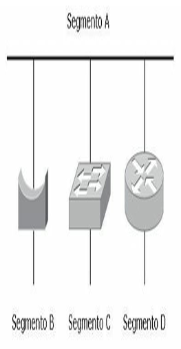
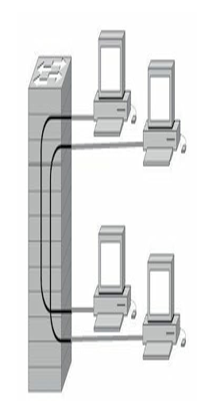
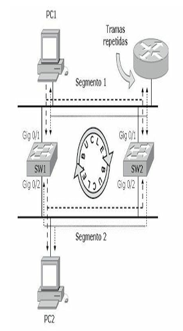
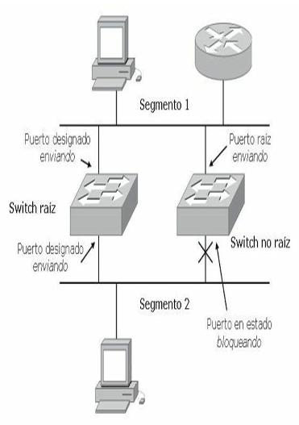
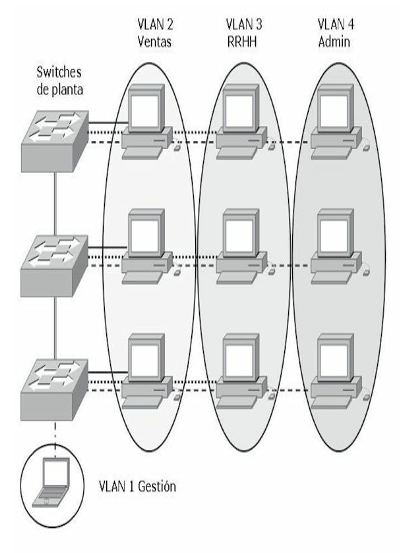
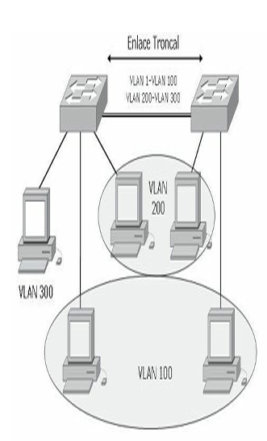
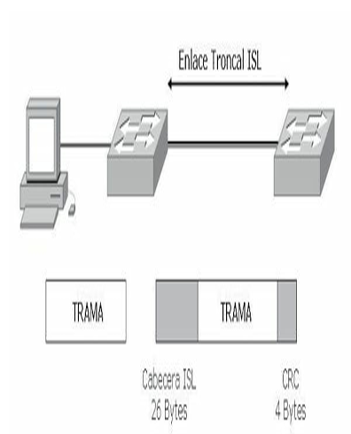
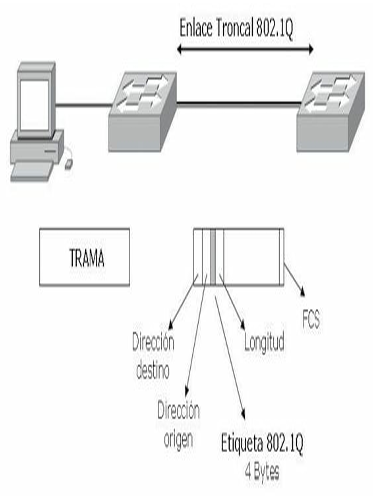
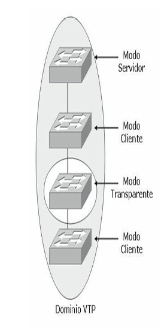

# Conmutación

## Conmutación de capa 2

Las redes ethernet pueden mejorar su desempeño a partir de la conmutación de tramas. La conmutación permite segmentar una LAN creando dominios de colisión con anchos de banda exclusivos para cada segmento pudiendo transmitir y recibir al mismo tiempo sin el retardo que provocarían las colisiones.

Al llegar una trama al puerto del switch, ésta se sitúa en una de las colas de entrada que contienen las tramas a reenviar con diferentes prioridades. El switch no solo tiene que saber dónde reenviar las tramas, sino cómo hacerlo tomando información a partir de las políticas de reenvío; estas decisiones las toma de forma simultánea utilizando diferentes partes del hardware involucrado en la decisión de switching.

El ancho de banda dedicado por puerto es llamado microsegmentación.

Los puentes, switches y routers son dispositivos que dividen las redes en segmentos:

- Los puentes trabajan a nivel de software generando alta latencia.
- Los routers utilizan gran cantidad de recursos.
- Los switches lo hacen a nivel de hardware siendo tan rápidos como el medio lo exija.



La conmutación permite:

- **Comunicaciones dedicadas entre dispositivos.** Los hosts poseen un dominio de colisión puro libre de colisiones, incrementando la rapidez de transmisión.
- **Múltiples conversaciones simultáneas.** Los hosts pueden establecer conversaciones simultáneas entre segmentos gracias a los circuitos virtuales proporcionados por los switch.
- **Comunicaciones full-duplex.** El ancho de banda dedicado por puerto permite transmitir y recibir a la vez, duplicando el ancho de banda teórico.
- **Adaptación a la velocidad del medio.** La conmutación creada por un switch funciona a nivel de hardware (ASIC), respondiendo tan rápidamente como el medio lo permita.

## Conmutación con switch

Un switch segmenta una red en dominios de colisión, tantos como puertos activos posea. Aprender direcciones, reenviar, filtrar paquetes y evitar bucles también son funciones de un switch.

El switch segmenta el tráfico de manera que los paquetes destinados a un dominio de colisión determinado no se propaguen a otro segmento aprendiendo las direcciones MAC de los hosts. A diferencia de un hub, un switch no inunda todos los puertos con las tramas. Por el contrario, el switch es selectivo con cada trama.

Debido a que los switches controlan el tráfico para múltiples segmentos al mismo tiempo, han de implementar memoria búfer para que puedan recibir y transmitir tramas independientemente en cada puerto o segmento.

Un switch nunca aprende direcciones de difusión o multidifusión, dado que las direcciones no aparecen en estos casos como dirección de origen de la trama. Una trama de broadcast será transmitida a todos los puertos a la vez.

### Tecnologías de conmutación

A partir del momento en que el switch toma la decisión de enviar la trama puede utilizar diferentes tipos de procesamientos internos para hacerlo.

- **Almacenamiento y envío:** el switch debe recibir la trama completa antes de enviarla por el puerto correspondiente. Lee la dirección MAC destino, comprueba el CRC (contador de redundancia cíclica, utilizado en las tramas para verificar errores de envío), aplica los filtrados correspondientes y retransmite. Si el CRC es incorrecto, se descarta la trama. El retraso de envío o latencia suele ser mayor debido a que el switch debe almacenar la trama completa, verificarla y posteriormente enviarla al segmento correspondiente.
- **Método de corte:** el switch verifica la dirección MAC de destino en cuanto recibe la cabecera de la trama, y comienza de inmediato a enviar la trama. La desventaja de este modo es que el switch podría retransmitir una trama de colisión o una trama con un valor de CRC incorrecto, pero la latencia es muy baja.
- **Libre de fragmentos:** modo de corte modificado, el switch lee los primeros 64 bytes antes de retransmitir la trama. Normalmente las colisiones tienen lugar en los primeros 64 bytes de una trama. El switch solo envía las tramas que están libres de colisiones.

Normalmente los terminales de trabajo utilizan enlaces a 100 Mbps, mientras que los enlaces ascendentes funcionan a 1 Gbps, sumado a la tecnología ASIC (*Application-Specific Integrated Circuits*), los switches de hoy en día utilizan típicamente el procesamiento de almacenamiento y envío, debido a que la latencia comparada con los otros dos métodos de conmutación es insignificante en estas velocidades.

### Aprendizaje de direcciones

Un switch crea circuitos virtuales entre segmentos, para ello debe identificar las direcciones MAC de destino, buscar en su tabla de direcciones MAC a qué puerto debe enviarla y ejecutar el envío. Cuando un switch se inicia no posee datos sobre los hosts conectados a sus puertos, por lo tanto, inunda todos los puertos esperando capturar la MAC correspondiente.

A medida que las tramas atraviesan el switch, este las comienza a almacenar en la memoria CAM (*Content-Addressable Memory*) asociándolas a un puerto de salida e indicando en cada entrada una marca horaria a fin de que pasado cierto tiempo sea eliminada preservando el espacio en memoria. Si un switch detecta que la trama pertenece al mismo segmento de donde proviene no la recibe evitando tráfico, si por el contrario el destino pertenece a otro segmento, solo enviará la trama al puerto correspondiente de salida. Si la trama fuera un broadcast, el switch inundará todos los puertos con dicha trama.



_Un switch crea circuitos virtuales mapeando la dirección MAC de destino con el puerto de
salida correspondiente_

La tabla CAM tiene un tamaño determinado que varía en función de cada equipo, pero en definitiva es de tamaño limitado y puede llenarse y provocar un desbordamiento. Para prevenir este desbordamiento de la CAM es muy útil reducir el tiempo de permanencia de las entradas en la tabla.

Existen casos particulares en los que la MAC no se aprenderá de forma dinámica, por ejemplo, un interfaz que solo reciba tráfico y que nunca envíe, en ese caso se podrá configurar la entrada en la CAM de forma manual.

**La siguiente captura muestra la tabla MAC de un switch:**

```text
switch#sh mac-address-table
Dynamic Address Count: 172
Secure Address Count: 0
Static Address (User-defined) Count: 0
System Self Address Count: 76
Total MAC addresses: 248
Maximum MAC addresses: 8192
Non-static Address Table:
Destination Address   Address Type   VLAN   Destination Port
-------------------   ------------   ----   --------------------
0000.0c07.ac01       Dynamic        12     GigabitEthernet0/1
0000.0c07.ac0b       Dynamic        11     GigabitEthernet0/1
0000.c0e5.b8d4       Dynamic        12     GigabitEthernet0/2
0001.9757.d29c       Dynamic        1      GigabitEthernet0/1
0001.9757.d29c       Dynamic        2      GigabitEthernet0/1
0001.9757.d29c       Dynamic        3      GigabitEthernet0/1
0001.9757.d29c       Dynamic        4      GigabitEthernet0/1
0001.9757.d29c       Dynamic        5      GigabitEthernet0/1
0001.9757.d29c       Dynamic        6      GigabitEthernet0/1
0001.9757.d29c       Dynamic        7      GigabitEthernet0/1
0001.9757.d29c       Dynamic        8      GigabitEthernet0/1
0001.9757.d29c       Dynamic        9      GigabitEthernet0/1
```

### Medios del switch

En el diseño de una red LAN, se debe tener en cuenta la longitud de cada tramo de cable y luego encontrar el mejor tipo de Ethernet y el tipo adecuado de cableado que soporte la longitud necesaria. En el capítulo 1 ya se ha hecho referencia a los medios y estándares de la capa física, las siguientes son tecnologías Ethernet aplicables a los puertos de switches Cisco:

- **Ethernet:** cuando comúnmente se habla de Ethernet se hace referencia a Ethernet basada en la norma de la IEEE 802.3, la cual describe Ethernet como un medio compartido que además es dominio de colisión y de difusión. En Ethernet dos estaciones no pueden transmitir simultáneamente y cuantas más estaciones existan en el segmento más probabilidad existe de colisión, esto solo ocurre en modo half-duplex, en el que una estación no es capaz de transmitir y recibir a la vez. Ethernet está basada en la tecnología CSMA/CD (*Carrier Sense Multiple Access Collision Detect*), que describe un modo de operación en sistemas de contienda o máximo esfuerzo.
- **Fast Ethernet:** definido en el estándar IEEE 802.3u, el cual declara un estándar que compartiendo la subcapa de acceso al medio (MAC) con IEEE 802.3 pueda transmitir a 100 Mbps. La diferencia con IEEE 802.3 consiste en la modificación del medio físico manteniendo la operación CSMA/CD y la subcapa MAC. La especificación Fast Ethernet dispone de compatibilidad con Ethernet tradicional, así que los puertos en el caso de 100BASE-T pueden ser 10/100, además de la velocidad es posible negociar el modo duplex de la transmisión. Los puertos pueden configurarse de forma automática o de manera manual para asegurar el modo de operación deseado. Los switches Cisco además permite en Fast Ethernet la agregación de puertos para conseguir mayor ancho de banda, esto se consigue mediante EtherChannel, el cual se tratará más adelante.
- **Gigabit Ethernet:** el estándar Gigabit Ethernet (IEEE 802.3z) es una mejora sobre Fast Ethernet que permite proporcionar velocidades de 1 Gbps, pero para conseguir este resultado fue necesario utilizar el estándar ANSI X3T11 - Fiberchannel junto con el estándar IEEE 802.3. De esta forma surgió un nuevo estándar con el mismo modo de operación que Ethernet, pero a 1 Gbps. Gigabit Ethernet permite la compatibilidad con sus predecesores, existen puertos de 10/100/1000 y es posible la autonegociación. La capacidad de agregación también existe en Gigabit Ethernet denominándose Gigabit EtherChannel.
- **10-Gigabit Ethernet:** el estándar 10-Gigabit Ethernet (IEEE 802.3ae) funciona sobre una nueva capa física totalmente diferente a las anteriores, pero manteniendo la subcapa MAC exactamente igual que las versiones antecesoras. 10-Gigabit Ethernet solo funcionará a 10 Gbps full duplex, en este caso no existe compatibilidad con versiones anteriores de Ethernet ya que la capa física no es compatible.
- **EtherChannel:** los dispositivos Cisco permiten realizar agregación de enlaces con la finalidad de aumentar el ancho de banda disponible a través de la tecnología EtherChannel. La agregación de puertos en Cisco se puede realizar con interfaces Fast Ethernet, Gigabit Ethernet o 10 Gigabit Ethernet. Con la tecnología EtherChannel es posible añadir hasta 8 enlaces de forma que se comporten como si fueran uno, eliminando la posibilidad de formar bucles de capa 2 debido a que el comportamiento de estos enlaces es el de un único enlace. La tecnología EtherChannel permite una distribución que no llega a ser un balanceo de carga perfecto por los métodos que utiliza, pero permite la correcta distribución del tráfico, además si uno de los enlaces que componen la agregación fallara, el tráfico se distribuiría entre los restantes sin perder la conectividad.

## Spanning Tree Protocol

Las redes están diseñadas por lo general con enlaces y dispositivos redundantes. Estos diseños eliminan la posibilidad de que un punto de fallo individual origine al mismo tiempo varios problemas que deben ser tenidos en cuenta. Sin algún servicio que evite bucles, cada switch inundaría las difusiones en un bucle infinito.

### Bucles de capa 2

La propagación continua de difusiones a través de un bucle produce una tormenta de difusión, lo que da como resultado un desperdicio del ancho de banda, así como impactos serios en el rendimiento de la red. Podrían ser distribuidas múltiples copias de tramas sin difusión a los puestos de destino. Esta situación se conoce como bucle de capa 2 o bucle de puente.

Muchos protocolos esperan recibir una sola copia de cada transmisión. La presencia de múltiples copias de la misma trama podría ser causa de errores irrecuperables. Una inestabilidad en el contenido de la tabla de direcciones MAC da como resultado que se reciban varias copias de una misma trama en diferentes puertos del switch.



### Solución a los bucles de capa 2

STP (*Spanning Tree Protocol*) es un protocolo de capa dos publicado en la especificación del estándar IEEE 802.1d.

El objetivo de STP es mantener una red libre de bucles. Un camino libre de bucles se consigue cuando un dispositivo es capaz de reconocer un bucle en la topología y bloquear uno o más puertos redundantes.

El protocolo Spanning Tree explora constantemente la red, de forma que cualquier fallo o adición en un enlace, switch o bridge es detectado al instante. Cuando cambia la topología de red, el algoritmo de STP reconfigura los puertos del switch o el bridge para evitar una pérdida total de la conectividad.

Los switches intercambian información multicast a través de las BPDU (*Bridge Protocol Data Unit*) cada dos segundos, si se detecta alguna anormalidad en algún puerto, STP cambiará de estado dicho puerto automáticamente utilizando algún camino redundante sin que se pierda conectividad en la red.

Cada switch envía las BPDU a través de un puerto usando la dirección MAC de ese puerto como dirección de origen, el switch no sabe de la existencia de otros switches por lo que las BPDU son enviadas con la dirección de destino multicast `01-80-c2-00-00-00`.

Existen dos tipos de BPDU:

- **Configuration BPDU:** utilizadas para el cálculo de STP.
- **Topology Change Notification (TCN) BPDU:** utilizada para anunciar los cambios en la topología de la red.

#### Proceso STP

STP funciona automáticamente siguiendo los siguientes criterios:

1. **Elección de un switch raíz.** En un dominio de difusión solo debería existir un switch raíz. Todos los puertos del bridge raíz se encuentran en estado enviando y se denominan puertos designados. Cuando está en este estado, un puerto puede enviar y recibir tráfico. La elección de un switch raíz se lleva a cabo determinando el switch que posea la menor prioridad. Este valor es la suma de la prioridad por defecto dentro de un rango de 1 al 65536 (2⁰ a 2¹⁶) y el ID del switch equivalente a la dirección MAC. Por defecto la prioridad es 2¹⁵ = 32768 y es un valor configurable. Un administrador puede cambiar la elección del switch raíz por diversos motivos configurando un valor de prioridad menor a 32768. Los demás switches del dominio se llaman switch no raíz.
2. **Puerto raíz.** El puerto raíz corresponde a la ruta de menor coste desde el switch no raíz, hasta el switch raíz. Los puertos raíz se encuentran en estado de envío o retransmisión y proporcionan conectividad hacia atrás al switch raíz. La ruta de menor coste al switch raíz se basa en el ancho de banda.
3. **Puertos designados.** El puerto designado es el que conecta los segmentos al switch raíz y solo puede haber un puerto designado por segmento. Los puertos designados se encuentran en estado de retransmisión y son los responsables del reenvío de tráfico entre segmentos. Los puertos no designados se encuentran normalmente en estado de bloqueo con el fin de romper la topología de bucle.

#### Estado de los puertos STP

Los puertos del switch que participan de STP toman diferentes estados según su funcionalidad en la red.

- **Bloqueando.** Inicialmente todos los puertos se encuentran en este estado. Si STP determina que el puerto debe continuar en ese estado, solo escuchará las BPDU, pero no las enviará.
- **Escuchando.** En este estado los puertos determinan la mejor topología enviando y recibiendo las BPDU.
- **Aprendiendo.** El puerto comienza a completar su tabla MAC, pero aún no envía tramas. El puerto se prepara para evitar inundaciones innecesarias.
- **Enviando.** El puerto comienza a enviar y recibir tramas.

Existe un quinto estado que puede llamarse desactivado y ocurre cuando el puerto se encuentra físicamente desconectado o anulado por el sistema operativo, aunque no es un estado real de STP pues no participa de la operativa STP.



!!! tip "RECUERDE"
    El tiempo que le lleva a STS el cambio de estado de un puerto desde bloqueado a envío es de 50 segundos.

## Rapid Spanning Tree Protocol

RSTP (*Rapid Spanning Tree Protocol*) es la versión mejorada de STP definido por el estándar IEEE 802.1w. El protocolo RSTP funciona con los mismos parámetros básicos que su antecesor:

- Designa el switch raíz con las mismas condiciones que STP.
- Elige el puerto raíz del switch no-raíz con las mismas reglas.
- Los puertos designados segmentan la LAN con los mismos criterios.

A pesar de estas similitudes con STP, el modo rápido mejora la convergencia entre los dispositivos ya que STP tarda 50 segundos en pasar del estado bloqueando al enviando mientras que RSTP lo hace prácticamente de inmediato sin necesidad de que los puertos pasen por los otros estados. RSTP es compatible con switches que solo utilicen STP.

En una topología RSTP el root bridge se elige de la misma manera que en el estándar 802.1d. Una vez que todos los switch están de acuerdo en la identificación del root, se determinan los roles de los puertos que pueden ser los siguientes:

- **Puerto raíz:** es el puerto con el menor coste hacia el switch raíz.
- **Puerto designado:** es el puerto de un segmento de LAN que está más cerca del switch raíz. Este puerto es el que envía las BPDU hacia abajo en el árbol de STP.
- **Puerto alternativo:** es un puerto que tiene un camino alternativo hacia el switch raíz y diferente del camino que utiliza el puerto raíz. Este camino es menos deseable que el del puerto raíz.
- **Puerto de backup:** proporciona redundancia en un segmento donde otro switch está conectado. Si este segmento común se pierde el switch no podría tener otro camino hacia el raíz.

RSTP solo define estados de puertos acorde a lo que el switch hace con las tramas que le llegan. Un puerto puede tener algunos de los siguientes estados:

- **Descartando:** las tramas de entrada simplemente son eliminadas, no se aprende ninguna dirección MAC; este estado combina los estados desconectado, bloqueando y aprendiendo del 802.1d.
- **Aprendiendo:** las tramas que le llegan son eliminadas pero las direcciones MAC quedan almacenadas.
- **Enviando:** las tramas de entrada son enviadas acorde a la dirección MAC que han sido aprendidas.

## Per-VLAN Spanning Tree

PVST es una versión propietaria de Cisco de STP que ofrece mayor flexibilidad que la versión estándar, el cual opera una instancia STP por cada una de las VLAN. Esto permite que cada instancia de STP se configure independientemente ofreciendo mayor rendimiento y optimizando las condiciones. Al tener múltiples instancias de STP es posible el balanceo de carga en los enlaces redundantes cuando son asignados a diferentes VLAN.

PVST+ (*Per-VLAN Spanning Tree Plus*) es una segunda versión propietaria que Cisco tiene de STP que permite interoperar con PVST y STP. El PVST+ es soportado por los switches Catalyst que ejecuten PVST, PVST+ y STP sobre enlaces 802.1q.

La eficiencia de cada instancia de STP puede mejorarse configurando el switch para que utilice RPVST+ (*Rapid Per VLAN STP plus*), esto significa que cada VLAN tendrá su propia instancia independiente de RSTP ejecutándose en el switch. Solamente será necesario un paso en la configuración para cambiar el modo se STP para comenzar a utilizar RPVSTP+, esto se lleva a cabo con el siguiente comando:

```text
Switch(config)# spanning-tree mode rapid-pvst
```

PVST+ actúa como un traductor entre grupos de switches STP y grupos PVST. PVST+ se comunica directamente con PVST con trunk ISL, mientras que con STP intercambia BPDU como tramas no etiquetadas utilizando la VLAN nativa.

## Redes virtuales

Las VLAN (*Virtual Lan*) proveen seguridad, segmentación, flexibilidad, permiten agrupar usuarios de un mismo dominio de broadcast con independencia de su ubicación física en la red. Usando la tecnología VLAN se pueden agrupar lógicamente puertos del switch y los usuarios conectados a ellos en grupos de trabajo con interés común.

Utilizando la electrónica y los medios existentes es posible asociar usuarios lógicamente con total independencia de su ubicación física incluso a través de una WAN. Las VLAN pueden existir en un solo switch o bien abarcar varios de ellos. Las VLAN pueden extenderse a múltiples switch por medio de enlaces troncales que se encargan de transportar tráfico de múltiples VLAN.

El rendimiento de una red se ve ampliamente mejorado al no propagarse las difusiones de un segmento a otro aumentando también los márgenes de seguridad. Para que las VLAN puedan comunicarse son necesarios los servicios de routers que pueden implementar el uso de ACL para mantener el margen de seguridad necesario.



## Puertos de acceso y troncales

Muchas veces es necesario agrupar usuarios de la misma VLAN que se encuentran ubicados en diferentes zonas, para conseguir esta comunicación los switches utilizan un enlace troncal. Para que los switches envíen información sobre las VLAN que tienen configuradas a través de enlaces troncales es necesario que las tramas sean identificadas con el propósito de saber a qué VLAN pertenecen.

A medida que las tramas salen del switch son etiquetadas para indicar a qué VLAN corresponden, esta etiqueta es retirada una vez que entra en el switch de destino para ser enviada al puerto de VLAN correspondiente.

Un puerto de switch que pertenece a una VLAN determinada es llamado **puerto de acceso**, mientras que un puerto que transmite información de varias VLAN a través de un enlace punto a punto es llamado **puerto troncal**.

Un puerto de acceso puede pertenecer a una LAN determinada y al mismo tiempo a una VLAN de voz o auxiliar para uso en telefonía IP.

La información de todas las VLAN creadas viajará por el enlace troncal automáticamente, la VLAN 1, que es la VLAN por defecto o nativa, lleva la información de estado de los puertos. También es la VLAN de gestión.



Para evitar que todas las VLAN viajen por el troncal es necesario quitarlas manualmente.

### Etiquetado de trama

La normativa IEEE 802.1q identifica el mecanismo de etiquetado de trama de capa 2 multivendedor. El protocolo 802.1q interconecta switches, routers y servidores. Solo los puertos FastEthernet y GigabitEthernet soportan el enlace troncal con el etiquetado 802.1q, también conocido como Dot1q.

Los switches Cisco implementan una variante de etiquetado propietaria, la ISL (*Inter Switch Link*). ISL funciona a nivel de capa 2 y añade una verificación por redundancia cíclica (CRC). ISL posee muy baja latencia debido a que el etiquetado utiliza tecnología ASIC.

El etiquetado de la trama es eliminado de la trama al salir de un puerto de acceso antes de ser enviada al dispositivo final.

!!! note "NOTA"
    Los switches reconocen la existencia de VLAN a través del etiquetado de trama, identificando el número de VLAN independientemente del nombre que estas posean en cada switch.



Ejemplo de un etiquetado ISL



## VLAN Trunking Protocol

VTP (*Vlan Trunking Protocol*) proporciona un medio sencillo de mantener una configuración de VLAN coherente a través de toda la red conmutada. VTP permite soluciones de red conmutada fácilmente escalable a otras dimensiones, reduciendo la necesidad de configuración manual de la red.

VTP es un protocolo de mensajería de capa 2 que mantiene la misma relación de la configuración VLAN a través de un dominio de administración común, gestionando las adiciones, supresiones y cambios de nombre de las VLAN a través de las redes. Existen varias versiones de VTP; en el caso particular de nuestro enfoque no es fundamental especificar las diferencias entre ellas.

Un dominio VTP son varios switches interconectados que comparten un mismo entorno VTP. Cada switch se configura para residir en un único dominio VTP. Para conseguir conectividad entre VLAN a través de un enlace troncal entre switches, las VLAN deben estar configuradas en cada switch.

GVRP (*GARP VLAN Registration Protocol*). GARP y GVRP están definidos en los estándares IEEE 802.1D y 802.1Q (cláusula 11) respectivamente y tienen funcionalidades muy similares al VTP pero como protocolos abiertos.

### Modos de operación VTP

Cuando se configura VTP es importante elegir el modo adecuado, ya que VTP es una herramienta muy potente y puede crear problemas en la red.

VTP opera en tres modos, existe un cuarto modo off pero no participa en el dominio ni en la operatividad VTP:

- **Modo servidor:** es el modo VTP predeterminado. En modo servidor pueden crearse, modificar y suprimir VLAN y otros parámetros de configuración que afectan a todo el dominio VTP. En modo servidor, las configuraciones de VLAN se guardan en la memoria de acceso aleatoria no volátil (NVRAM). En este modo se envían y retransmiten avisos VTP y se sincroniza la información de configuración de VLAN con otros switches.
- **Modo cliente:** un dispositivo que opera en modo VTP cliente no puede crear, cambiar ni suprimir VLAN. Un cliente VTP no guarda la configuración VLAN en memoria no volátil. Tanto en modo cliente como en modo servidor, los switches sincronizan su configuración VLAN con la del switch que tenga el número de revisión más alto en el dominio VTP. En este modo se envían y retransmiten avisos VTP y se sincroniza la información de configuración de VLAN con otros switches.
- **Modo transparente:** un switch que opera en VTP transparente no crea avisos VTP ni sincroniza su configuración de VLAN con la información recibida desde otros switches del dominio de administración. Reenvía los avisos VTP recibidos desde otros switches que forman parte del mismo dominio de administración. Un switch configurado en el modo transparente puede crear, suprimir y modificar VLAN, pero los cambios no se transmiten a otros switches del dominio, afectan tan solo al switch local.
- **Modo off:** este modo desactiva todas las actividades de VTP en un switch. No se envían ni reciben publicaciones VTP ni son retrasmitidas a otros switches.



En un mismo dominio VTP la información de VLAN configurada en el servidor se transmite a todos los clientes.

!!! note "NOTA"
    En una red grande pueden convivir en un mismo dominio VTP varios switches servidores trabajando de manera redundante, sin embargo, esta alternativa puede dificultar la tarea del administrador.

**Copia de un show vtp status:**

```text
switch#show vtp status
VTP Version : 2
Configuration Revision : 63
Maximum VLANs supported locally : 254
Number of existing VLANs : 20
VTP Operating Mode : Client
VTP Domain Name : damian
VTP Pruning Mode : Enabled
VTP V2 Mode : Disabled
VTP Traps Generation : Enabled
MD5 digest : 0x38 0x3F 0x5F 0xF0 0x58 0xB6 0x74 0x30
Configuration last modified by 104.10.2.3 at 11-4-06 14:49:55
```

### Recorte VTP

Por defecto todas las líneas troncales transportan el tráfico de todas las VLAN configuradas. Algún tráfico innecesario podría inundar los enlaces perdiendo efectividad. El recorte o *pruning* VTP permite determinar cuál es el tráfico que inunda el enlace troncal evitando enviarlo a los switches que no tengan configurados puertos de la VLAN destino.

!!! tip "RECUERDE"
    - El modo servidor debe elegirse para el switch que se usará para crear, modificar o suprimir VLAN.
    - El modo cliente debe configurarse para cualquier switch que se añada al dominio VTP para prevenir un posible reemplazo de configuraciones de VLAN.
    - El modo transparente debe usarse en un switch que se necesite para avisos VTP a otros switches, pero que necesitan también capacidad para administrar sus VLAN independientemente.

!!! note "NOTA"
    La pertenencia de los puertos de switch a las VLAN se asigna manualmente puerto a puerto (pertenencia VLAN estática o basada en puertos).

!!! note "NOTA"
    La VLAN1 es la VLAN de administración y se utiliza para tareas de gestión como las publicaciones VTP, no será omitida por el pruning VTP.

## Fundamentos para el examen

- Recuerde y analice los conceptos sobre la microsegmentación y los beneficios de la conmutación de capa 2.
- Recuerde cuáles son los dispositivos que pueden segmentar una LAN y cómo sería el rendimiento de la red con cada uno de ellos.
- Estudie las tecnologías de conmutación, el funcionamiento de cada uno de los métodos.
- Analice el funcionamiento del aprendizaje de direcciones de un switch.
- Compare cada uno de los medios que se pueden utilizar en los puertos de un switch.
- Razone la problemática que generan los bucles de capa 2.
- Estudie todos los conceptos sobre STP, procesos y estados de los puertos.
- Determine las similitudes y diferencias entre STP, RSTP y PVST.
- Recuerde las razones fundamentales para el uso y aplicación de VLAN.
- Analice los beneficios asociados del uso de VLAN.
- Tenga claras las diferencias entre un puerto de acceso y un puerto troncal y para qué utilizaría cada uno.
- Recuerde qué es un enlace troncal y para qué sirve.
- Memorice los tipos de etiquetado de trama, para qué sirven y las diferencias fundamentales entre ambos formatos.
- Memorice y analice el funcionamiento detallado de VTP, sus modos de operación y el recorte VTP.
