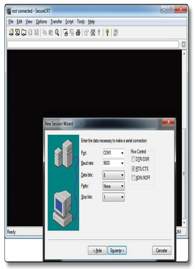
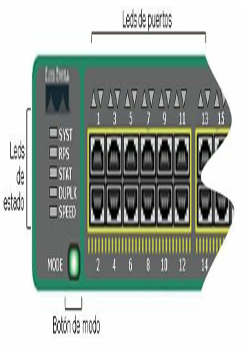
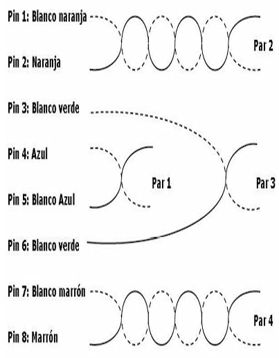
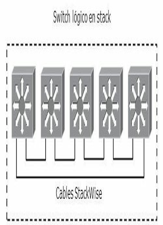
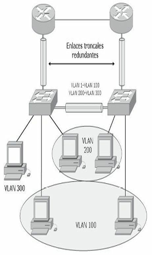
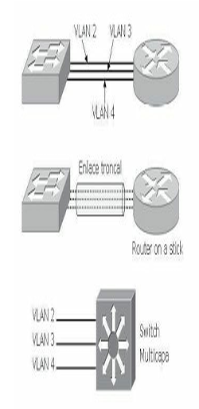
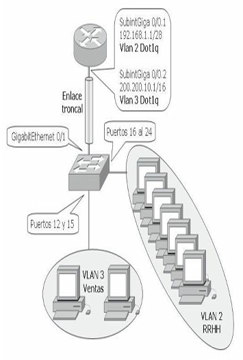

# Configuración del switch

## Operatividad del switch

Cuando un switch Catalyst se pone en marcha, hay tres operaciones fundamentales que el dispositivo de red debe realizar:

1. El dispositivo localiza el hardware y lleva a cabo una serie de rutinas de detección del mismo. Un término que se suele utilizar para describir este conjunto inicial de rutinas es el POST (*Power-on Self Test*), o pruebas de inicio.
2. Una vez que el hardware se muestra en una disposición correcta de funcionamiento, el dispositivo lleva a cabo rutinas de inicio del sistema. El switch o el router inicia localizando y cargando el software del sistema operativo IOS secuencialmente desde la Flash, servidor TFTP o la ROM, según corresponda (o incluso descomprimiéndola desde la NVRAM).
3. Tras cargar el sistema operativo, el dispositivo trata de localizar y aplicar las opciones de configuración que definen los detalles necesarios para operar en la red. Generalmente, hay una secuencia de rutinas de arranque que proporcionan alternativas al inicio del software cuando es necesario.

Un switch Catalyst utiliza varios tipos de memoria, todas ellas son de estado sólido, lo que permite mantener mayor tiempo de actividad y disponibilidad. La siguiente lista detalla los cuatro tipos de memorias que utiliza un switch Catalyst y para qué sirven:

- **RAM:** memoria de acceso aleatorio, también llamada memoria de acceso aleatorio dinámica (DRAM), se utiliza para almacenar la configuración actual y los procesos de ejecución. El contenido de la RAM se pierde cuando se apaga la unidad.
- **Flash:** la memoria flash se utiliza para almacenar una imagen completa del software IOS de Cisco, que puede estar comprimido o no. Estas imágenes pueden actualizarse cargando una nueva en la memoria.
- **NVRAM:** memoria de acceso aleatorio no volátil, se utiliza para guardar la configuración de inicio, estas memorias retienen sus contenidos cuando se apaga la unidad.
- **ROM:** memoria de solo lectura, se utiliza para almacenar de forma permanente el código de diagnóstico de inicio (Monitor de ROM). Las tareas principales de la ROM son el diagnóstico del hardware durante el arranque del router y la carga del software IOS de Cisco desde la memoria flash a la RAM. Las memorias ROM no se pueden borrar.

## Instalación inicial

En la instalación inicial, el administrador de la red configura generalmente los dispositivos de la red desde un terminal de consola, conectado a través del puerto de consola (RJ45). Los nuevos dispositivos Cisco incluyen un puerto extra USB (Mini-B) como puerto de consola.

Posteriormente y una vez configurados ciertos parámetros mínimos el switch puede ser configurado desde distintas ubicaciones:

- Si el administrador debe dar soporte a dispositivos remotos, una conexión local por módem con el puerto auxiliar del dispositivo permite a aquél configurar los dispositivos de red (según modelo y antigüedad).
- En los equipos más modernos con una configuración básica y desde cualquier sitio de la red el dispositivo puede cargar la configuración a través de algún servidor de gestión centralizada.
- Dispositivos con direcciones IP establecidas pueden permitir conexiones Telnet para la tarea de configuración.
- Descargar un archivo de configuración de un servidor TFTP (*Trivial File Transfer Protocol*).
- Configurar el dispositivo por medio de un navegador HTTP (*Hypertext Transfer Protocol*).

### Conectándose por primera vez

Para la configuración inicial del switch se utiliza el puerto de consola conectado a un cable transpuesto o de consola y un adaptador RJ-45 a DB-9 para conectarse al puerto COM1 del ordenador o un adaptador USB. Este debe tener instalado un software de emulación de terminal.



*La imagen corresponde a una captura de pantalla de un emulador de terminal*

Los parámetros de configuración de la conexión son los siguientes:

- El puerto COM adecuado.
- 9600 baudios.
- 8 bits de datos.
- Sin paridad.
- 1 bit de parada.
- Sin control de flujo.

Al iniciar por primera vez un switch Catalyst, no posee configuración inicial alguna. Mostrará la siguiente sintaxis:

```text
Cisco Internetwork Operating System Software
IOS (tm) C2950 Software (C2950-I6Q4L2-M), Version 12.1(22)EA4, RELEASE SOFTWARE(fc1)
Copyright (c) 1986-2005 by cisco Systems, Inc.
Compiled Wed 22-May-11 22:31 by Miguelito
Press RETURN to get started!
Switch>
```

Desde la línea de comandos el switch se inicia en el modo EXEC usuario, las tareas que se pueden ejecutar en este modo son solo de verificación ya que no se permiten cambios de configuración. En el modo EXEC privilegiado se realizan las tareas típicas de configuración.

Modo EXEC usuario y modo EXEC privilegiado respectivamente:

```text
Switch>
Switch#
```

Para pasar del modo usuario al privilegiado ejecute el comando `enable`, para regresar `disable`. Esto es posible porque no se ha configurado contraseña, de lo contrario sería requerida cada vez que se pasara al modo privilegiado.

```text
Switch>
Switch>enable
Switch#disable
Switch>
```

Modo global y de interfaz:

```text
Switch>enable
Switch#configure terminal
Switch(config)#interface [tipo de interfaz][número]
Switch(config)#interface FastEthernet 0/0
Switch(config-if)#exit
Switch(config)#exit
Switch#
```

Para pasar del modo privilegiado al global debe introducir el comando `configure terminal`, para pasar del modo global al de interfaz ejecute el comando `interface`. Para regresar un modo más atrás utilice el `exit` o `Control+Z` que lo llevará directamente al modo privilegiado.

Para utilizar la opción del puerto USB, tome en cuenta que posiblemente necesitará un driver controlador en su PC según el sistema operativo que utilice. Para las conexiones desde su PC al puerto USB, posiblemente también necesite un cable adaptador.

### Leds indicadores de estado

Los switch Catalyst incluyen varios leds (diodos emisores de luz) que proporcionan información del estado del dispositivo y ayudan a solucionar problemas, tanto en el arranque como durante las operaciones en curso. Esta forma visual permite al administrador verificar el estado de funcionamiento del switch sin necesidad de conexión ni de comandos.



La imagen ilustra la ubicación de los leds de estado y de interfacesen un switch Cisco 2960

| LED | Descripción |
| --- | --- |
| SYST | **Sistema:** proporciona una visión general del switch, con tres estados:<br>apagado: el switch no está encendido.<br>verde: encendido y operativo.<br>ámbar: fallo en el arranque (POST) y el IOS no se cargó. |
| RPS | Muestra el estado de la fuente de alimentación adicional (redundante). |
| STAT | En verde implica que los leds de los puertos muestren su estado:<br>apagado: el enlace no funciona.<br>verde: el enlace funciona, pero no hay tráfico.<br>verde intermitente: el enlace está funcionando y está pasando tráfico a través de la interfaz.<br>ámbar intermitente: la interfaz está desactivada administrativamente o se ha desactivado de forma dinámica por diferentes razones. |
| DUPLX | En verde implica que los leds de los puertos muestren su modo duplex:<br>verde: full.<br>apagado: half. |
| SPEED | En verde implica que los leds de los puertos muestren su velocidad:<br>apagado: 10 Mbps.<br>verde: 100 Mbps.<br>verde intermitente: 1 Gbps. |
| Puertos | Tiene diferentes significados, dependiendo de la selección hecha desde el botón de modo. |

### Comandos ayuda

Memorizar todos los comandos disponibles resulta difícil, el switch ofrece la posibilidad de ayudas, el signo de interrogación (`?`) y el tabulador del teclado brindan la ayuda necesaria a ese efecto. El tabulador completa los comandos que no recordamos completos o que no queremos escribir en su totalidad.

El `?` colocado inmediatamente después de un comando muestra todos los que comienzan con esas letras, colocado después de un espacio lista todos los comandos que se pueden ejecutar en esa posición.

```text
Switch#sh?
show

Switch#show ?
access-lists List access lists
arp              Arp table
boot             show boot attributes
cdp              CDP information
clock            Display the system clock
crypto           Encryption module
<cr>
--More--

Switch#show interfaces ?
Ethernet         IEEE 802.3
FastEthernet     FastEthernet IEEE 802.3
GigabitEthernet  GigabitEthernet IEEE 802.3z
Vlan             Catalyst Vlans
etherchannel     Show interface etherchannel information
switchport       Show interface switchport information
trunk            Show interface trunk information
<cr>
```

La ayuda se puede ejecutar desde cualquier modo:

```text
Switch#?
Exec commands:
<1-99>  Session number to resume
clear   Reset functions
clock   Manage the system clock
configure Enter configuration mode
connect Open a terminal connection
dir     List files on a filesystem
--More--

Switch(config)#?
Configure commands:
access-list Add an access list entry
banner      Define a login banner
boot        Boot Commands
cdp         Global CDP configuration subcommands
enable      Modify enable password parameters
end         Exit from configure mode
interface   Select an interface to configure
--More--
```

La indicación `--More--` significa que existe más información disponible. La barra espaciadora pasará de página en página, mientras que el Intro lo hará línea por línea.

El acento circunflejo (`^`) indicará un fallo de escritura en un comando:

```text
Switch#show ip interface bief
                     ^
% Invalid input detected at '^' marker.
Switch#sh ip interface brief
```

Los ejecutados comandos quedan registrados en un búfer llamado historial y pueden verse con el comando `show history`:

```text
Switch#show history
en
conf t
show ip interface bief
sh history
ping 10.0.0.1
conf t
show history
```

### Comandos de edición

Las diferentes versiones de IOS ofrecen combinaciones de teclas que permiten una configuración del dispositivo más rápida y simple. La siguiente tabla muestra algunos de los comandos de edición más utilizados.

| Tecla | Efecto |
| --- | --- |
| Delete | Elimina un carácter a la derecha del cursor. |
| Retroceso | Elimina un carácter a la izquierda del cursor. |
| TAB | Completa un comando parcial. |
| Ctrl+A | Mueve el cursor al comienzo de la línea. |
| Ctrl+R | Vuelve a mostrar una línea escrita anteriormente. |
| Ctrl+U | Borra una línea. |
| Ctrl+W | Borra una palabra. |
| Ctrl+Z | Finaliza el modo de configuración y vuelve al modo EXEC. |
| Esc-B | Desplaza el cursor hacia atrás una palabra. |
| Flecha arriba / Ctrl+P | Repite hacia adelante los comandos anteriores. |
| Flecha abajo / Ctrl+N | Repite hacia atrás los comandos anteriores. |
| Flecha derecha / Ctrl+F | Desplaza el cursor hacia la derecha sin borrar caracteres. |
| Flecha izquierda / Ctrl+B | Desplaza el cursor hacia la izquierda sin borrar caracteres. |

## Configuración inicial

### Asignación de nombre y contraseñas

Para asignar un nombre al switch, como la primera tarea recomendable (pero no excluyente) de configuración se ingresa desde el modo de configuración global, con el comando `hostname`. Es aconsejable que el nombre del dispositivo sea exclusivo en la red.

```text
Switch>enable
Switch#configure terminal
Switch(config)#hostname nombre
```

Los comandos `enable password` y `enable secret` se utilizan para restringir el acceso al modo EXEC privilegiado. El comando `enable password` se utiliza solo si no se ha configurado previamente `enable secret`.

Se recomienda habilitar siempre `enable secret`, ya que a diferencia de `enable password`, la contraseña estará siempre cifrada utilizando el algoritmo MD5 (*Message Digest 5*).

```text
Switch>enable
Switch#configure terminal
Switch(config)#hostname SW_MADRID
SW_MADRID(config)#enable password contraseña
SW_MADRID(config)#enable secret contraseña
```

En la siguiente sintaxis se copia parte de un `show running-config` donde se ha configurado como hostname `SW_MADRID` y como contraseña `cisco` en la `enable secret` y la `enable password`, abajo se ve cómo la contraseña secret aparece encriptada por defecto mientras que la otra se lee perfectamente.

```text
Switch>enable
Switch#configure terminal
Enter configuration commands, one per line. End with CNTL/Z.
Switch(config)#hostname SW_MADRID
SW_MADRID(config)#enable password cisco
SW_MADRID(config)#enable secret cisco
SW_MADRID#show running-config
hostname SW_MADRID
!
enable secret 5 $1$EBMD$0rTOiN4QQab7s8AFzsSof/
enable password cisco
```

### Contraseñas de consola y telnet

Para configurar la contraseña para consola se debe acceder a la interfaz de consola con el comando `line console 0`:

```text
Switch#configure terminal
Switch(config)#line console 0
Switch(config-line)#login
Switch(config-line)#password contraseña
```

El comando `exec-timeout` permite configurar un tiempo de desconexión determinado en la interfaz de consola.

El comando `logging synchronous` impedirá mensajes dirigidos a la consola de configuración que pueden resultar molestos.

Para configurar la contraseña para telnet se debe acceder a la interfaz de telnet con el comando `line vty 0 4`, donde `line vty` indica dicha interfaz, `0` el número de la interfaz y `4` la cantidad máxima de conexiones en un rango de 0-15 múltiples, en este caso se permiten 5 conexiones múltiples:

```text
Switch(config)#line vty 0 4
Switch(config-line)#login
Switch(config-line)#password contraseña
```

El comando `show sessions` muestra las conexiones de telnet efectuadas desde el switch, el comando `show users` muestra las conexiones de usuarios remotos hacia el switch.

```text
Switch#show users
Line       User       Host(s)              Idle       Location
* 1 vty 0               idle                 00:00:00   192.168.59.132
  2 vty 1               idle                 00:00:02   192.168.59.156
Interface    User               Mode                     Idle      Peer Address

Switch#show sessions
Conn Host Address         Byte  Idle  Conn Name
    1    10.99.59.49       10.99.59.49      0     1  10.99.59.49
*   2    10.99.55.1        10.99.55.1       0     0  10.99.55.1
```

En todos los casos el comando `login` suele estar configurado por defecto, permite al dispositivo preguntar la contraseña al intentar conectarse.

### Asignación de dirección IP

Para configurar la dirección IP a un switch se debe hacer sobre una interfaz vlan. Por defecto la VLAN 1 es VLAN nativa del switch, al asignar un direccionamiento a la interfaz vlan 1 se podrá administrar el dispositivo vía telnet. Es posible la configuración de manera estática o dinámica a través de un servidor DHCP (*Dynamic Host Configuration Protocol*).

```text
SW_2950(config)#interface vlan 1
SW_2950(config-if)#ip address [dirección ip + máscara]
SW_2950(config-if)#no shutdown

SW_2950(config)#interface vlan 1
SW_2950(config-if)#ip address dhcp
SW_2950(config-if)#no shutdown
```

Si el switch necesita enviar información a una red diferente a la de administración se debe configurar un gateway.

```text
SW_2950(config)#ip default-gateway [IP de gateway]
```

Para verificar la configuración IP establecida en la VLAN de gestión:

```text
SW_2950#show interface vlan 1
Vlan1 is up, line protocol is up
Hardware is EtherSVI, address is 001e.79e9.d8c1 (bia 001e.79e9.d8c1)
Internet address is 10.99.59.49/24
MTU 1500 bytes, BW 1000000 Kbit, DLY 10 usec,
     reliability 255/255, txload 1/255, rxload 1/255
Encapsulation ARPA, loopback not set
ARP type: ARPA, ARP Timeout 04:00:00
Last input 00:00:00, output 00:00:00, output hang never
--More--

SW_2950#show ip interface vlan 1
Vlan3 is up, line protocol is up
Internet address is 10.99.59.49/24
Broadcast address is 255.255.255.255
Address determined by non-volatile memory
MTU is 1500 bytes
Helper address is not set
Directed broadcast forwarding is disabled
Outgoing access list is not set
Inbound access list is not set
Proxy ARP is enabled
Local Proxy ARP is disabled
Security level is default
--More--
```

### Configuración de puertos

La configuración básica de puertos se lleva a cabo mediante la determinación de la velocidad y el modo de transmisión. Por defecto, la velocidad asignada es la establecida según el tipo de puerto.

```text
Switch(config)#interface FastEthernet 0/1
Switch(config-if)#speed [10 | 100 | auto]
Switch(config-if)#duplex [full | half | auto]
Switch(config-if)#no shutdown
```

También puede hacerse por rangos de interfaces separando el comienzo del rango y el fin por un guion o por interfaces sueltas separadas por una coma.

```text
SW_2960(config)#interface range fastEthernet 0/1 - 10
SW_2960(config-if-range)#speed 100
SW_2960(config)#interface range fastEthernet 0/11 , gigab 0/1
SW_2960(config-if-range)#no shutdown
```

**La siguiente captura muestra la tabla MAC con las asociaciones de cada puerto:**

```text
SW_2960#sh mac-address-table
Mac Address Table
-------------------------------------------
Vlan  Mac Address         Type        Ports
----  -----------         --------    -----
   3  000f.fee3.bdb3      DYNAMIC     Gi0/1
   3  000f.fee4.8ba9      DYNAMIC     Fa0/38
   5  0024.8116.08dc      DYNAMIC     Fa0/45
   3  24be.0508.1df8      DYNAMIC     Fa0/44
   2  24be.0510.a2d6      DYNAMIC     Fa0/42
   3  24be.0510.a2e0      DYNAMIC     Gi0/2
   3  24be.0510.a2f1      DYNAMIC     Fa0/26
   3  24be.0510.a334      DYNAMIC     Gi0/3

SW_2960#show mac-address-table interface fastEthernet 0/24
Mac Address Table
-------------------------------------------
Vlan  Mac Address         Type        Ports
----  -----------         --------    -----
   2  24be.0510.a1c0      DYNAMIC     Fa0/24
Total Mac Addresses for this criterion: 1
```

### PoE

Un switch Catalyst puede ofrecer PoE (*Power over Ethernet*) en sus puertos solo si está diseñado para hacerlo. Tiene que tener una o más fuentes de alimentación preparadas para brindar la carga adicional que ofrecerá a los dispositivos conectados. PoE está disponible en muchas plataformas incluyendo los Catalyst 3750 PWR, los 4500 y los 6500.

PoE tiene el beneficio adicional de que puede ser gestionado y monitorizado, funciona con teléfonos IP Cisco o con cualquier otro dispositivo compatible. Con un nodo que no necesite funcionar con PoE, como un PC normal, el switch simplemente no ofrece la energía en el cable.

El switch Catalyst podría estar conectado a una UPS (*Uninterruptible Power Supply*) o utilizar fuentes alternativas, para que en el caso de que la principal falle siga siendo capaz de alimentar al teléfono IP.

Existen dos métodos de proporcionar PoE a los dispositivos conectados:

- **ILP (Cisco Inline Power):** es un método propietario de Cisco desarrollado antes del estándar IEEE 802.3 AF.
- **IEEE 802.3 AF:** es un método estándar que ofrece compatibilidad entre diferentes fabricantes y cumple la misma función que su antecesor.

El switch siempre mantiene la energía deshabilitada cuando el puerto está caído, pero tiene que detectar cuándo un dispositivo que necesita alimentación se conecta al puerto. En caso de conexión el switch tiene que comenzar a generar la energía para que el dispositivo pueda inicializarse y hacerse operacional. Solo a partir de ese momento el enlace Ethernet será establecido.

Para IEEE 802.3AF los dispositivos comienzan dando un pequeño voltaje a través de los pares transmisores de par trenzado variando de esta forma la resistencia del par.

El método Cisco ILP toma un camino distinto al del 802.3AF, en lugar de ofrecer voltajes y chequear el nivel de la resistencia el switch envía un tono a una frecuencia de 340 KHz (340000 ciclos por segundo) en el par transmisor del cable de par trenzado.

Cisco ILP proporciona la energía sobre los cables de par trenzado 2 y 3, que son los pares de datos, con 48 VDC. IEEE 802.3AF, la energía puede ser proporcionada de la misma manera, es decir, sobre los pares 2 y 3 o además sobre los pares 1 y 4.



Ahora el dispositivo tiene la posibilidad de encenderse y establecer los enlaces Ethernet. La oferta de energía entregada al dispositivo por defecto puede ser cambiada a un valor más ajustado, esto puede ayudar a suplir menor energía ajustándose a la realidad que los dispositivos necesitan. Con 802.3AF la oferta de energía puede cambiarse detectando la clase de energía del dispositivo. Para Cisco ILP el switch puede intentar efectuar un intercambio de mensajes CDP con el dispositivo. Si la información de CDP es devuelta, el switch podrá descubrir los requerimientos reales del dispositivo, reduciendo la energía a la que realmente necesita.

Con los comandos `debug ilpower controller` y `debug cdp packets`, pueden verse los cambios de energía, en el ejemplo siguiente se muestra como la energía ha sido reducida de 15000 mW a 6300 mW:

```text
00:58:46: ILP uses AC Disconnect(Fa1/0/47): state= ILP_DETECTING_S, event= PHY_CSCO_DETECTED_EV
00:58:46: %ILPOWER-7-DETECT: Interface Fa1/0/47: Power Device detected: Cisco PD
00:58:46: Ilpower PD device 1 class 2 from interface (Fa1/0/47)
00:58:46: ilpower new power from pd discovery Fa1/0/47, power_status ok
00:58:46: Ilpower interface (Fa1/0/47) power status change, allocated power 15400
00:58:46: ILP Power apply to ( Fa1/0/47 ) Okay
00:58:46: ILP Start PHY Cisco IP phone detection ( Fa1/0/47 ) Okay
00:58:46: %ILPOWER-5-POWER_GRANTED: Interface Fa1/0/47: Power granted
00:58:46: ILP uses AC Disconnect(Fa1/0/47): state= ILP_CSCO_PD_DETECTED_S, event=IEEE_PWR_GOOD_EV
00:58:48: ILP State_Machine ( Fa1/0/47 ): State= ILP_PWR_GOOD_USE_IEEE_DISC_S, Event=PHY_LINK_UP_EV
00:58:48: ILP uses AC Disconnect(Fa1/0/47): state= ILP_PWR_GOOD_USE_IEEE_DISC_S, event=PHY_LINK_UP_EV
00:58:50: %LINK-3-UPDOWN: Interface FastEthernet1/0/47, changed state to up
00:58:50: CDP-AD: Interface FastEthernet1/0/47 coming up
00:58:50: ilpower_powerman_power_available_tlv: about sending patlv on Fa1/0/47
00:58:50: req id 0, man id 1, pwr avail 15400, pwr man -1
00:58:50: CDP-PA: version 2 packet sent out on FastEthernet1/0/47
00:58:51: %LINEPROTO-5-UPDOWN: Line protocol on Interface FastEthernet1/0/47, changed state to up
00:58:54: CDP-PA: Packet received from SIP0012435D594D on interface FastEthernet1/0/47
00:58:54: **Entry NOT found in cache**
00:58:54: Interface(Fa1/0/47) - processing old tlv from cdp, request 6300, current allocated 15400
00:58:54: Interface (Fa1/0/47) efficiency is 100
00:58:54: ilpower_powerman_power_available_tlv: about sending patlv on Fa1/0/47
00:58:54: req id 0, man id 1, pwr avail 6300, pwr man -1
00:58:54: CDP-PA: version 2 packet sent out on FastEthernet1/0/47
```

## Configuración avanzada

### Seguridad de acceso

La autenticación por usuario añade una función de seguridad. Hay dos métodos para configurar nombres de usuario de cuentas locales: `username password` y `username secret`.

```text
Switch(config)#username usuario1 password contraseña1
Switch(config)#username usuario2 password contraseña2
Switch(config)#username usuario secret contraseña
```

El comando `username secret` es más seguro porque utiliza el algoritmo MD5 (*Message Digest 5*) para crear las claves.

```text
Switch#show running-config
!
username ernesto secret 5 $1$aI44$fJoWcpIOAzTbkCd.bKxPS1
username matias password 0 contraseña
```

El comando `login local` en las configuraciones de línea habilita la base de datos local para autenticación.

```text
Switch(config)#line vty 0 15
Switch(config-line)#login local
Switch(config-line)#password contraseña
```

Un añadido de seguridad es el comando `service password-encryption` que encripta con un cifrado leve las contraseñas que no están cifradas por defecto como las de telnet, consola, auxiliar, etc. Una vez cifradas las contraseñas no se podrán volver a leer en texto plano.

!!! note "NOTA"
    Las contraseñas sin encriptación aparecen en texto plano en el `show running` debiendo tener especial cuidado ante la presencia de intrusos.

Los switches pueden ser configurados por HTTP si el comando `ip http server` está habilitado en el dispositivo. Por defecto la configuración por web viene deshabilitada, por razones de seguridad se recomienda dejarlo desactivado.

### Mensajes o banners

Los banners son muy importantes para la red desde una perspectiva legal. Además de advertir a intrusos potenciales, los banners también pueden ser utilizados para informar a administradores remotos de las restricciones de uso.

Los banners están deshabilitados por defecto y deben ser habilitados explícitamente. Use el comando `banner` desde el modo de configuración global para especificar mensajes apropiados.

```text
Switch(config)#banner ?
  LINE c  banner-text c, where 'c' is a delimiting character
  exec       Set EXEC process creation banner
  incoming   Set incoming terminal line banner
  login      Set login banner
  motd       Set Message of the Day banner
```

El banner motd es de poco uso en entornos de producción y se utiliza raramente. El banner exec, por el contrario, es útil para mostrar mensajes de administrador, ya que se presenta solo para los usuarios autenticados.

```text
SW_2960#configure terminal
Enter configuration commands, one per line. End with CNTL/Z.
SW_2960(config)#banner exec#
Enter TEXT message. End with the character '#'.
+--------------------------------------------------------------+
| ADVERTENCIA                                                    |
| -------                                                        |
| Este sistema es para el uso exclusivo de los usuarios autorizados
| para fines oficiales. Usted no tiene ninguna autorización de su
| uso y para asegurarse de que el sistema funciona correctamente,
| las personas que administran esta red monitorizan toda la
| actividad. La utilización de este dispositivo sin consentimiento
| expreso revela evidencias de un posible abuso o actividad
| criminal denunciable a las autoridades competentes según las     |
| leyes vigentes.                                                |
+--------------------------------------------------------------+
#
```

### Configuración de PoE

PoE se configura de manera sencilla, cada puerto del switch puede detectar automáticamente la presencia de un dispositivo capacitado para ILP antes de aplicar energía al puerto. También puede configurarse de tal manera que el puerto no acepte ILP. Por defecto todos los puertos del switch intentan descubrir dispositivos que sean ILP, para cambiar este comportamiento se utiliza la siguiente serie de comandos:

```text
Switch(config)#interface type mod/num
Switch(config-if)#power inline {auto [max milli-watts] | static [max milli-watts] | never}
```

Por defecto todas las interfaces del switch están configuradas en `auto`, donde el dispositivo y la oferta de energía se descubren automáticamente. La oferta de energía por defecto es 15,4 W (Watts); este valor de máxima energía puede configurarse a través del parámetro `max` de 4000 a 15400 mW.

Es posible configurar una oferta de energía estática con el parámetro `static` si el dispositivo no es capaz de interactuar con cualquiera de los métodos de descubrimiento de energía. Para deshabilitar PoE en el puerto de tal manera que nunca se detecten dispositivos y no se ofrezca energía se utiliza el parámetro `never`.

El estado de la energía se puede verificar en los puertos del switch con el siguiente comando:

```text
Switch#show power inline [type mod/num]
```

El siguiente ejemplo proporciona una salida del comando; si la interfaz se muestra como n/a, se ha utilizado ILP; de lo contrario es 802.3AF:

```text
Switch#show power inline
Module  Available Used Remaining
        (Watts)  (Watts) (Watts)
------  --------- -------- ---------
     1     370.0    39.0     331.0
Interface  Admin  Oper  Power  Device              Class Max
            (Watts)
---------  ------  ----------  ---------------------  ----- ----
Fa1/0/1    auto   on      6.5   AIR-AP1231G-A-K9      n/a  15.4
Fa1/0/2    auto   on      6.3   IP Phone 7940         n/a  15.4
Fa1/0/3    auto   on      6.3   IP Phone 7960         n/a  15.4
Fa1/0/4    auto   on     15.4   Ieee PD                    0  15.4
Fa1/0/5    auto   on      4.5   Ieee PD                    1  15.4
Fa1/0/6    static on     15     n/a                    n/a  15.4
Fa1/0/7    auto   off      0.0   n/a                    n/a  15.4
```

### Etherchannel

Los dispositivos Cisco permiten realizar agregación de enlaces con la finalidad de aumentar el ancho de banda disponible a través de la tecnología EtherChannel. La agregación de puertos en Cisco se puede realizar con interfaces Fast Ethernet, Gigabit Ethernet o 10 Gigabit Ethernet.

Con la tecnología EtherChannel es posible añadir hasta 8 enlaces de forma que se comporten como si solo fueran uno, eliminando la posibilidad de formar bucles de capa 2 debido a que el comportamiento de STP sobre estos enlaces es el de un único enlace.

Actualmente existen dos opciones para utilizar como protocolos de negociación en EtherChannel:

- **PAgP (*Port Aggregation Protocol*):** es un protocolo propietario de Cisco. Los paquetes PAgP son intercambiados entre switch a través de los enlaces configurados para ello. Los vecinos son identificados y sus capacidades comparadas con las capacidades locales.
- **LACP (*Link Aggregation Control Protocol*):** es la opción abierta y viene definida en el estándar 802.3ad, también conocida como IEEE 802.3 Cláusula 43 "Link Aggregation". El funcionamiento es bastante parecido al de PAgP, pero en este caso se asignan roles a cada uno de los extremos basándose en la prioridad del sistema.

EtherChannel puede configurarse de forma manual o dinámicamente utilizando los protocolos de negociación LACP o PAgP, por lo tanto, la configuración dependerá de la opción más adecuada que se haya elegido en cada caso.

```text
Switch(config)#interface tipo número
Switch(config-if)#channel-group número mode on
```

El modo `on` es un modo de configuración en el cual se establece toda la configuración del puerto de forma manual, no existe ningún tipo de negociación entre los puertos para establecer un grupo. En este tipo de configuración es necesario que ambos extremos estén en modo `on`.

Para la configuración de EtherChannel la creación del PortChannel se realizará automáticamente a partir de la configuración del ChannelGroup, llevando asociada la misma numeración. La interfaz EtherChannel es una interfaz lógica que agrupará a todos los enlaces miembros del EtherChannel. Cada interfaz que quiera ser miembro debe de ser asignada a él.

El siguiente comando se utiliza para configurar la manera en que las tramas serán distribuidas en el EtherChannel:

```text
Switch(config)#port-channel load-balance método
```

Los comandos necesarios para la configuración con el protocolo de negociación PAgP son los siguientes:

```text
Switch(config)#interface tipo número
Switch(config-if)#channel-protocol pagp
Switch(config-if)#channel-group número mode {on | {auto | desirable} [non-silent]}
```

La configuración básica de LACP es muy similar a PAgP, se utilizan los siguientes comandos:

```text
Switch(config)#interface tipo número
Switch(config-if)#channel-protocol lacp
Switch(config-if)#channel-group número mode {on | passive | active}
```

Cada interfaz ha de estar asignada al mismo número de EtherChannel y configurada como `active` o `pasive`.

Para la correcta configuración de Etherchannel hay varios puntos clave a tener en cuenta:

- Si se utiliza el modo `on` no se enviarán paquetes LACP o PAgP por lo tanto ambos extremos han de estar en modo `on`.
- Los modos `active` (LACP) o `desirable` (PAgP) preguntarán activamente al otro extremo.
- Los modos `passive` (LACP) o `auto` (PAgP) participarán en el EtherChannel pero solo si reciben primero paquetes desde el otro extremo.
- PAgP modo `desirable` y `auto` por defecto contienen el parámetro `silent` por lo que podrán negociar incluso si no escuchan paquetes desde el otro extremo.

!!! note "NOTA"
    En muchos casos los términos Etherchannel, PortChannel y ChannelGroup pueden utilizarse como sinónimos.

En el siguiente ejemplo se han configurado de manera manual las interfaces FastEthernet 0/1 a la 0/4 en el ChannelGroup 1 y las interfaces FastEthernet 0/5 a 0/8 en el ChannelGroup 2 a través del protocolo de negociación LACP.

```text
SW_2960(config)#interface range fastEthernet 0/1-4
SW_2960(config-if-range)#channel-group 1 mode on
SW_2960(config-if-range)#exit
SW_2960(config)#interface range fastEthernet 0/5-8
SW_2960(config-if-range)#channel-protocol lacp
SW_2960(config-if-range)#channel-group 2 mode active
SW_2960(config-if-range)#exit
SW_2960(config)#exit
SW-2960#
%SYS-5-CONFIG_I: Configured from console by console
```

**A continuación se muestra la configuración guardada, donde se observan los dos Port-channel creados:**

```text
SW_2960#show running-config
Building configuration...
Current configuration : 1396 bytes
!
version 12.2
no service timestamps log datetime msec
no service timestamps debug datetime msec
no service password-encryption
!
hostname SW-2960
!
!
spanning-tree mode pvst
!
interface FastEthernet0/1
 channel-group 1 mode on
!
 ................................
!
interface FastEthernet0/5
 channel-protocol lacp
 channel-group 2 mode active
!
 ................................
!
interface Port-channel 1
!
interface Port-channel 2
!
 ................................
```

Sobre el mismo ejemplo el `show spanning-tree` muestra el rol que cumplen las interfaces PortChannel en la topología STP.

```text
SW_2960#show spanning-tree vlan 1
VLAN0001
Spanning tree enabled protocol ieee
Root ID    Priority 32769
           Address 0001.641A.D44B
           Cost 7
           Port 27(Port-channel 1)
Hello Time 2 sec Max Age 20 sec Forward Delay 15 sec
Bridge ID  Priority 32769 (priority 32768 sys-id-ext 1)
           Address 0090.2B11.0D7C
Hello Time 2 sec Max Age 20 sec Forward Delay 15 sec
Aging Time 20

Interface     Role Sts Cost      Prio.Nbr Type
---------------- ---- --- --------- -------- ----------------
Po2           Altn BLK 7         128.28   Shr
Po1           Root FWD 7         128.27   Shr
```

Para la verificación del EtherChannel se pueden utilizar los siguientes comandos:

```text
show etherchannel summary
show etherchannel port-channel
show etherchannel load-balance

SW_2960#show etherchannel ?
  load-balance Load-balance/frame-distribution scheme among ports in port-channel
  port-channel Port-channel information
  summary       One-line summary per channel-group
```

### Stackwise

Tradicionalmente, los switches de capa de acceso han sido dispositivos físicos independientes. Si era necesario múltiples switches en un solo lugar, había que configurar los enlaces entre ellos.

Cisco introdujo el StackWise y tecnologías StackWise Plus para permitir que switches físicos independientes puedan actuar como un único switch lógico. StackWise está disponible en modelos de switch como el Cisco Catalyst 3750-E, 3750-X, y 3850. Para crear un switch lógico en stack, los switches físicos individuales deben estar conectados entre sí utilizando cables especiales para este fin. Cada switch admite dos puertos en stack; los switches están conectados en una cadena tipo margarita, conectándose uno detrás del otro y una conexión final se conecta al primero formando bucle cerrado. Esta conexión a través de los cables stack crea una extensión del entramado de conmutación. Cuando las tramas deben ser enviadas de un switch a otro, se envían a través del bucle de cables de stack.



*Ejemplo de 5 switches conectados en Stac*

Una de las ventajas de StackWise es que se pueden realizar cambios en el stack sin interrumpir su funcionamiento. Los switches individuales pueden ser insertados o eliminados sin interrumpir completamente la conectividad entre los switches. El anillo se puede abrir para agregar o remover un switch, pero los switches restantes permanecerán conectados al anillo. En otras palabras, usted puede realizar cambios en la pila sin interrumpir su funcionamiento.

Cuando los switches físicos no forman parte de un stack, cada uno opera de forma independiente y gestiona sus propias funciones. Cuando los switches están conectados como una pila (en stack) mantienen su funcionalidad de conmutación, pero únicamente un switch se convierte en el master de la pila y realiza todas las funciones de gestión. De hecho, toda la pila se gestiona a través de una única dirección IP. Si el switch master falla, otros switches miembros pueden asumir su papel.

En una pila, todos los switches utilizan el mismo ID para una instancia de spanning-tree. Aun añadiendo más switches al stack se sigue manteniendo la misma instancia STP para todos.

La elección del rol de cada switch se crea automáticamente o manualmente modificando el valor de la prioridad con el comando `switch número priority 1-15`.

```text
Switch#show switch
              Current
Switch#  Role        Mac Address     Priority  State
--------------------------------------------------------
*1      Master       001b.90b1.8280       3     Ready
 2      Member       001b.2bea.c380       1     Ready
 3      Member       0007.0e27.7f80       1     Ready
```

!!! note "NOTA"
    Una conexión en StackWise se puede utilizar para conectar hasta nueve switches físicos en forma de anillo cerrado.

!!! tip "RECUERDE"
    El master contiene almacenados los archivos de configuración que se ejecutan en el stack y cada miembro tiene una copia actualizada de estos archivos con fines de copia de seguridad.

### Configuración de SSH

SSH (*Secure Shell*) ha reemplazado a telnet como práctica recomendada para proveer administración remota con conexiones que soportan confidencialidad e integridad de la sesión. Provee una funcionalidad similar a una conexión telnet de salida, con la excepción de que la conexión está cifrada y opera en el puerto 22.

1. Configure la línea vty para que utilice nombres de usuarios locales con el comando `login local`.
2. Asegúrese de que haya una entrada de nombre de usuario válida en la base de datos local. Si no la hay, cree una usando el comando `username nombre secret contraseña`.
3. Deben generarse las claves secretas de una sola vía para que el switch cifre el tráfico SSH. Estas claves se denominan claves asimétricas RSA (*Rivest, Shamir y Adleman*). Primero configure el nombre de dominio DNS de la red usando el comando `ip domain-name` en el modo de configuración global. Luego para crear la clave RSA, use el comando `crypto key generate rsa` en el modo de configuración global.
4. En muchas versiones actuales de IOS la configuración de las sesiones SSH viene configurada por defecto, sin embargo si fuera necesario habilite las sesiones SSH vty de entrada con el comando de línea vty `transport input ssh`. Para prevenir sesiones de telnet configure el comando `no transport input telnet` para todas las líneas vty.
5. De manera opcional puede configurarse la versión 2 de SSH con el comando de configuración global `ip ssh version 2`.

```text
Switch#
Switch#configure terminal
Enter configuration commands, one per line. End with CNTL/Z.
Switch(config)#hostname CCNA
CCNA(config)#line vty 0 15
CCNA(config-line)#login local
CCNA(config-line)#transport input telnet ssh
CCNA(config-line)#exit
CCNA(config)#username ernesto secret cisco
CCNA(config)#ip domain-name aprenderedes.com
CCNA(config)#crypto key generate rsa
The name for the keys will be: ernesto.aprenderedes.com
Choose the size of the key modulus in the range of 360 to 2048 for your General Purpose Keys.
Choosing a key modulus greater than 512 may take a few minutes.
How many bits in the modulus [512]: 1024
% Generating 1024 bit RSA keys ...[OK]
00:03:58: %SSH-5-ENABLED: SSH 1.99 has been enabled
```

Puede verificar el estado y las conexiones SSH con los comandos `show ip ssh` y `show ssh`.

```text
CCNA#show ip ssh
SSH Enabled - version 2.0
Authentication timeout: 120 secs; Authentication retries: 3

CCNA#show ssh
Connection  Version Mode Encryption    State         Username
          2.0     IN   DES              Session started ernesto
```

Será posible conectarse usando un cliente SSH público y disponible comercialmente ejecutándose en un host. Algunos ejemplos de estos clientes son PuTTY, OpenSSH y TeraTerm.

!!! tip "RECUERDE"
    El comando `username secret` cifra la contraseña del usuario por defecto mientras que el comando `username password` muestra la contraseña en texto plano. Ambos comandos tienen el mismo efecto en el dispositivo y permiten establecer niveles de cifrado.

!!! note "NOTA"
    Asegúrese de que los dispositivos destino estén ejecutando una imagen IOS que soporte SSH. Muchas versiones básicas o antiguas no lo soportan.

### Guardar la configuración

Las configuraciones actuales son almacenadas en la memoria RAM, este tipo de memoria pierde el contenido al apagarse el switch. Para que esto no ocurra es necesario poder hacer una copia a la NVRAM. El comando `copy` se utiliza con esta finalidad, identificando un origen con datos a guardar y un destino donde se almacenarán esos datos. Se puede guardar la configuración de la RAM a la NVRAM, de la RAM a un servidor TFTP, etc.

Copia de la RAM a la NVRAM:

```text
Switch#copy running-config startup-config
```

Copia de la NVRAM a la RAM:

```text
Switch#copy startup-config running-config
```

```text
SW_2960#copy ?
  flash:         Copy from flash: file system
  ftp:           Copy from ftp: file system
  running-config Copy from current system configuration
  startup-config Copy from startup configuration
  tftp:          Copy from tftp: file system

SW_2960#copy running-config ?
  flash:         Copy to flash file
  ftp:           Copy to current system configuration
  startup-config Copy to startup configuration
  tftp:          Copy to current system configuration

SW_2960#copy running-config startup-config
Destination filename [startup-config]?
Building configuration...
[OK]
```

Para la copia a un servidor TFTP se debe tener como mínimo una conexión de red activa hacia el servidor (verifique la conexión a través de un `ping`); se solicitará el nombre de archivo con el que se guardará la configuración y la dirección IP del servidor.

```text
SW_2960#ping 192.168.1.25
Type escape sequence to abort.
Sending 5, 100-byte ICMP Echos to 192.168.1.25, timeout is 2 seconds:
!!!!!
Success rate is 100 percent (5/5), round-trip min/avg/max = 31/31/32 ms

SW_2960#copy running-config tftp
Address or name of remote host []? 192.168.1.25
Destination filename [SW_2960-confg]?
Writing running-config....!!!!!!!!!!!!!!!!
[OK - 1080 bytes]
1080 bytes copied in 3.074 secs (0 bytes/sec)
```

La función SCP (*Secure Copy*) proporciona un método seguro y autenticado para copiar configuraciones de los dispositivos o archivos de imágenes de ellos. SCP se basa en SSH (*Secure Shell*), también requiere que AAA (*Authentication, Authorization y Accounting*) esté configurado en el router para determinar si el usuario tiene el nivel de privilegio correcto.

!!! tip "RECUERDE"
    El comando `copy` identifica un origen y un destino para los datos a guardar. El resultado de la copia sobrescribe los datos existentes, por lo tanto, se debe tener especial atención asegurándose de que los datos que se copiarán son los correctos y que no se eliminarán datos sensibles.

Los siguientes comandos muestran el contenido de la RAM y de la NVRAM respectivamente.

```text
Switch#show running-config
Switch#show startup-config
```

A continuación se copia parte de un `show startup-config`, se observa la cantidad de memoria que se está utilizando, la versión del software IOS, la contraseña cifrada, la configuración de la VLAN1, etc.:

```text
SW_2960#show startup-config
Building configuration...
Current configuration : 6318 bytes
!
version 12.2
no service pad
service timestamps debug uptime
service timestamps log uptime
service password-encryption
!
hostname SW_2960
!
enable secret 5 $1$fZxC$SgtgUKRGpUBs15eMoLmyB80
!
vtp mode transparent
ip subnet-zero
--More--
interface Vlan1
 ip address 192.168.59.49 255.255.255.0
!
ip default-gateway 192.168.59.1
no ip http server
!
line con 0
 password 7 110461712590E00087A
 login
line vty 0 4
--More--
```

!!! note "NOTA"
    La memoria RAM es la `running-config`, su contenido se pierde al apagar y no existe comando para borrado. La memoria NVRAM es la `startup-config`, no pierde su contenido al apagar.

### Borrado de las memorias

Los datos de configuración almacenados en la memoria no volátil no son afectados por la falta de alimentación, el contenido permanecerá en la NVRAM hasta tanto se ejecute el comando `erase` para su eliminación:

```text
Switch#erase startup-config

SW_2960#erase startup-config
Erasing the nvram filesystem will remove all configuration files! Continue? [confirm]
```

Por el contrario no existe comando para borrar el contenido de la RAM. Si el administrador pretende dejar sin ningún dato de configuración debe reiniciar o apagar el switch. La RAM se borra únicamente ante la falta de alimentación eléctrica:

```text
SW_2960#reload
System configuration has been modified. Save? [yes/no]: no
Proceed with reload? [confirm]
```

Para borrar completamente la configuración responda NO a la pregunta si quiere salvar.

!!! note "NOTA"
    Tenga especial cuidado al borrar las memorias, asegúrese de eliminar lo que desea antes de confirmar el borrado.

### Copia de seguridad del IOS

Cuando sea necesario restaurar o actualizar el IOS puede hacerse desde un servidor TFTP. Es importante que se guarden copias de seguridad de todas las IOS en un servidor central.

El comando para esta tarea es el `copy flash tftp`, verifique el nombre del archivo a guardar mediante el comando `show flash`:

```text
SW_2960#show flash
Directory of flash:/
  3  -rwx   736  Mar 1 1993 00:00:29 +00:00  vlan.dat
  4  -rwx     5  May 17 2012 05:49:12 +00:00  private-config.text
  5  -rwx  6394  May 17 2012 05:49:12 +00:00  config.text
  7  drwx   192  Mar 1 1993 00:07:15 +00:00  c2960-lanbase-mz.122-25.FX.bin
32514048 bytes total (24172032 bytes free)

SW_2960#copy flash tftp
Source filename []? c2960-lanbase-mz.122-25.FX.bin
Address or name of remote host []? 192.168.1.25
Destination filename [c2960-lanbase-mz.122-25.FX.bin]?
Writing c2960-lanbase-mz.122-25.FX.bin...!!!!!!!!!!!!!!!!!!!!!!!!!!!!!!!!!!!!
[OK - 4414921 bytes]
4414921 bytes copied in 2.746 secs (1607000 bytes/sec)
```

En el proceso inverso al anterior puede utilizarse para IOS corruptas que necesiten ser restablecidas o para actualizar la versión del IOS. Es importante verificar si existe espacio suficiente en la memoria flash antes de iniciar el proceso de copiado con el comando `show flash`. El comando `copy tftp flash` inicia la copia desde el servidor TFTP. El dispositivo pedirá confirmación del borrado antes de copiar en la memoria.

```text
SW_2960#show flash
Directory of flash:/
  3  -rwx   736  Mar 1 1993 00:00:29 +00:00  vlan.dat
  4  -rwx     5  May 17 2012 05:49:12 +00:00  private-config.text
  5  -rwx  6394  May 17 2012 05:49:12 +00:00  config.text
  7  drwx   192  Mar 1 1993 00:07:15 +00:00  c2960-lanbase-mz.122-25.FX.bin
32514048 bytes total (24172032 bytes free)

SW_2960#copy tftp flash
Address or name of remote host []? 192.168.1.25
Source filename []? c2960-lanbase-mz.122-25.FX.bin
Destination filename [c2960-lanbase-mz.122-25.FX.bin]?
%Warning:There is a file already existing with this name
Do you want to over write? [confirm]
Erase flash: before copying? [confirm]
Erasing the flash filesystem will remove all files! Continue? [confirm]
Erasing device...
eeee...erased
Erase of flash: complete
Accessing tftp://192.168.1.25/c2960-lanbase-mz.122-25.FX.bin...
Loading c2960-lanbase-mz.122-25.FX.bin from 192.168.1.25:
!!!!!!!!!!!!!!!!!!!!!!!!!!!!!!!!!!!!!!!!!!!!!!!!!!!!!!!!!!!!!!!!!!!!!!!!!!!!!!!!
[OK - 4414921 bytes]
4414921 bytes copied in 2.699 secs (44443 bytes/sec)
```

!!! tip "RECUERDE"
    A pesar de eliminar la configuración de la NVRAM las VLAN no se eliminan debido a que se guardan en un archivo en la memoria flash llamado VLAN.dat.

## Recuperación de contraseñas

La recuperación de contraseñas le permite alcanzar el control administrativo de su dispositivo si ha perdido u olvidado su contraseña. Para lograr esto necesita conseguir acceso físico al switch, ingresar sin la contraseña, restaurar la configuración y restablecer la contraseña con un valor conocido.

1. Conéctese a través del puerto de consola. Apague el switch y vuelva a encenderlo mientras presiona el botón "MODE" (modo) en la parte delantera del switch. Deje de presionar el botón "MODE" luego de varios segundos o una vez que se apaga el LED STAT.

Una información similar a la siguiente debe aparecer en la pantalla:

```text
C2950 Boot Loader (C2950-HBOOT-M) Version 12.1(11r)EA1, RELEASE SOFTWARE (fc1)
Compiled Mon 22-Jul-02 18:57 by federtec
WS-C2950-24 starting...
Base ethernet MAC Address: 00:0a:b7:72:2b:40
Xmodem file system is available.
The system has been interrupted prior to initializing the flash files system. The following commands will initialize the flash files system, and finish loading the operating system software:
flash_init
load_helper
boot
```

2. Para inicializar el sistema de archivos y terminar de cargar el sistema operativo, introduzca los siguientes comandos:

```text
switch: flash_init
switch: load_helper
switch: dir flash:
Directory of flash:/
  3  -rwx   736  Mar 1 1993 00:00     +00:00  vlan.dat
  4  -rwx     5  May 1 2012 05:49     +00:00  private-config.text
  5  -rwx  6394  May 1 2012 05:49     +00:00  config.text
  7  drwx   192  Mar 1 1993 00:07     +00:00  c2960-lanbase-mz.122-35.SE5
32514048 bytes total (24172032 bytes free)
```

No se olvide de escribir los dos puntos (`:`) después de la palabra "flash" en el comando.

3. Escriba `rename flash:config.text flash:config.old` para cambiar el nombre del archivo de configuración. Este archivo contiene la definición de la contraseña.

```text
switch: rename flash:config.text flash:config.old
```

4. Escriba `boot` para arrancar el sistema. Responda `No` a la pregunta:

```text
Continue with the configuration dialog? [yes/no]: N
```

5. En el indicador del modo EXEC privilegiado, escriba `rename flash:config.old flash:config.text` para cambiar el nombre del archivo de configuración al nombre original.

```text
Switch#rename flash:config.old flash:config.text
```

6. Copie el archivo de configuración a la memoria de la siguiente manera:

```text
Switch#copy flash:config.text system:running-config
Source filename [config.text]? [enter]
Destination filename [running-config] [enter]
```

7. Se ha vuelto a cargar el archivo de configuración. Cambie las contraseñas anteriores que se desconocen como se indica a continuación:

```text
Switch#configure terminal
Switch(config)#no enable secret
Switch(config)#enable password contraseña nueva
Switch(config)#enable secret contraseña nueva
Switch(config)#line console 0
Switch(config-line)#password contraseña nueva
Switch(config-line)#exit
Switch(config)#line vty 0 15
Switch(config-line)#password contraseña nueva
Switch(config-line)#exit
Switch(config)#exit
Switch#copy running-config startup-config
Destination filename [startup-config]? [enter]
Building configuration...
[OK]
```

## Configuración de VLAN

La tecnología de VLAN está pensada básicamente para ser implementada en la capa de acceso del modelo jerárquico, donde los hosts se agregan a una u otra VLAN de forma estática o de forma dinámica.

- **Configuración estática:** es la realizada por un administrador creando las VLAN y asignando manualmente los puertos a las respectivas VLAN. Por defecto todos los puertos pertenecen a la VLAN1 hasta que el administrador cambie esta configuración.
- **Configuración dinámica:** se basa en la MAC del dispositivo que se conecte a un puerto determinado, son utilizadas por ejemplo en el caso de utilizar IEEE 802.1X para proporcionar seguridad. Las VLAN dinámicas utilizan algún software de gestión para su funcionalidad.

### Proceso de configuración de VLAN

El proceso de configuración de una VLAN estática debe seguir los siguientes pasos:

1. Crear la VLAN.
2. Opcionalmente nombrar la VLAN.
3. Asociar uno o más puertos a la VLAN creada.

En la configuración de las VLAN se utiliza un nombre que identificará dicha VLAN, sin embargo el switch solo tiene en cuenta el rango numérico de la misma. Nombrar una VLAN es una tarea opcional pero que facilita enormemente la tarea de los administradores.

El rango de configuración va desde 1 a 1005 y el rango ampliado va de 1006 a 4094. Las VLAN 1 y las 1002 a la 1005 son rangos reservados.

```text
Switch(config)#vlan número
Switch(config-vlan)#name nombre
Switch(config-vlan)#exit
```

Una vez creada la VLAN es preciso asignar a ésta los puertos necesarios siguiendo el siguiente proceso:

```text
Switch(config)#interface tipo de interfaz número
Switch(config-if)#switchport mode access
Switch(config-if)#switchport access vlan número
```

En algunos casos la línea de comandos `switchport mode access` puede suprimirse.

Para añadir una VLAN de voz se utiliza el siguiente comando:

```text
Switch(config-if)#switchport voice vlan número
```

Muchos switches Cisco permiten añadir directamente un puerto a una VLAN que todavía no ha sido creada, este mecanismo crea la VLAN automáticamente, sin embargo, a pesar de esta funcionalidad lo mejor es crear primero la VLAN y luego asociar el puerto.

```text
SW_2960(config)#interface fastEthernet 0/1
SW_2960(config-if)#switchport access vlan 25
% Access VLAN does not exist. Creating vlan 25
SW_2960(config-if)#
```

!!! tip "RECUERDE"
    La VLAN 1 es la VLAN nativa o de administración, que por defecto es a la que se le asigna la dirección IP de gestión del switch.

### Eliminación de VLAN

Para eliminar una VLAN desagrupe los puertos que estén asociados con esta anteponiendo un `no` al comando `switchport`. También es posible asociarlos a otra VLAN para desvincularlos con la VLAN que se borrará. Elimine la VLAN anteponiendo un `no` al comando de configuración. El switch no debe estar en modo VTP cliente.

```text
Switch(config)#interface tipo de interfaz número
Switch(config-if)#no switchport access vlan número
Switch(config)#no vlan número
Switch(config-vlan)#exit
```

Si el switch está en modo cliente y no es posible cambiarlo de modo VTP, o ante inconsistencias de VLAN, será necesario eliminar el archivo de información de la base de datos de la VLAN que está almacenado en la memoria flash. Tenga especial cuidado de eliminar el archivo VLAN.dat y no otro. A partir del siguiente reinicio todas las VLAN quedarán eliminadas.

```text
Switch#delete flash:vlan.dat
Delete filename [vlan.dat]? [enter]
Delete flash:vlan.dat? [confirm]
```

Si no hay ningún archivo VLAN, aparece el siguiente mensaje:

```text
%Error deleting flash:vlan.dat (No such file or directory)
```

!!! note "NOTA"
    Cuando se elimina una VLAN, los puertos asignados a ella quedan inactivos hasta que se asignen a una nueva VLAN.

### Verificación de VLAN

En el resumen de la información brindada por un `show vlan` que se muestra a continuación se observa la asociación de las respectivas VLAN, con sus puertos asociados:

```text
SW_2960#show vlan

VLAN Name                             Status    Ports
---- -------------------------------- --------- -------------------------------
1    default                          active    Fa0/1, Fa0/2, Fa0/3, Fa0/4
2    VENTAS                           active    Fa0/5, Fa0/6, Fa0/7, Fa0/8,
                                                 Fa0/9, Fa0/10, Fa0/11, Fa0/12,
                                                 Fa0/13, Fa0/28, Fa0/30
3    ADMINISTRACION                   active    Fa0/14, Fa0/15, Fa0/16, Fa0/17,
                                                 Fa0/18, Fa0/19, Fa0/20, Fa0/21
4    LOGISTICA                        active    Fa0/22, Fa0/23, Fa0/24, Fa0/25,
                                                 Fa0/26, Fa0/27, Fa0/29, Fa0/31,
                                                 Fa0/32, Fa0/33, Fa0/34, Fa0/35,
                                                 Fa0/36, Fa0/37, Fa0/38, Fa0/39,
                                                 Fa0/40, Fa0/41, Fa0/42, Fa0/43,
                                                 Fa0/44, Fa0/45, Fa0/46, Fa0/47,
                                                 Fa0/48
```

Los siguientes comandos son útiles para verificar la operación:

| Comando | Descripción |
| --- | --- |
| `show vlan brief` | Muestra la información de VLAN resumida. |
| `show vtp status` | Muestra la información del estado VTP. |
| `show interface trunk` | Muestra los parámetros troncales. |
| `show spanning-tree vlan Nº` | Muestra información sobre el estado STP. |

```text
Switch#show spanning-tree vlan 100
VLAN0100
Spanning tree enabled protocol ieee
Root ID    Priority 4200
           Address 000b.5f65.1f80
           Cost 4
           Port 1 (GigabitEthernet0/1)
Hello Time 2 sec Max Age 20 sec Forward Delay 15 sec
Bridge ID  Priority 32868 (priority 32768 sys-id-ext 100)
           Address 000c.8554.9a80
Hello Time 2 sec Max Age 20 sec Forward Delay 15 sec
Aging Time 300
```

### Configuración de la interfaz SVI

Es posible asignar una dirección IP a una interfaz virtual SVI (*Switch Virtual Interface*) que identifique a una VLAN en particular, lo que resulta de suma utilidad cuando existe tráfico que entra y sale de dicha VLAN.

Para configurar una SVI se utilizan los siguientes comandos:

```text
Switch(config)#interface vlan vlan-id
Switch(config-if)#ip address dirección-IP máscara
Switch(config-if)#no shutdown
```

Para que la interfaz SVI funcione correctamente se debe crear previamente la VLAN y que a su vez esté activa y asignada a algún puerto de capa 2 que esté habilitado. La interfaz SVI no debe estar en el estado shutdown.

La siguiente sintaxis muestra la configuración de una interfaz SVI:

```text
Switch(config)#vlan 100
Switch(config-vlan)#name CCNP
Switch(config-vlan)#exit
Switch(config)#interface fastethernet 0/1
Switch(config-if)#switchport access vlan 100
Switch(config)#interface vlan 100
Switch(config-if)#ip address 192.168.0.1 255.255.255.0
Switch(config-if)#no shutdown
```

## Configuración del enlace troncal

Por defecto los puertos de capa 2 de los switches son puertos de acceso que por defecto pertenecen a la VLAN1, para que estos funcionen como puertos troncales hay que configurarlos con el comando de interfaz `switchport mode trunk`.

```text
Switch(config)#interface tipo número
Switch(config-if)#switchport trunk encapsulation {isl | dot1q | negotiate}
Switch(config-if)#switchport trunk native vlan número
Switch(config-if)#switchport trunk allowed vlan {vlan-list | all | {add | except | remove} vlan-list}
Switch(config-if)#switchport mode {trunk | dynamic {desirable | auto}}
```

En la configuración de los troncales intervienen varios parámetros, en la encapsulación existen tres posibilidades de configuración:

- **isl:** el troncal se formará utilizando ISL.
- **dot1q:** el troncal se formará utilizando IEEE 802.1Q.
- **negotiate:** el troncal se formará utilizando el protocolo DTP de Cisco.

El comando `switchport trunk native vlan` solo se utiliza con la encapsulación dot1q e indica qué VLAN será la VLAN de administración o nativa, por lo tanto no llevará etiqueta alguna.

El comando `switchport trunk allowed vlan` se utiliza para añadir o borrar VLAN del troncal, aunque la opción `except` lo que hará será permitir todas excepto la que se indique.

Existen tres modos de un puerto troncal:

- **trunk:** por defecto es el estado del puerto troncal (que se recomienda).
- **dynamic desirable:** inicia o responde dinámicamente a los mensajes de negociación para elegir si desea iniciar un troncal.
- **dynamic auto:** espera pasivamente recibir mensajes de negociación, momento en el que responderá si desea utilizar el troncal.

Es importante tener en cuenta que en los casos donde exista demasiado tráfico el troncal se puede aplicar no solo en una interfaz individual sino en una agregación Fast EtherChannel o Gigabit EtherChannel ampliando así el ancho de banda del enlace.

Para ver el estado de una interfaz troncal se utiliza el comando `show interface trunk`, la sintaxis que sigue muestra un ejemplo:

```text
Switch#show interface gigabitethernet 0/2 trunk

Port      Mode         Encapsulation  Status        Native vlan
Gi2/1     on           802.1q         trunking       1

Port Vlans allowed on trunk
Gi2/1     1-4094

Port Vlans allowed and active in management domain
Gi2/1     1-2,526,539,998,1002-1005

Port Vlans in spanning tree forwarding state and not pruned
Gi2/1     1-2,526,539,998,1002-1005
```

### Configuración de VLAN nativa

Cuando un switch local recibe tramas doblemente etiquetadas como si se utilizara 802.1Q decide enviarlas a través de las interfaces troncales. El ataque consiste en engañar al switch como si el enlace fuera un troncal a través de las etiquetas falsas 802.1Q y de la VLAN a donde se quiere llegar.

La clave para el ataque VLAN Hopping se basa en que la VLAN nativa no viaja etiquetada. Para solucionar este tipo de ataques se pueden seguir los siguientes pasos:

- Configurar la VLAN nativa como una VLAN falsa o una que no esté en uso.
- Recortar la VLAN nativa de los enlaces del troncal.

Por ejemplo si el troncal solo debe llevar las VLAN 10 y 20, se debería configurar la VLAN nativa con un valor de una VLAN que no se esté utilizando, por lo tanto, la VLAN nativa podría recortarse del troncal configurándolo en el propio enlace según muestra la siguiente sintaxis:

```text
Switch(config)#vlan 500
Switch(config-vlan)#name Nativa
Switch(config-vlan)#exit
Switch(config)#interface gigabitethernet 1/1
Switch(config-if)#switchport trunk encapsulation dot1q
Switch(config-if)#switchport trunk native vlan 800
Switch(config-if)#switchport trunk allowed vlan remove 800
Switch(config-if)#switchport mode trunk
```

El parámetro `switchport trunk allowed` permite limitar administrativamente las VLAN cuyo tráfico utiliza el troncal.

Otra alternativa es forzar a los troncales 802.1Q para añadir etiquetas a la VLAN nativa, de esta manera el ataque no funcionará porque el switch no eliminará la primera etiqueta de la VLAN nativa etiquetada. Para forzar al switch a etiquetar la VLAN nativa se utiliza el siguiente comando:

```text
Switch(config)#vlan dot1q tag native
```

### Dynamic Trunking Protocol

DTP (*Dynamic Trunking Protocol*) es un protocolo propietario de Cisco que se utiliza entre switches directamente conectados y que negocia de manera automática la creación de enlaces troncales entre ellos así como el tipo de encapsulación (ISL o 802.1q).

DTP no funciona entre switches con diferente nombre de dominio VTP, es decir, que solo puede utilizarse entre switches del mismo dominio o bien si uno de los switches no tiene definido un nombre de dominio VTP (NULL) y el otro sí.

Si bien DTP puede facilitar la administración del switch, se expone a que los puertos del switch queden comprometidos. Si un puerto mantiene su configuración por defecto donde el trunk está en auto, podría ser indagado por un puerto de otro switch también en auto u on enlazando entonces un troncal.

### Enrutamiento entre VLAN

Para que las VLAN puedan establecer comunicación entre ellas debe ser necesario que el switch sea multicapa o a través de un router comúnmente llamado *router on a stick*. La interconexión puede establecerse directamente a través de interfaces físicas a cada VLAN o con un enlace troncal. Para esto se deben establecer subinterfaces FastEthernet, con su encapsulación y dirección IP correspondiente de manera que cada una de estas subinterfaces pertenezca a una VLAN determinada.

La complementación del filtrado de trama en los switches y las listas de acceso en los routers, hacen que la seguridad sea uno de los factores primordiales en el uso de las VLAN.



Enrutamiento típico entre VLAN con enlaces troncales redundantes hacia los routers



*Enrutamiento entre VLAN con diferentes enlaces*

Los pasos que siguen establecen las configuraciones de una subinterfaz FastEthernet en un router:

```text
Router(config)#interface fastethernet [Nº de slot/Nº de interfaz.Nº de subinterfaz]
Router(config-subif)#encapsulation [dot1q|ISL] [Nº de vlan]
Router(config-subif)#ip address [dirección IP + máscara]
Router(config-subif)#exit
Router(config)#interface fastethernet [Nº de slot/Nº de interfaz]
Router(config-if)#no shutdown
```

!!! tip "RECUERDE"
    Para que la subinterfaz no esté caída se debe ejecutar el comando `no shutdown` directamente desde la interfaz física.

## Configuración de STP

La configuración de STP viene habilitada por defecto. Cisco desarrolló PVST+ para que una red pueda ejecutar una instancia de STP para cada VLAN de la red. La creación de distintos switches raíz en STP por VLAN genera una red más redundante. En ciertos casos será necesaria la configuración de la prioridad, cada switch posee la misma prioridad predeterminada (32768) y la elección del puente raíz para cada VLAN se basará en la dirección MAC. Esta elección en ciertos casos puede no ser la más conveniente.

```text
switch(config)#spanning-tree vlan número priority [0-61440]

switch(config)#spanning-tree mode ?
  mst       Multiple spanning tree mode
  pvst      Per-Vlan spanning tree mode
  rapid-pvst Per-Vlan rapid spanning tree mode

switch(config)#interface Fastethernet Nº
switch(config-if)#spanning-tree link-type ?
  point-to-point Consider the interface as point-to-point
  shared        Consider the interface as shared
```

En ciertos casos será necesario desactivar STP aunque se recomienda enfáticamente no deshabilitar STP. En general, STP no es muy exigente para el procesador.

```text
switch(config)#no spanning-tree vlan Nº
```

En la siguiente captura se observa resaltado la prioridad y más abajo el estado y rol de los puertos.

```text
switch#show spanning-tree vlan 1
VLAN0001
Spanning tree enabled protocol ieee
Root ID    Priority 8192
           Address 0003.a0ea.f800
           Cost 4
           Port 27 (GigabitEthernet1/0/3)
Hello Time 2 sec Max Age 20 sec Forward Delay 15 sec
Bridge ID  Priority 32769 (priority 32768 sys-id-ext 1)
           Address 001b.90b1.8680
Hello Time 2 sec Max Age 20 sec Forward Delay 15 sec
Aging Time 300

Interface      Role Sts Cost      Prio.Nbr Type
---------------- ---- --- --------- -------- ----
Gi1/0/3         Root FWD 4         128.27   P2p
Gi3/0/4         Altn BLK 4         128.132  P2p
```

### PortFast y BPDU Guard

Existen métodos adicionales que hacen que la convergencia STP sea más rápida en casos de fallos del enlace. Estos métodos son los siguientes:

- **PortFast:** habilita conectividad rápida para los puertos conectados a estaciones de trabajo o equipos terminales mientras estos están inicializando.
- **Uplink Fast:** habilita el enlace uplink rápido del switch en la capa de acceso cuando existen conexiones duales hacia la capa de distribución.
- **Backbone Fast:** habilita una rápida convergencia en el core de la red después de que un cambio de topología ocurre en STP.

En puertos de switch que conectan solo hacia simples estaciones de trabajo los bucles de capa 2 nunca serán posibles. Los switches Catalyst ofrecen la característica PortFast la cual baja los tiempos de cambio de estado de STP. Cuando el enlace de la estación de trabajo se levanta en el puerto PortFast, el switch mueve inmediatamente el estado del puerto a enviando. Una de las características más ventajosas es que las BPDU TCN no son enviadas ante los cambios de estado de los puertos configurados como PortFast.

Por defecto, PortFast está deshabilitado en todos los puertos. Para configurarlo a todos los puertos de acceso se puede utilizar el siguiente comando:

```text
Switch(config)#spanning-tree portfast default
```

Cuando PortFast es habilitado no se espera encontrar ningún dispositivo que genere BPDU, es decir, nada que pueda provocar un bucle. Cuando por error se conecta un switch a un puerto en el que se ha habilitado PortFast, existe un problema potencial de que se genere un bucle y aún más cuando el nuevo switch se anuncia como posible root bridge. La característica BPDU Guard fue creada para garantizar la integridad de los puertos del switch PortFast para que si alguna BPDU es recibida, el puerto se ponga inmediatamente en estado errdisable. El puerto pasa a una condición de error y es desactivado, teniendo que ser manualmente rehabilitado o automáticamente recuperado a través de la función de un temporizador.

Por defecto BPDU Guard está deshabilitado en todos los puertos del switch pudiendo configurarse con el siguiente comando:

```text
Switch(config)#spanning-tree portfast bpduguard default
Switch(config-if)#spanning-tree bpduguard enable
```

## Configuración de VTP

Los switches que utilizan VTP, versión 1 o versión 2, anuncian las VLAN (solo desde la 1 hasta la 1005), números de versión de configuración y parámetros de cada VLAN por el trunk para notificar esta información al resto de los switches de dominio mediante mensajes de multicast. La versión 3 de VTP permite la utilización de VLAN en el rango extendido de 1-4096, lo que haría a VTP compatible con el estándar IEEE 802.1Q.

Por defecto los switches utilizan la versión 1. Cambiar la versión de VTP es tan simple como introducir este comando en el modo de configuración global:

```text
Switch(config)#vtp version {1 | 2 | 3}
```

El nombre de dominio soporta un máximo de 32 caracteres y se configura con el siguiente comando:

```text
Switch(config)#vtp domain domain-name
```

Por defecto, los switches vienen configurados en modo servidor. Para configurar el modo y la contraseña en las actualizaciones VTP se utilizan los siguientes comandos:

```text
Switch(config)#vtp mode { server | client | transparent | off }
Switch(config)#vtp password password [ hidden | secret ]
```

La contraseña se configura únicamente en los clientes y servidores VTP.

El siguiente es un ejemplo de la configuración de un servidor VTP.

```text
Switch(config)#vtp version 1
Switch(config)#vtp domain CCNAvtp
Switch(config)#vtp mode server
Switch(config)#vtp password PaSsWoRd
```

La siguiente sintaxis de un `show vtp status` muestra la configuración de un switch servidor.

```text
switch#show vtp status

VTP Version                     : 2
Configuration Revision          : 0
Maximum VLANs supported locally : 64
Number of existing VLANs        : 5
VTP Operating Mode              : Servidor
VTP Domain Name                 : ccNa
VTP Pruning Mode                : Disabled
VTP V2 Mode                     : Disabled
VTP Traps Generation            : Disabled
MD5 digest                      : 0x8C 0x29 0x40 0xDD 0x7F 0x7A 0x63
Configuration last modified by 0.0.0.0 at 0-0-00 00:00:00
```

!!! note "NOTA"
    Muchos de los comandos utilizados a lo largo de este capítulo poseen gran cantidad de parámetros opcionales, para facilitar el aprendizaje estos han sido simplificados.

## Caso práctico

### Configuración de VLAN

Ejemplo de la creación de una VLAN 2 RRHH y una VLAN 3 Ventas y su asociación a los puertos correspondientes, 12 y 15 VLAN 3 y los puertos 16 al 24 (configurado por rango) VLAN 2.



```text
Switch(config)#vlan 3
Switch(config-vlan)#name Ventas
Switch(config-vlan)#exit
VLAN 3 added:
Name: Ventas
Switch(config)#interface fastethernet 0/12
Switch(config-if)#switchport access vlan 3
Switch(config)#interface fastethernet 0/15
Switch(config-if)#switchport access vlan 3
Switch(config)#vlan 2
Switch(config-vlan)#name RRHH
Switch(config-vlan)#exit
VLAN 2 added:
Name: RRHH
Switch(config)#interface fastethernet 0/16-24
Switch(config-if)#switchport access vlan 2
```

El enlace troncal se realiza a través del puerto GigabitEthernet 0/1, según muestra la sintaxis.

```text
Switch(config)#interface GigabitEthernet 0/1
Switch(config-if)#switchport mode trunk
```

### Configuración del troncal en el router

Ejemplo de configuración de un enlace troncal sobre dos subinterfaces GigabitEthernet:

```text
Router(config)#interface GigabitEthernet 0/0.1
Router(config-subif)#encapsulation dot1q 2
Router(config-subif)#ip address 192.168.1.1 255.255.255.0
Router(config-subif)#exit
Router(config)#interface GigabitEthernet 0/0.2
Router(config-subif)#encapsulation dot1q 3
Router(config-subif)#ip address 200.200.10.1 255.255.255.0
Router(config-subif)#exit
Router(config)#interface GigabitEthernet 0/0
Router(config-if)#no shutdown
```

## Fundamentos para el examen

- Memorice los parámetros para la configuración de un emulador de consola para la configuración inicial de un switch.
- Estudie los comandos básicos para la configuración del switch.
- Recuerde los pasos en el proceso de recuperación de contraseñas y para qué sirve cada uno de ellos.
- Aprenda como aumentar la seguridad de acceso al switch con SSH.
- Recuerde qué es, para qué sirve y los pasos básicos en el proceso de configuración de VLAN.
- Analice otras opciones de creación de VLAN y como eliminarlas.
- Memorice los comandos para la configuración de VTP.
- Analice el funcionamiento de los routers en el enrutamiento entre VLAN y cuáles son los aspectos básicos para ello.
- Recuerde los comandos `show` que permiten visualizar el funcionamiento de las VLAN.
- Memorice los comandos STP y como se puede mejorar una topología STP.
- Analice en que se diferencian LACP y PAgP.
- Repase para qué sirve y como funciona PoE.
- Tenga claro las diferencias entre puerto de acceso, puerto troncal y puerto de voz. Analice sus configuraciones.
- Ejercite los pasos para realizar copias de seguridad de las configuraciones y de las IOS.
- Piense como se puede aumentar la seguridad en los enlaces troncales.
- Ejercite todas las configuraciones en dispositivos reales o en simuladores.
